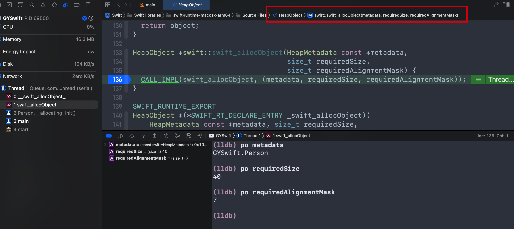

## 要求

1. 空间：首先需要确保有足够的硬盘空间。按本文操作下来最终大小`69G` 

> Disk space: Make sure that you have enough available disk space before starting. The source code, including full git history, requires about 3.5 GB. Build artifacts take anywhere between 5 GB to 70 GB, depending on the build settings.

2. 时间：一切顺利的前提下，到编译成功可能耗时几个小时左右。（在各种幺蛾子情况下，本人到编译成功整整花费一个星期。。。）

## 环境说明

以下所列环境均为本人测试环境，非官方严格要求的环境

- Apple M1
- Xcode  (13.1)
- macOS Monterey  (12.3.1)
- python3  (3.9.7)
- cmake（3.23.1）官方文档要求cmake >= 3.19.6
- ninja (1.10.2)
- sccache (0.3.0)

可通过homebrew安装 [CMake](https://cmake.org/), [Ninja](https://ninja-build.org/) 和 [Sccache](https://github.com/mozilla/sccache):

```
brew install cmake ninja sccache
```

准备好环境之后，接下来就开始正式操作了。这里说一下选择使用Xcode而不是Ninja编译的原因

1. 日常Xcode使用顺手习惯。若选择Ninja编译则需要使用vscode来进行调试
1. xcode编译成功之后可以直接新建target，代码写在工程内直接调试。而vscode写代码要在Perl模式下进行，代码不连贯，不易阅读。这是重要原因

## 编译步骤

### 获取源码、资源

1. 单独创建一个目录

   ```
   mkdir swift-build
   cd swift-build
   ```

2. 克隆Swift源码。推荐使用SSH方式下载，更快

   ```
   git clone git@github.com:apple/swift.git swift
   cd swift
   ```

3. 源码下载成功之后需要切换分支，此分支和Xcode版本需要有对应的关系，Xcode13.1通过[官方说明](https://developer.apple.com/support/xcode/)查看应该使用swift5.5、swift5.6都可以，但是我试了 `swift-5.5-RELEASE`, `swift-5.6-RELEASE` 两个分支，各种编译命令，换过xcode版本，cmake版本，最终结果都是不成功。

   最后在[swift论坛](https://forums.swift.org/t/problems-with-build-script-building-compiler-with-xcode/53477)上试了一个分支，令人意外的编译成功了，分支名为`swift-DEVELOPMENT-SNAPSHOT-2021-09-14-a`。建议第一次也按照此分支来操作。日后可以尝试使用其他分支来测试

   ```
   git checkout swift-DEVELOPMENT-SNAPSHOT-2021-09-14-a
   ```

   

4. 切换分支成功之后，通过swift自带`update-checkout`脚本，获取编译所需其他资源。下载成功之后有`4G`左右大小

   还是推荐使用SSH，若使用https，最好使用梯子。（本人在此步骤耽误了有两天左右时间，访问github极不稳定，一直下载不成功）

   ```
   python3 utils/update-checkout --tag swift-DEVELOPMENT-SNAPSHOT-2021-09-14-a
   ```

   ​		`update-checkout`、`build-script` 等脚本是通过python编写的，由于macOS12以上移除了自带的python2.7库。所以这里使用python3来执行脚本

   

这里本人把下载好的资源文件上传到网盘了，下载之后直接进行下一步编译就行

> 链接: https://pan.baidu.com/s/1pGYZb2KNpuLx03nKMnfHzw?pwd=3f4m 提取码: 3f4m  

### 编译

```
python3 utils/build-script --xcode --debug --skip-build-benchmarks --swift-darwin-supported-archs "$(uname -m)" --sccache --skip-ios --skip-tvos --skip-watchos --libswift=off
```

耗时2个小时左右，不同电脑可能有差异。结尾看到 `BUILD SUCCEEDED` 则说明成功了


此时可以查看Swift.xcodeproj工程文件是否生成


### Xcode使用

打开 swift-macosx-arm64（intel下为 swift-macos-x86_64）目录下 Swift.xcodeproj

1. 第一次打开，选择自动管理Scheme，xcode会生成许多Target。

2. 选择新建一个自己的Target，这里命名为 `GYSwift`

3. 进入 `GYSwift`下 `Build Phases` ，`Dependencies` 添加 `ALL_BUILD(Swift)` 依赖项

   

4. 设置完之后，就可以在main.swift文件中写代码调试了，这些新建一个Person类，调试一下`swift_allocObject`方法是否触发断点

   

   进入`HeapObject.cpp` 文件，找到 `swift_allocObject` 方法，打上断点，运行项目。断点触发，lldb功能也ok

   

5. 可以在main.swift文件中编写代码调试了，就是比vscode调试起来舒服

## 问题记录

1. `error: using unsupported Xcode version:`

   ```
   error: using unsupported Xcode version:
   
   Xcode 13.1
   Build version 13A1030d
   
   Install one of:
   12.3 (12C33)
   12.4 (12D4e)
   12.5 (12E262)
   13.0 beta (13A5154h)
   13.0 beta 4 (13A5201i)
   
   Or set 'SKIP_XCODE_VERSION_CHECK=1' in the environment
   ```

   若刚开始编译时遇到此错误，则按照说明操作 ，执行命令之后重新编译

   ```
   export SKIP_XCODE_VERSION_CHECK = 1
   ```

2. 若遇到类似 new build system的问题。因为cmake 3.19.0以上默认使用xcode新构建系统，但是一些老的库不知道新构建系统。网上有的建议使用cmake 3.18.x版本来编译，但是我从官方文档看的要求是3.19.6以上版本，所以就没有选择降级方式。

   ```
   but none of these is a common dependency of the other(s).  This is not
   allowed by the Xcode "new build system".
   ```

   最后发现添加编译参数 `--libswift=off`可以越过此错误。

   [apple/swift/blob/main/CMakeLists.txt#L190](https://github.com/apple/swift/blob/main/CMakeLists.txt#L190) 有一行注释可能解释了为什么要添加此参数。

   https://forums.swift.org/t/build-error-for-xcode/54385/3

3. 若添加了`--test`参数，但是编译过程中，test不通过，则去除此参数，也可尝试添加 `--skip-test-cmark`参数

4. `--lldb` 使用Ninja编译需要此参数，Xcode则不需要

5. 若遇到python2.7没有找到的错误，则需要自行去python官网下载，brew现在也不支持2.x版本的安装

6. 使用xcode编译，Swift.xcodeproj无法生成

   ```
   python3 utils/build-script --skip-build-benchmarks --libswift=off \
     --skip-ios --skip-watchos --skip-tvos --swift-darwin-supported-archs "$(uname -m)" \
     --sccache --release-debuginfo --swift-disable-dead-stripping \
     --xcode
   ```

   ```
   Command line invocation:
       /Applications/Xcode.app/Contents/Developer/usr/bin/xcodebuild -project Swift.xcodeproj build -target ZERO_CHECK -parallelizeTargets -configuration RelWithDebInfo -hideShellScriptEnvironment
   
   User defaults from command line:
       HideShellScriptEnvironment = YES
       IDEPackageSupportUseBuiltinSCM = YES
   
   xcodebuild: error: 'Swift.xcodeproj' does not exist.
   ```

   可以尝试将 `--release-debuginfo` 替换为 `--debug`。替换之后命令实际和本文编译命令一致

7. 若编译失败的话可尝试以下命令

   ```
   python3 utils/build-script --skip-build-benchmarks \
     --skip-ios --skip-watchos --skip-tvos --swift-darwin-supported-archs "$(uname -m)" \
     --sccache --debug --swift-disable-dead-stripping --test \
     --xcode --skip-test-cmark --libswift=off
   ```

## 参考资料

[How to Set Up an Edit-Build-Test-Debug Loop](https://github.com/apple/swift/blob/swift-5.6-RELEASE/docs/HowToGuides/GettingStarted.md)

[超实用～使用Xcode编译Swift源码](https://juejin.cn/post/7064077836755140645)

[Problems with `build-script` building compiler with `–xcode`](https://forums.swift.org/t/problems-with-build-script-building-compiler-with-xcode/53477)

[Build Error for `–xcode`](https://forums.swift.org/t/build-error-for-xcode/54385)

