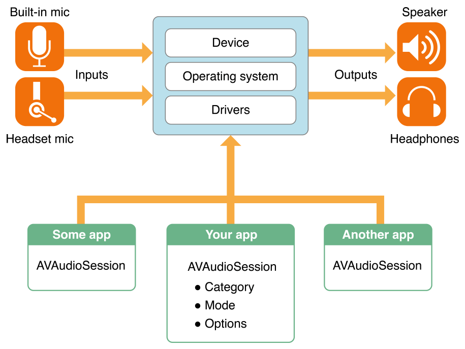
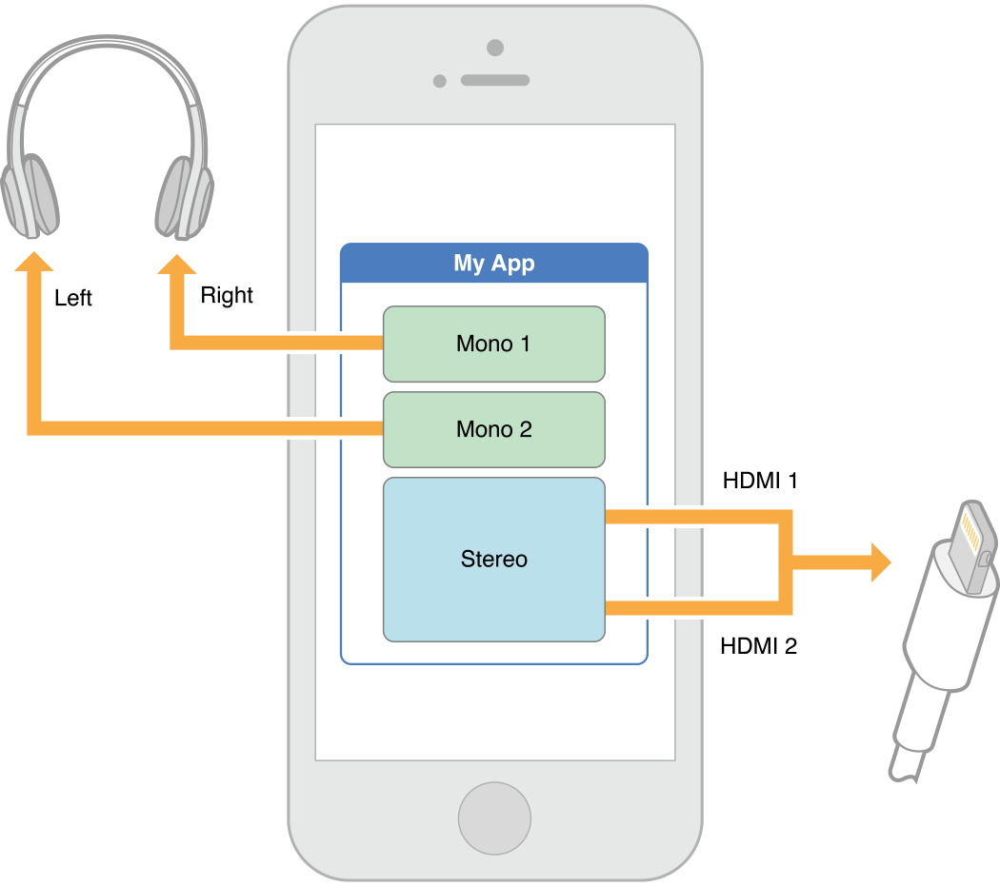
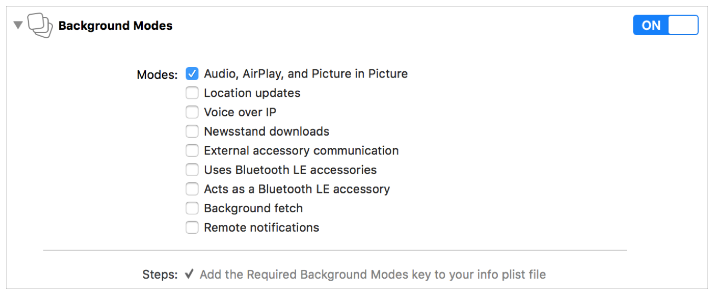
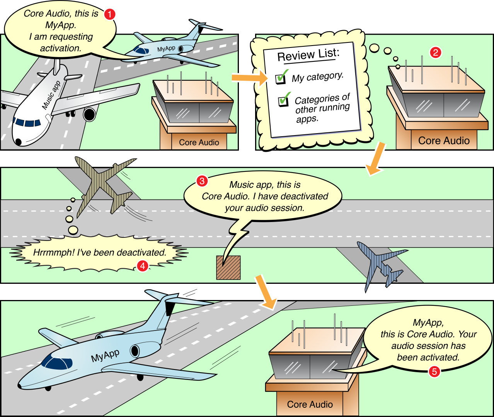
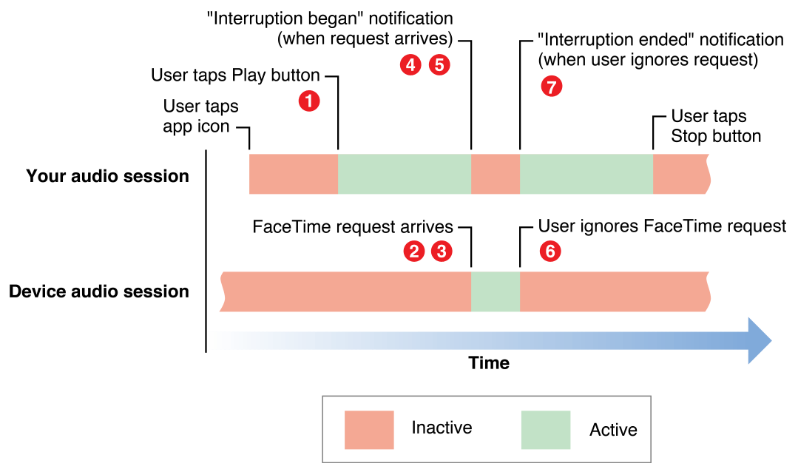
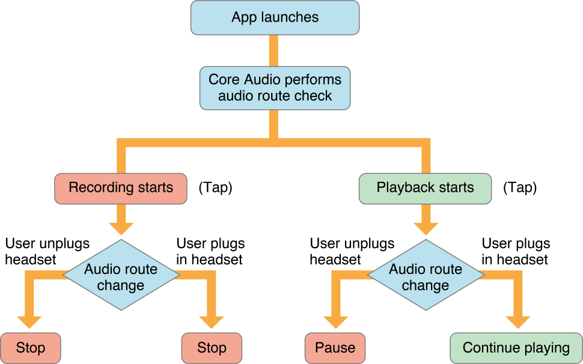

你可以使用音频会话来向系统传达你打算如何在你的应用程序中使用音频。这个音频会话作为你的应用程序和操作系统之间的一个中介。你使用它向操作系统传达应用音频的本质，而无需详细说明特定行为或与音频硬件的必要交互。将这些细节的管理委托给音频会话可以确保用户音频体验的最佳管理。


# 概览

你使用[AVAudioSession](https://developer.apple.com/documentation/avfoundation/avaudiosession)的实例与应用程序的音频会话交互:

- 配置音频会话类别和模式，以与系统通信，您打算如何在您的应用程序中使用音频
- 激活你的应用程序的音频会话，把你的类别和模式配置付诸行动
- 订阅并响应重要的音频会话通知，如音频中断和路由更改
- 执行高级音频设备配置，如设置采样率、I/O缓冲区持续时间和通道数


## 音频会话管理音频行为

音频会话是应用和操作系统之间的中介，用于配置应用的音频行为。在启动时，你的应用程序会自动提供一个单独的音频会话。您可以配置它以提供所需的行为，并激活它以将该行为付诸行动。

> [Activating an Audio Session](https://developer.apple.com/library/archive/documentation/Audio/Conceptual/AudioSessionProgrammingGuide/ConfiguringanAudioSession/ConfiguringanAudioSession.html#//apple_ref/doc/uid/TP40007875-CH2-SW1)


## Categories表达音频角色

表达音频行为的主要机制是 audio session category。通过设置category，您可以指示应用程序使用输入或输出路径，是否希望音乐与音频一起继续播放，等等。你指定的行为应该满足用户的期望

AVFoundation定义了许多音频会话类别，以及一组覆盖和修改开关，让您根据您的应用程序的个性或角色定制音频行为。各种类别支持播放、录音和带录音的播放。当系统知道应用程序的音频角色时，它会为你提供对硬件资源的适当访问。该系统还确保设备上的其他音频以一种适合你的应用程序的方式运行，并与用户的期望一致。

通过指定模式，可以进一步定制某些类别，该模式用于专门化给定类别的行为。例如，当一个应用程序使用视频录制模式时，系统可能会选择一个不同的内置麦克风，而不是使用默认模式。该系统还可以进行麦克风信号处理，用于视频录制用例

> [Configuring an Audio Session](https://developer.apple.com/library/archive/documentation/Audio/Conceptual/AudioSessionProgrammingGuide/AudioSessionBasics/AudioSessionBasics.html#//apple_ref/doc/uid/TP40007875-CH3-SW1)


## 支持中断处理通知

*audio interruption* 是指你的应用程序的音频会话被停用，它会立即停止你的音频。中断发生时，竞争音频会话从 另一个应用程序被激活。你的应用程序应该通过保存状态、更新用户界面等方式来响应中断。当音频中断开始和结束时被通知，注册到观察[AVAudioSessionInterruptionNotification](https://developer.apple.com/documentation/avfoundation/avaudiosession/1616596-interruptionnotification) 类型的通知

> [Responding to Interruptions](https://developer.apple.com/library/archive/documentation/Audio/Conceptual/AudioSessionProgrammingGuide/HandlingAudioInterruptions/HandlingAudioInterruptions.html#//apple_ref/doc/uid/TP40007875-CH4-SW1)


## 音频线路更改处理通知

当用户通过连接或断开设备，或插入或断开耳机来启动音频路线变化时，他们会有特殊的期望。通过注册观察 [AVAudioSessionRouteChangeNotification](https://developer.apple.com/documentation/avfoundation/avaudiosession/1616493-routechangenotification) 类型的通知来处理线路变化

> [Responding to Route Changes](https://developer.apple.com/library/archive/documentation/Audio/Conceptual/AudioSessionProgrammingGuide/HandlingAudioHardwareRouteChanges/HandlingAudioHardwareRouteChanges.html#//apple_ref/doc/uid/TP40007875-CH5-SW1)


## Audio Sessions 控制设备配置

应用程序不能直接控制设备的硬件，但是一个音频会话为你提供了一个接口来请求你首选的硬件设备设置。通过该接口，您可以对音频设备进行高级配置，例如设置采样率、I/O缓冲时间、音频通道数等。

> [Configuring Device Hardware](https://developer.apple.com/library/archive/documentation/Audio/Conceptual/AudioSessionProgrammingGuide/OptimizingForDeviceHardware/OptimizingForDeviceHardware.html#//apple_ref/doc/uid/TP40007875-CH6-SW1)


## Audio Sessions 保护用户隐私

录制音频的应用程序，无论是单独录制还是与视频结合，在录制之前都需要明确的用户许可。在用户授予你的应用程序录制权限之前，应用程序只能录制沉默。AVAudioSession提供了请求权限并确定用户隐私设置的接口。

> [Protecting User Privacy](https://developer.apple.com/library/archive/documentation/Audio/Conceptual/AudioSessionProgrammingGuide/RequestingPermission/RequestingPermission.html#//apple_ref/doc/uid/TP40007875-CH13-SW1)


# 配置Audio Session

音频会话类别是识别应用程序音频行为的关键。通过设置类别，你可以向系统表明你的音频意图，比如当铃声/静音开关被打开时，你的音频是否应该继续。几个音频会话类别，以及一组覆盖和修改开关，让您定制您的应用程序的音频行为。

如 [Table B-1](https://developer.apple.com/library/archive/documentation/Audio/Conceptual/AudioSessionProgrammingGuide/AudioSessionCategoriesandModes/AudioSessionCategoriesandModes.html#//apple_ref/doc/uid/TP40007875-CH10-SW3) 所示，每个音频会话类别指定了对以下行为的特定响应集:

- *Interrupts nonmixable apps audio*: 如果yes，当你的app激活它的音频会话时，nonmixable apps会被中断
- *Interrupts nonmixable apps audio*：如果yes，当用户激活静音开关时，您的音频将被静音。(在iPhone上，这个开关被称为铃声/静音开关)
- *Supports audio input:*：如果yes，则允许app音频输入(录音)
- *Supports audio output*：如果yes，允许app音频输出(播放)

大多数应用程序只需要在启动时设置一次类别，但你可以根据需要经常更改类别。你可以在音频会话处于活动状态时更改它; 但是，在改变类别或其他会话属性之前，最好先禁用音频会话。在会话被停用时进行这些更改可以防止对音频系统进行不必要的重新配置。


## Audio Session 默认行为

所有iOS、tvOS和watchOS应用程序都有一个默认的音频会话，如下所示:

- 支持音频播放，不允许录音
- 在iOS中，将铃声/静音开关设置为静音模式，使应用程序播放的任何音频静音
- 在iOS系统中，当设备被锁定时，应用程序的音频会被静音
- 当你的应用程序播放音频，任何其他后台播放的音频（如正在播放的Music应用程序）是静音的

默认的音频会话具有有用的行为，但在大多数情况下，你应该自定义它以更好地满足应用的需求。要改变这种行为，你需要配置应用程序的音频会话。


## 配置你的Audio Session

配置音频会话的主要方法是设置它的类别。音频会话类别定义了一组音频行为。与每个类别相关的精确行为不在你的应用程序的控制之下，而是由操作系统设置的。苹果可能会在未来的操作系统版本中完善类别行为，所以你的最佳策略是选择最能准确描述你想要的音频行为意图的类别。[Audio Session Categories and Modes](https://developer.apple.com/library/archive/documentation/Audio/Conceptual/AudioSessionProgrammingGuide/AudioSessionCategoriesandModes/AudioSessionCategoriesandModes.html#//apple_ref/doc/uid/TP40007875-CH10-SW1) 总结了每个类别的行为细节

虽然类别为你的应用设置了基本的音频行为，但你可以通过设置类别的模式进一步专门化这些行为。例如，IP语音(VoIP)应用程序将使用[AVAudioSessionCategoryPlayAndRecord](https://developer.apple.com/documentation/avfoundation/avaudiosession/category/1616568-playandrecord)。您可以通过将音频会话的模式设置为AVAudioSessionModeVoiceChat 来专门化VoIP应用程序的这类行为。这种模式确保通过系统提供的信号处理来优化语音信号。

通过在会话中设置一个或多个类别选项，某些类别支持覆盖它们的默认行为(参见[AVAudioSessionCategoryOptions](https://developer.apple.com/documentation/avfoundation/avaudiosession/categoryoptions))。例如，当会话被激活时，与[AVAudioSessionCategoryPlayback](https://developer.apple.com/documentation/avfoundation/avaudiosessioncategoryplayback)类别相关联的默认行为会中断其他系统音频。在大多数情况下，播放应用程序需要这种行为。然而，如果你想让你的音频与其他系统音频混合，你可以通过在会话上设置[AVAudioSessionCategoryOptionMixWithOthers](https://developer.apple.com/documentation/avfoundation/avaudiosessioncategoryoptions/avaudiosessioncategoryoptionmixwithothers)选项来覆盖这个行为

要设置音频会话类别(以及它的模式和选项)，调用 [setCategory:mode:options:error:](https://developer.apple.com/documentation/avfoundation/avaudiosession/1771734-setcategory) 方法，如清单1-1所示

**Listing 1-1** Setting the audio session category using the AVFoundation framework

``` swift
// Access the shared, singleton audio session instance
let session = AVAudioSession.sharedInstance()
do {
    // Configure the audio session for movie playback
    try session.setCategory(AVAudioSessionCategoryPlayback,
                            mode: AVAudioSessionModeMoviePlayback,
                            options: [])
} catch let error as NSError {
    print("Failed to set the audio session category and mode: \(error.localizedDescription)")
}
```


## Expanding Options Using the Multiroute Category （使用多线路类别扩展选项）

multiroute类别的工作原理与其他类别略有不同。所有其他类别都遵循“最后胜出”规则，即插入输入或输出线路的最后一个设备是主导设备。然而，multiroute类别使应用程序能够使用所有连接的输出端口，而不是仅使用最后一个端口。例如，如果你正在通过HDMI输出路径听音频，并插入一套耳机，你的应用程序继续通过HDMI输出路径播放音频，同时也通过耳机播放音频

有了multiroute类别，你的应用程序也可以将不同的音频流发送到不同的输出线路。例如，你的应用程序可以将一个音频流发送到左边的耳机，另一个发送到右边的耳机，第三个发送到HDMI线路。图1-1是将多个音频流发送到不同的音频线路的示例

**Figure 1-1** Sending different audio streams to different audio routes



根据设备和任何连接的附件，以下是有效的输出路径组合:

- USB 和 耳机
- HDMI 和 耳机
- LineOut 和 耳机

multiroute类别支持使用单个输入端口

> 内置扬声器只能在没有其他合格的输出端口(USB, HDMI, LineOut)连接时使用


## 为AirPlay选择类别和模式

只有特定的类别和模式支持AirPlay。以下类别支持AirPlay的镜像和非镜像版本:

- `AVAudioSessionCategorySoloAmbient`
- `AVAudioSessionCategoryAmbient`
- `AVAudioSessionCategoryPlayback`

`AVAudioSessionCategoryPlayAndRecord` 类别和以下模式只支持AirPlay的镜像版本:

- `AVAudioSessionModeDefault`
- `AVAudioSessionModeVideoChat`
- `AVAudioSessionModeGameChat`

> 注意:从iOS 10开始，当使用AVAudioSessionCategoryPlayAndRecord类别时，通过激活AVAudioSessionCategoryOptionAllowAirPlay选项，你可以启用非镜像的AirPlay输出。


## 开启 Background Audio

iOS和tvOS应用程序需要你为一些后台操作启用某些功能。播放应用程序需要的一个常见功能是后台播放音频。启用此功能后，当用户切换到另一个应用程序或锁定iOS设备时，应用程序的音频可以继续。在iOS中，支持AirPlay流媒体和Picture in Picture播放等高级播放功能也需要这种能力。

配置这些功能的最简单方法是使用Xcode。在Xcode中选择应用程序的目标，并选择**Capabilities** tab。在Capabilities标签下，设置 Background Modes 切换到ON，并从可用模式列表中选择 “Audio, AirPlay, and Picture in Picture” 选项



启用了这种后台模式，你的音频会话配置了一个适当的类别，你的应用程序已经准备好播放后台音频

> 注意:要允许视频演示文稿的音频部分在后台中播放，请参见 *[Media Playback Programming Guide](https://developer.apple.com/library/archive/documentation/AudioVideo/Conceptual/MediaPlaybackGuide/Contents/Resources/en.lproj/Introduction/Introduction.html#//apple_ref/doc/uid/TP40016757)* 的 [Playing Background Audio](https://developer.apple.com/library/archive/documentation/AudioVideo/Conceptual/MediaPlaybackGuide/Contents/Resources/en.lproj/RefiningTheUserExperience/RefiningTheUserExperience.html#//apple_ref/doc/uid/TP40016757-CH6-SW9)


# 激活 Audio Session

通过设置 category、options 和 mode，您已经配置了一个音频会话。要将配置付诸行动，您现在需要激活您的音频会话


## 系统如何解决竞争的音频需求

当你的应用程序启动时，内置的应用程序 (Messages、Music、Safari、手机) 可能会在后台运行。每一个都可能产生音频: 一条消息到达，你10分钟前开始播放的播客继续播放，等等。

如果你把一个设备想象成一个机场，它的应用程序代表着滑行的飞机，那么这个系统就相当于一个控制塔台。你的应用程序可以发出音频请求并声明它想要的优先级，但最终决定权来自于系统。你可以使用音频会话与“控制塔”进行交流。图2-1展示了一个典型的场景-你的应用程序要求使用音频时，音乐应用程序已经在播放。在这个场景中，您的应用程序中断了音乐应用程序。

**Figure 2-1** The system manages competing audio demands



在图的第1步中，你的应用程序请求激活它的音频会话。例如，你会在应用程序启动时发出这样的请求，或者回应用户在音频录制和播放应用程序中点击播放按钮。在第2步中，系统会考虑激活请求。特别地，它会考虑你为自己的音频会话分配的类别。在图2-1中，你的应用程序使用了一个需要其他音频静音的类别。

在步骤3和步骤4中，系统将关闭音乐应用程序的音频会话，停止其音频播放。最后，在第5步，系统激活你的应用程序的音频会话和播放可以开始


## 激活和停用你的 Audio Session

虽然AVFoundation播放和录音类会自动激活您的音频会话，但手动激活它可以让您有机会测试激活是否成功。然而，如果你的应用有一个 play / pause UI元素，那么编写代码，让用户在会话被激活前必须按play。同样，当更改音频会话的 active/inactive 状态时，检查以确保调用成功。编写代码来优雅地处理系统拒绝激活会话的情况

系统将在闹钟或日历闹钟或来电时停用音频会话。当用户解除警报，或选择忽略电话呼叫时，系统将允许您的会话重新激活。是否在中断结束时重新激活会话取决于应用类型，如[Audio Guidelines By App Type](https://developer.apple.com/library/archive/documentation/Audio/Conceptual/AudioSessionProgrammingGuide/AudioGuidelinesByAppType/AudioGuidelinesByAppType.html#//apple_ref/doc/uid/TP40007875-CH11-SW1) 中描述

**Listing 2-1** Activating an audio session

``` swift
let session = AVAudioSession.sharedInstance()
do {
    // 1) Configure your audio session category, options, and mode
    // 2) Activate your audio session to enable your custom configuration
    try session.setActive(true)
} catch let error as NSError {
    print("Unable to activate audio session:  \(error.localizedDescription)")
}
```

要禁用您的音频会话，请将 false 传递给 setActive 方法

当使用AVFoundation对象(AVPlayer、AVAudioRecorder等)播放或录制音频时，系统会在中断结束时重新激活音频会话。然而，如果你注册了通知消息并明确地重新激活你的音频会话，你可以验证重新激活成功，你可以更新你的应用程序的状态和用户界面。更多信息请参见图3-1。

许多应用程序从来不需要明确地禁用它们的音频会话。重要的例外，包括VoIP应用程序、导航应用程序，在某些情况下还有播放和录音应用程序。

- 确保VoIP应用程序的音频会话(通常在后台运行)只有在应用程序处理呼叫时才活跃。在后台，一个VoIP应用程序的音频会话不应该处于激活状态。
- 确保使用录音类别的应用程序的音频会话只有在录音时才活跃。在录音开始前和停止时，确保您的会话是非活动的，以允许其他声音，如传入消息提醒，播放。
- 如果一个应用程序支持后台音频播放或录音，当进入后台时，如果应用程序不积极使用音频(或准备使用音频)，停用其音频会话。这样做可以让系统释放音频资源，以便其他进程可以使用它们。当应用进程被操作系统挂起时，它也可以防止应用的音频会话被停用(参见[AVAudioSessionInterruptionWasSuspendedKey](https://developer.apple.com/documentation/avfoundation/avaudiosessioninterruptionwassuspendedkey))。


## 查看是否有其他声音在播放

当你的应用激活时，声音可能已经在设备上播放了。例如，当用户启动你的应用程序时，音乐应用程序可能正在播放一首歌，或者Safari可能正在播放流媒体音频。如果你的应用是一款游戏，那么知道是否有其他音频在播放就显得尤为重要。许多游戏都有音乐音轨和音效。《*iOS Human Interface Guidelines*》建议你假设用户在玩游戏时，会期待其他音频和游戏音效一起继续。

在你的应用程序代理方法 [applicationDidBecomeActive:](https://developer.apple.com/documentation/uikit/uiapplicationdelegate/1622956-applicationdidbecomeactive)中，检查音频会话的[secondaryAudioShouldBeSilencedHint](https://developer.apple.com/documentation/avfoundation/avaudiosession/1616600-secondaryaudioshouldbesilencedhi) 属性来确定音频是否已经播放。当另一个带有非混合音频会话的应用程序正在播放音频时，该值为true。应用程序应该使用这个属性作为一个提示来静音音频，这是次要的功能的应用程序。例如，一个使用AVAudioSessionCategoryAmbient 的游戏可以使用这个属性来决定它是否应该静音它的音乐，而保持其音效不静音。

你也可以订阅 [AVAudioSessionSilenceSecondaryAudioHintNotification](https://developer.apple.com/documentation/avfoundation/avaudiosessionsilencesecondaryaudiohintnotification) 类型的通知，以确保当可选的次要音频静音应该开始或结束时，你的应用程序被通知。此通知只发送给当前在前台并有活动音频会话的已注册监听器

``` swift
func setupNotifications() {
    NotificationCenter.default.addObserver(self,
                                           selector: #selector(handleSecondaryAudio),
                                           name: .AVAudioSessionSilenceSecondaryAudioHint,
                                           object: AVAudioSession.sharedInstance())
}
 
func handleSecondaryAudio(notification: Notification) {
    // Determine hint type
    guard let userInfo = notification.userInfo,
        let typeValue = userInfo[AVAudioSessionSilenceSecondaryAudioHintTypeKey] as? UInt,
        let type = AVAudioSessionSilenceSecondaryAudioHintType(rawValue: typeValue) else {
            return
    }
 
    if type == .begin {
        // Other app audio started playing - mute secondary audio
    } else {
        // Other app audio stopped playing - restart secondary audio
    }
}
```

这个通知的userInfo字典包含了一个 [AVAudioSessionSilenceSecondaryAudioHintType](https://developer.apple.com/documentation/avfoundation/avaudiosession/silencesecondaryaudiohinttype) 值，用于[AVAudioSessionSilenceSecondaryAudioHintTypeKey](https://developer.apple.com/documentation/avfoundation/avaudiosessionsilencesecondaryaudiohinttypekey)。使用音频提示类型来确定次要音频静音应该开始还是结束


# Responding to Interruptions（响应中断）

添加音频会话代码来处理中断，可以确保你的应用程序的音频在电话到来、闹钟或日历闹钟响起或其他应用程序激活其音频会话时继续正常运行。

音频中断是指你的应用程序的音频会话被停用，它会立即停止你的音频。中断发生时，竞争音频会话从一个应用程序被激活。当您的会话处于非活动状态后，系统会发送一条“您被中断了”的消息，您可以通过保存状态、更新用户界面等方式响应该消息。

你的应用程序可能会在中断后被暂停。当用户接听电话时就会发生这种情况。如果用户忽略来电，或解除警报，系统会发出“中断结束”的信息，你的应用程序继续运行。要恢复音频，必须重新激活音频会话。


## 中断生命周期

图3-1显示了播放应用程序音频会话中断之前、期间和之后的事件顺序。

**Figure 3-1** An audio session is interrupted



中断事件 (在本例中是FaceTime请求的到达)的处理过程如下。经过编号的步骤与图中的数字相对应。

1. 你的应用程序处于激活状态，正在播放音频
2. FaceTime请求到达。系统会激活FaceTime应用的音频会话
3. 系统将关闭您的音频会话。此时，应用程序中的播放已经停止
4. 系统发出通知，表示您的会话已被停用
5. 您的通知处理程序将采取适当的操作。例如，它可以更新用户界面，并在停止播放时保存恢复播放所需的信息
6. 如果用户拒绝中断或忽略FaceTime请求，系统就会发出通知，表明中断已经结束
7. 通知处理程序在中断结束时采取适当的操作。例如，它可能更新用户界面，重新激活音频会话，并恢复播放
8. (图中未示)如果用户在第6步接受了一个电话，而不是放弃中断，你的应用程序将暂停

## 音频中断处理技术

通过注册来观察由AVAudioSession发布的中断通知来处理中断。您在中断代码中所做的工作取决于您所使用的音频技术，以及您将其用于播放、录音、音频格式转换、读取流音频包等方面的内容。一般来说，从用户的角度来看，您需要确保最小的可能中断和最优雅的可能恢复。

表3-1总结了中断期间适当的音频会话行为。如果您使用AVFoundation播放或录制对象，其中一些步骤将由系统自动处理。

Table 3-1  What should happen during an audio session interruption

| *After interruption starts* | - Save state and context<br>- Update user interface          |
| --------------------------- | ------------------------------------------------------------ |
| *After interruption ends*   | - Restore state and context<br>- Update user interface<br>- Reactivate audio session, if appropriate for the app |

表3-2总结了如何根据技术处理音频中断。本章的其余部分将提供详细信息。

Table 3-2  Audio interruption handling techniques according to audio technology

| Audio technology                     | How interruptions work                                       |
| :----------------------------------- | :----------------------------------------------------------- |
| AVFoundation framework               | 系统自动暂停播放或录音中断，并重新激活您的音频会话时，您恢复播放或录音。<br>如果你想保存和恢复应用程序启动之间的播放位置，在中断和应用程序退出时保存播放位置。 |
| Audio Queue Services, I/O audio unit | 这些技术使您的应用程序控制处理中断。您负责保存播放或录音位置，并在中断结束后重新激活您的音频会话。 |
| System Sound Services                | 当中断开始时，使用系统声音服务播放的声音将静音。如果中断结束，这些声音可以再次播放。应用程序不能影响使用此播放技术的声音的中断行为 |

## 处理 Siri 的中断

当Siri中断应用程序的播放时，你必须在音频会话处于中断状态时跟踪Siri发出的任何远程控制命令。在中断过程中，跟踪Siri发出的任何命令，并在中断结束时做出相应的响应。例如，在中断期间，用户要求Siri暂停应用程序的音频播放。当你的应用程序被通知中断已经结束，它不应该自动恢复播放。相反，你的应用程序的UI应该表明应用程序处于暂停状态。

## 监听 Audio Interruptions

要处理音频中断，首先注册观察类型为 [AVAudioSessionInterruptionNotification](https://developer.apple.com/documentation/avfoundation/avaudiosession/1616596-interruptionnotification) 的通知

``` swift
func registerForNotifications() {
    NotificationCenter.default.addObserver(self,
                                           selector: #selector(handleInterruption),
                                           name: .AVAudioSessionInterruption,
                                           object: AVAudioSession.sharedInstance())
}
 
func handleInterruption(_ notification: Notification) {
    // Handle interruption
}
```

发布的NSNotification实例包含一个填充的userInfo字典，提供中断的详细信息。您可以通过从userInfo字典中检索 AVAudioSessionInterruptionType 值来确定中断的类型。中断类型指示中断是开始还是结束

``` swift
func handleInterruption(_ notification: Notification) {
    guard let info = notification.userInfo,
        let typeValue = info[AVAudioSessionInterruptionTypeKey] as? UInt,
        let type = AVAudioSessionInterruptionType(rawValue: typeValue) else {
            return
    }
    if type == .began {
        // Interruption began, take appropriate actions (save state, update user interface)
    }
    else if type == .ended {
        guard let optionsValue =
            userInfo[AVAudioSessionInterruptionOptionKey] as? UInt else {
                return
        }
        let options = AVAudioSessionInterruptionOptions(rawValue: optionsValue)
        if options.contains(.shouldResume) {
            // Interruption Ended - playback should resume
        }
    }
}
```

如果中断类型是 [AVAudioSessionInterruptionTypeEnded](https://developer.apple.com/documentation/avfoundation/avaudiosessioninterruptiontype/avaudiosessioninterruptiontypeended) , userInfo字典可能包含一个[AVAudioSessionInterruptionOptions](https://developer.apple.com/documentation/avfoundation/avaudiosession/interruptionoptions)值。AVAudioSessionInterruptionOptionShouldResume的一个选项值是一个提示，指示你的应用程序是否应该自动恢复播放，如果它已经播放时被中断。媒体播放应用程序应该总是在中断后开始播放之前寻找这个标志。如果它不存在，播放不应该再次开始，直到用户发起。不呈现播放界面的应用程序，如游戏，可以忽略这个标志，并在中断结束时重新激活和恢复播放。

> 注意:不能保证开始中断会有相应的结束中断。您的应用程序需要知道切换到前台运行状态或用户按下播放按钮。无论哪种情况，确定你的应用程序是否应该重新激活它的音频会话。


## Responding to a Media Server Reset

媒体服务器通过共享的服务器进程提供音频和其他多媒体功能。虽然很少见，但当你的应用程序处于激活状态时，媒体服务器也有可能被重置。注册[AVAudioSessionMediaServicesWereResetNotification](https://developer.apple.com/documentation/avfoundation/avaudiosession/1616540-mediaserviceswereresetnotificati)通知，以监视媒体服务器复位。在收到通知后，你的应用程序需要做以下工作:

- 处理孤立的音频对象(如播放器、录音机、转换器或音频队列)并创建新的对象
- 重置任何被跟踪的内部音频状态，包括[AVAudioSession](https://developer.apple.com/documentation/avfoundation/avaudiosession)的所有属性
- 在适当的时候，使用[setActive:error:](https://developer.apple.com/documentation/avfoundation/avaudiosession/1616597-setactive)方法重新激活AVAudioSession实例

> 重要提示:应用程序不需要重新注册任何AVAudioSession通知或重置AVAudioSession属性上的键值观察者。

你也可以注册[AVAudioSessionMediaServicesWereLostNotification](https://developer.apple.com/documentation/avfoundation/avaudiosessionmediaserviceswerelostnotification)通知，如果你想知道什么时候媒体服务器第一次变得不可用。然而，大多数应用程序只需要响应重置通知。只有当应用程序必须响应媒体服务器丢失后发生的用户事件，但在媒体服务器被重置之前，才使用丢失通知。

> 注意:您可以触发媒体服务器崩溃并重新启动，从开发人员菜单中选择重置媒体服务。使用这个工具可以让你很容易地确保当媒体服务被重置时你的应用程序适当地响应。


# Responding to Route Changes（响应线路改变）

当你的应用程序运行时，用户可能会插入或拔掉耳机，或者使用带有音频连接的对接站。iOS人机界面指南描述了应用程序应该如何响应此类事件。为了实现这些建议，编写音频会话代码来处理音频硬件路由变化。某些类型的应用程序，比如游戏，并不总是需要响应路线的变化。然而，其他类型的应用程序，如媒体播放器，必须响应所有的路径变化。

## 各种音频硬件线路变化

音频硬件路径是音频信号的有线电子路径。当设备用户插入或拔出耳机时，系统会自动改变音频硬件路由。如果你注册了[AVAudioSessionRouteChangeNotification](https://developer.apple.com/documentation/avfoundation/avaudiosession/1616493-routechangenotification)类型的观察通知，你的应用程序可以收到此类更改的通知。

录像播放过程中各种路由变化的事件顺序如图4-1所示。图的底部显示了四种可能的结果，它们是由您编写的属性侦听器回调函数所采取的操作产生的。

**Figure 4-1** Handling audio hardware route changes




如图所示，在应用启动后，系统首先决定音频路径。它会在应用程序运行时继续监控活动线路。首先考虑用户点击应用程序中的Record按钮的情况，该按钮由图左侧的“开始录音”框表示。

在录音过程中，用户可以插入或拔下耳机—如图左下角的菱形决策元素。因此，系统会发送一条线路变更通知，通知内容包括变更原因和前一条线路。你的应用程序应该停止录制。

播放的情况类似，但有不同的结果，如图的右侧所示。如果用户在播放过程中拔下耳机，你的应用程序应该暂停音频。如果用户在播放过程中插入耳机，您的应用程序应该允许播放继续。

## Observing Audio Route Changes

音频路由的变化有很多原因，包括用户插入一对耳机、连接蓝牙LE耳机或拔掉USB音频接口。知道这些变化发生的时间可能对你的应用程序很重要，这样你就可以更新它的用户界面或改变它的内部状态。通过注册 [AVAudioSessionRouteChangeNotification](https://developer.apple.com/documentation/avfoundation/avaudiosession/1616493-routechangenotification) 类型的观察通知，你可以得到音频线路变化的通知

``` swift
func setupNotifications() {
    NotificationCenter.default.addObserver(self,
                                           selector: #selector(handleRouteChange),
                                           name: .AVAudioSessionRouteChange,
                                           object: AVAudioSession.sharedInstance())
}
 
func handleRouteChange(_ notification: Notification) {
 
}
```

发布的通知包含一个填充的userInfo字典，提供线路更改的详细信息。您可以通过从userInfo字典中检索AVAudioSessionRouteChangeReason值来确定更改的原因。当一个新设备连接时，原因是[AVAudioSessionRouteChangeReasonNewDeviceAvailable](https://developer.apple.com/documentation/avfoundation/avaudiosession/routechangereason/newdeviceavailable)，当一个设备被删除时，它是[AVAudioSessionRouteChangeReasonOldDeviceUnavailable](https://developer.apple.com/documentation/avfoundation/avaudiosession/routechangereason/olddeviceunavailable)。

``` swift
func handleRouteChange(_ notification: Notification) {
    guard let userInfo = notification.userInfo,
        let reasonValue = userInfo[AVAudioSessionRouteChangeReasonKey] as? UInt,
        let reason = AVAudioSessionRouteChangeReason(rawValue:reasonValue) else {
            return
    }
    switch reason {
    case .newDeviceAvailable:
        // Handle new device available.
    case .oldDeviceUnavailable:
        // Handle old device removed.
    default: ()
    }
}
```

当有新设备可用时，您可以查询音频会话的 currentRoute 属性，以确定音频输出当前路由到何处。它返回一个[AVAudioSessionRouteDescription](https://developer.apple.com/documentation/avfoundation/avaudiosessionroutedescription)对象，列出所有音频会话的输入和输出。当一个设备被移除时，你从userInfo字典中检索之前路由的AVAudioSessionRouteDescription对象。在这两种情况下，您都要查询路由描述的outputs属性，它返回[AVAudioSessionPortDescription](https://developer.apple.com/documentation/avfoundation/avaudiosessionportdescription)对象的数组，提供音频输出路由的详细信息。

``` swift
func handleRouteChange(notification: NSNotification) {
    guard let userInfo = notification.userInfo,
        let reasonValue = userInfo[AVAudioSessionRouteChangeReasonKey] as? UInt,
        let reason = AVAudioSessionRouteChangeReason(rawValue:reasonValue) else {
            return
    }
    switch reason {
    case .newDeviceAvailable:
        let session = AVAudioSession.sharedInstance()
        for output in session.currentRoute.outputs where output.portType == AVAudioSessionPortHeadphones {
            headphonesConnected = true
        }
    case .oldDeviceUnavailable:
        if let previousRoute =
            userInfo[AVAudioSessionRouteChangePreviousRouteKey] as? AVAudioSessionRouteDescription {
            for output in previousRoute.outputs where output.portType == AVAudioSessionPortHeadphones {
                headphonesConnected = false
            }
        }
    default: ()
    }
}
```

> 重要提示:如果线路改变的原因是AVAudioSessionRouteChangeReasonOldDeviceUnavailable，媒体播放应用应该暂停播放，但如果原因是AVAudioSessionRouteChangeReasonOverride，则不应该。

> 注意:音频路由的更改也可能导致音频会话的采样率、I/O缓冲区持续时间、通道计数或其他硬件相关值的更改。如果这些值对你的应用很重要，在路由变化后查询它们，看看它们的值是否发生了变化。

# Configuring Device Hardware

使用音频会话 properties，你可以在运行时为设备硬件优化应用程序的音频行为。这样做可以让你的代码适应它所运行的设备的特性，以及用户在应用运行时所做的更改(如插入耳机或对接设备)。

使用AVAudioSession可以做以下事情：

- 为 采样率 和 I/O缓冲区时间 指定首选硬件设置
- 查询许多硬件特性，如输入和输出延迟、输入和输出通道计数、硬件采样率、硬件音量设置和音频输入的可用性

## Choosing Preferred Audio Hardware Values

使用音频会话来指定您首选的设备设置，例如采样率和硬件I/O缓冲区持续时间。表5-1描述了这些首选项的好处和代价。

Table 5-1  Choosing preferred hardware values

| Setting      | Preferred sample rate                                        | Preferred I/O buffer duration                                |
| :----------- | :----------------------------------------------------------- | :----------------------------------------------------------- |
| *High value* | *Example: 48 kHz*<br>**+** High audio quality**<br>–** Large file or buffer size | *Example: 500 mS*<br>**+** Less-frequent file access<br>**–** Longer latency |
| *Low value*  | *Example: 8 kHz*<br>**+** Small file or buffer size**<br>–** Low audio quality | *Example: 5 mS*<br>**+** Low latency<br>**–** Frequent file access |

例如，如果音频质量在你的应用中非常重要，如果大文件或缓冲区大小不是重要问题，你可以指定高采样率。

> 注意:默认的音频I/O缓冲持续时间(44.1 kHz音频大约0.02秒)为大多数应用程序提供了足够的响应能力。您可以为延迟关键型应用程序(如实时乐器监控)设置较低的I/O持续时间，但对于大多数应用程序，您永远不需要修改此设置。

## Setting Preferred Audio Hardware Values

在您激活音频会话之前设置首选的硬件值。如果你已经在运行音频会话，请将其停用。对首选值的更改在音频会话激活后生效，此时您可以验证更改。清单5-1显示了如何设置首选硬件值以及如何验证它们。

**Listing 5-1** Setting and verifying audio hardware values

``` swift
let session = AVAudioSession.sharedInstance()
 
// Configure category and mode
do {
    try session.setCategory(AVAudioSessionCategoryRecord, mode: AVAudioSessionModeDefault)
} catch let error as NSError {
    print("Unable to set category:  \(error.localizedDescription)")
}
 
// Set preferred sample rate
do {
    try session.setPreferredSampleRate(44_100)
} catch let error as NSError {
    print("Unable to set preferred sample rate:  \(error.localizedDescription)")
}
 
// Set preferred I/O buffer duration
do {
    try session.setPreferredIOBufferDuration(0.005)
} catch let error as NSError {
    print("Unable to set preferred I/O buffer duration:  \(error.localizedDescription)")
}
 
// Activate the audio session
do {
    try session.setActive(true)
} catch let error as NSError {
    print("Unable to activate session. \(error.localizedDescription)")
}
 
// Query the audio session's ioBufferDuration and sampleRate properties
// to determine if the preferred values were set
print("Audio Session ioBufferDuration: \(session.ioBufferDuration), sampleRate: \(session.sampleRate)")
```

> 注意:当竞争音频会话设置首选硬件值时，系统优先考虑非混合会话。使用[AVAudioSessionCategoryAmbient](https://developer.apple.com/documentation/avfoundation/avaudiosessioncategoryambient)类别或[AVAudioSessionCategoryOptionMixWithOthers](https://developer.apple.com/documentation/avfoundation/avaudiosessioncategoryoptions/avaudiosessioncategoryoptionmixwithothers) 选项的音频会话不太可能有其首选的硬件设置。

## Selecting and Configuring Microphones

在带有两个或多个内置麦克风的设备上，iOS会通过使用音频会话模式自动选择麦克风。模式指定用于输入的数字信号处理(DSP)和可能的路径。输入和路由为每个模式的用例进行了优化。设置模式也可能会影响正在使用的路由的其他方面。

开发人员还可以手动选择麦克风，甚至选择硬件支持的首选麦克风极性模式

> 重要提示:在使用任何输入选择功能之前，为您的应用程序设置音频会话类别和模式，然后激活音频会话。

### Setting a Preferred Input

要发现内置或连接的输入端口，请使用音频会话的[availableInputs](https://developer.apple.com/documentation/avfoundation/avaudiosession/1616557-availableinputs)属性。这个属性返回[AVAudioSessionPortDescription](https://developer.apple.com/documentation/avfoundation/avaudiosessionportdescription)对象的数组，描述设备的可用输入端口。端口可以通过它们的[portType](https://developer.apple.com/documentation/avfoundation/avaudiosessionportdescription/1616445-porttype)属性来识别。要设置首选输入端口(内置麦克风、有线麦克风、USB输入等等)，请使用音频会话的 [setPreferredInput:error:](https://developer.apple.com/documentation/avfoundation/avaudiosession/1616491-setpreferredinput) 方法。

### Setting a Preferred Data Source

一些端口，如内置麦克风和一些USB配件，支持数据源。应用程序可以通过查询端口描述的[dataSources](https://developer.apple.com/documentation/avfoundation/avaudiosessionportdescription/1616570-datasources)属性来发现可用的数据源。对于内置麦克风，返回的数据源描述对象表示每个单独的麦克风。不同的设备对内置麦克风返回不同的值。例如，iPhone 4和iPhone 4S有两个麦克风:底部和顶部。iPhone 5有三个麦克风:底部、前部和后部。

单个内置麦克风可以通过数据源描述的 [location](https://developer.apple.com/documentation/avfoundation/avaudiosessiondatasourcedescription/1616495-location) 属性(上、下)和方向属性(前、后等)的[orientation](https://developer.apple.com/documentation/avfoundation/avaudiosessiondatasourcedescription/1616456-orientation)来标识。应用程序可以通过使用AVAudioSessionPortDescription对象的 [setPreferredDataSource:error:](https://developer.apple.com/documentation/avfoundation/avaudiosessionportdescription/1616554-setpreferreddatasource) 方法来设置首选数据源

### Setting a Preferred Polar Pattern

一些iOS设备支持为一些内置麦克风配置polar模式。麦克风的polar模式定义了它相对于声源方向对声音的灵敏度。当前一代iphone支持设置前置和后置麦克风的首选polar模式。可用的模式使用数据源描述对象的[supportedPolarPatterns](https://developer.apple.com/documentation/avfoundation/avaudiosessiondatasourcedescription/1616450-supportedpolarpatterns)属性返回。此属性将返回数据源支持的polar模式的数组，如cardioid或omnidirectional，或在没有可选择模式时返回nil。如果数据源有许多受支持的polar模式，您可以使用数据源描述的 [setPreferredPolarPattern:error:](https://developer.apple.com/documentation/avfoundation/avaudiosessiondatasourcedescription/1616516-setpreferredpolarpattern) 方法设置首选polar模式

### Putting It All Together

下面的代码提供了一个简单的示例，说明如何选择特定的麦克风和设置它的polar模式。

``` swift
// Preferred Mic = Front, Preferred Polar Pattern = Cardioid
let preferredMicOrientation = AVAudioSessionOrientationFront
let preferredPolarPattern = AVAudioSessionPolarPatternCardioid
 
// Retrieve your configured and activated audio session
let session = AVAudioSession.sharedInstance()
 
// Get available inputs
guard let inputs = session.availableInputs else { return }
 
// Find built-in mic
guard let builtInMic = inputs.first(where: {
    $0.portType == AVAudioSessionPortBuiltInMic
}) else { return }
 
// Find the data source at the specified orientation
guard let dataSource = builtInMic.dataSources?.first (where: {
    $0.orientation == preferredMicOrientation
}) else { return }
 
// Set data source's polar pattern
do {
    try dataSource.setPreferredPolarPattern(preferredPolarPattern)
} catch let error as NSError {
    print("Unable to preferred polar pattern: \(error.localizedDescription)")
}
 
// Set the data source as the input's preferred data source
do {
    try builtInMic.setPreferredDataSource(dataSource)
} catch let error as NSError {
    print("Unable to preferred dataSource: \(error.localizedDescription)")
}
 
// Set the built-in mic as the preferred input
// This call will be a no-op if already selected
do {
    try session.setPreferredInput(builtInMic)
} catch let error as NSError {
    print("Unable to preferred input: \(error.localizedDescription)")
}
 
// Print Active Configuration
session.currentRoute.inputs.forEach { portDesc in
    print("Port: \(portDesc.portType)")
    if let ds = portDesc.selectedDataSource {
        print("Name: \(ds.dataSourceName)")
        print("Polar Pattern: \(ds.selectedPolarPattern ?? "[none]")")
    }
}
```

在iPhone 6s上运行这段代码会产生以下控制台输出:

```
Port: MicrophoneBuiltIn
Name: Front
Polar Pattern: Cardioid
```


## Running Your App in Simulator

当你添加音频会话支持到你的应用程序，你可以在模拟器或设备上运行你的应用程序。然而，模拟器并不能模拟不同进程中音频会话之间的大多数交互或音频线路变化。当你在模拟器中运行你的应用时，你不能:

- 调用一个中断
- 模拟插入或拔出耳机
- 修改“静默”开关的设置
- 模拟屏幕锁
- 测试音频混合行为（将您的音频与其他应用程序(如Music应用程序)的音频一起播放）

由于模拟器的特性，您可能希望对代码进行条件化，以允许在模拟器中进行部分测试。清单5-2展示了如何做到这一点。

**Listing 5-2** Using a conditional compilation block

``` c
#if arch(i386) || arch(x86_64)
    // Execute subset of code that works in the Simulator
#else
    // Execute device-only code as well as the other code
#endif
```


# 保护用户隐私 (Protecting User Privacy)

为了保护用户隐私，你的应用程序在录制音频之前必须询问并获得用户的许可。如果用户没有授予权限，那么只记录静音。当你使用支持录音的类别，并且应用试图使用输入路径时，系统会自动提示用户获得许可。

## Requesting Permission to Record Audio

您可以使用 [requestRecordPermission:](https://developer.apple.com/documentation/avfoundation/avaudiosession/1616601-requestrecordpermission) 方法手动请求权限，而不是等待系统提示用户允许录制。使用这种方法可以让你的应用程序在不中断应用程序自然流程的情况下获得许可，从而获得更好的用户体验。

``` swift
AVAudioSession.sharedInstance().requestRecordPermission { granted in
    if granted {
        // User granted access. Present recording interface.
    } else {
        // Present message to user indicating that recording
        // can't be performed until they change their preference
        // under Settings -> Privacy -> Microphone
    }
}
```

> 重要提示: 从iOS 10开始，所有访问设备麦克风的应用程序必须静态声明其意图。要做到这一点，应用程序现在必须在其 Info.plist 信息中包含NSMicrophoneUsageDescription，并为这个key提供一个用途字符串。当系统提示用户允许访问时，此字符串将作为弹窗的一部分显示。
>
> 如果应用程序试图在没有此key和value的情况下访问设备的任何麦克风，则应用程序将终止


# Audio Guidelines By App Type

以下章节提供了不同类型的音频应用程序的设计指南。

## Audio Guidelines for Game Apps

大多数游戏都需要用户互动才能在游戏中发生。在设计游戏时使用[AVAudioSessionCategoryAmbient](https://developer.apple.com/documentation/avfoundation/avaudiosessioncategoryambient) 或 [AVAudioSessionCategorySoloAmbient](https://developer.apple.com/documentation/avfoundation/avaudiosessioncategorysoloambient) 类别。当用户打开另一款应用或锁定屏幕时，他们并不希望该应用继续玩下去。通常情况下，他们希望另一款应用的音频能够在游戏应用播放时继续播放

以下是一些推荐的指南:

- 在应用委托的 [applicationDidBecomeActive:](https://developer.apple.com/documentation/uikit/uiapplicationdelegate/1622956-applicationdidbecomeactive) 方法中激活你的音频会话
- 播放应用程序的声音效果，同时允许另一个应用程序的音频播放
- 在其他音频未播放时播放应用程序原声音频，否则允许播放前一个音频
- 在结束中断事件后，始终尝试重新激活和恢复播放声音效果
- 查询音频会话的 [secondaryAudioShouldBeSilencedHint](https://developer.apple.com/documentation/avfoundation/avaudiosession/1616600-secondaryaudioshouldbesilencedhi) 属性，以确定是否应该恢复播放游戏的配乐
- 忽略所有的路线变化，除非应用程序特别需要注意它们
- 在应用启动时显示视频之前设置音频类别。

## Audio Guidelines for User-Controlled Playback and Recording Apps

Pandora和Netflix等录音应用和播放应用也有类似的指导方案。这些类型的应用程序使用[AVAudioSessionCategoryRecord](https://developer.apple.com/documentation/avfoundation/avaudiosession/category/1616451-record),  [AVAudioSessionCategoryPlayAndRecord](https://developer.apple.com/documentation/avfoundation/avaudiosession/category/1616568-playandrecord)，或[AVAudioSessionCategoryPlayback](https://developer.apple.com/documentation/avfoundation/avaudiosessioncategoryplayback)类别，并通常中断其他系统音频时，他们的音频会话被激活。UI将包括 播放/暂停 按钮或 录音/暂停 按钮。

以下是一些推荐的指南:

- 当应用程序进入前台，等待用户按下播放或录制按钮，然后激活音频会话
- 当应用程序在前台时，保持音频会话active，除非它被打断
- 如果应用程序在转换到后台时没有积极地播放或录制音频，则禁用其音频会话。这可以防止它的音频会话被另一个不可混合的应用程序或系统响应应用程序被暂停。
  更新UI以表明播放或录制在中断时已暂停。不要关闭音频会话。
- 监听类型为 [AVAudioSessionInterruptionNotification](https://developer.apple.com/documentation/avfoundation/avaudiosession/1616596-interruptionnotification) 的通知，以获得音频会话中断的通知。当中断结束时，不要再次开始播放或录制音频，除非应用程序在中断之前已经开始播放或录制音频
- 如果线路变化是由拔插事件引起的，则暂停播放或录制，但保持音频会话处于活动状态
- 假设应用程序的音频会话从暂停状态过渡到前台状态时是不活跃的。当用户按下播放或录制按钮时重新激活音频会话
- 确保设置了音频 [UIBackgroundModes](https://developer.apple.com/library/archive/documentation/General/Reference/InfoPlistKeyReference/Articles/iPhoneOSKeys.html#//apple_ref/doc/plist/info/UIBackgroundModes) 标志
- 注册远程控制事件(参见[MPRemoteCommandCenter](https://developer.apple.com/documentation/mediaplayer/mpremotecommandcenter))，并为您的媒体提供适当的NowPlaying信息(参见[MPNowPlayingInfoCenter](https://developer.apple.com/documentation/mediaplayer/mpnowplayinginfocenter))
- 使用 [MPVolumeView](https://developer.apple.com/documentation/mediaplayer/mpvolumeview) 对象来显示系统音量滑块和线路选择器
- 使用后台任务，而不是流沉默，以防止应用程序挂起
- 请求用户允许使用 [requestRecordPermission:](https://developer.apple.com/documentation/avfoundation/avaudiosession/1616601-requestrecordpermission) 方法录音输入。不要依赖操作系统来提示用户
- 对于录制应用程序，使用 [AVAudioSessionCategoryPlayAndRecord](https://developer.apple.com/documentation/avfoundation/avaudiosession/category/1616568-playandrecord) 类别而不是 [AVAudioSessionCategoryRecord](https://developer.apple.com/documentation/avfoundation/avaudiosession/category/1616451-record) 类别。“只录制”这一类别会屏蔽几乎所有系统输出，对大多数应用程序来说，这通常太有限制性了

## Audio Guidelines for VoIP and Chat Apps

VoIP和聊天应用程序要求输入和输出路由都是可用的。这些类型的应用程序使用[AVAudioSessionCategoryPlayAndRecord](https://developer.apple.com/documentation/avfoundation/avaudiosession/category/1616568-playandrecord) 类别，不与其他应用程序混合

以下是一些推荐的指南:

- 仅在用户应答或发起呼叫时激活音频会话
- 更新UI，以反映在一个中断通知之后，呼叫的音频已被中断
- 不要在中断后激活音频会话，直到用户应答或发起呼叫
- 调用结束后，使用[AVAudioSessionSetActiveOptionNotifyOthersOnDeactivation](https://developer.apple.com/documentation/avfoundation/avaudiosessionsetactiveoptions/avaudiosessionsetactiveoptionnotifyothersondeactivation)常量来停用音频会话
- 忽略所有的路线变化，除非应用程序特别需要注意它们。例如，线路更改可能会导致会话的采样率、缓冲区持续时间或延迟发生更改。如果这些值与你的应用程序相关，在线路改变后查询它们，以获得它们的最新状态
- 对于VoIP应用程序，使用 Apple's Voice Processing I/O音频单元
- 确保设置了音频 [UIBackgroundModes](https://developer.apple.com/library/archive/documentation/General/Reference/InfoPlistKeyReference/Articles/iPhoneOSKeys.html#//apple_ref/doc/plist/info/UIBackgroundModes) 标志
- 使用 [MPVolumeView](https://developer.apple.com/documentation/mediaplayer/mpvolumeview) 对象来显示系统音量滑块和线路选择器
- 使用 [requestRecordPermission:](https://developer.apple.com/documentation/avfoundation/avaudiosession/1616601-requestrecordpermission) 方法向用户请求录音输入的权限。不要依赖操作系统来提示用户

从iOS 10开始，使用CallKit框架构建具有内置电话应用(Phone和FaceTime应用)相同功能的VoIP应用。更多信息，请参见 *[CallKit Framework Reference](https://developer.apple.com/documentation/callkit)*

## Audio Guidelines for Browser-like Apps That Sometimes Play Audio

社交媒体或其他类似浏览器的应用程序经常播放短视频。他们使用AVAudioSessionCategoryPlayback类别，不服从静音开关。这些应用程序也不会与其他应用程序混在一起。

以下是一些推荐的指南:

- 总是等待用户初始化播放
- 在视频结束后停用音频会话，使用[AVAudioSessionSetActiveOptionNotifyOthersOnDeactivation](https://developer.apple.com/documentation/avfoundation/avaudiosessionsetactiveoptions/avaudiosessionsetactiveoptionnotifyothersondeactivation)常量
- 由于拔插事件引起的路线变化而暂停音频会话，但保持音频会话活动
- 视频播放时注册远程控制事件，视频结束时取消注册
- 当应用程序接收到一个开始中断事件时，更新UI
- 接收到结束中断事件后，等待用户发起播放

## Audio Guidelines for Navigation and Workout Apps

导航和健身应用程序使用 [AVAudioSessionCategoryPlayback](https://developer.apple.com/documentation/avfoundation/avaudiosessioncategoryplayback) 或[AVAudioSessionCategoryPlayAndRecord](https://developer.apple.com/documentation/avfoundation/avaudiosession/category/1616568-playandrecord) 类别。这些应用程序的音频通常包含简短的语音提示。当播放时，这些提示会打断语音，如播客或有声书，并混合(或回避)其他音频，如从音乐应用中播放

以下是一些推荐的指南:

- 使用[AVAudioSessionCategoryOptionInterruptSpokenAudioAndMixWithOthers](https://developer.apple.com/documentation/avfoundation/avaudiosession/categoryoptions/1616534-interruptspokenaudioandmixwithot)和[AVAudioSessionCategoryOptionDuckOthers](https://developer.apple.com/documentation/avfoundation/avaudiosessioncategoryoptions/avaudiosessioncategoryoptionduckothers)选项激活您的音频会话
- 不要激活音频会话，直到需要提示
- 总是在提示音播放后关闭音频会话
- 不要试图恢复被中断的提示的播放

## Audio Guidelines for Cooperative Music Apps

合作音乐应用程序被设计成在其他应用程序正在播放时播放。这些类型的应用程序使用[AVAudioSessionCategoryPlayback](https://developer.apple.com/documentation/avfoundation/avaudiosessioncategoryplayback)或[AVAudioSessionCategoryPlayAndRecord](https://developer.apple.com/documentation/avfoundation/avaudiosession/category/1616568-playandrecord)类别，并与其他应用程序混合。

以下是一些推荐的指南:

- 使用[AVAudioSessionCategoryOptionMixWithOthers](https://developer.apple.com/documentation/avfoundation/avaudiosessioncategoryoptions/avaudiosessioncategoryoptionmixwithothers)选项激活你的音频会话
- 如果应用程序的UI没有提供启动/停止按钮，请遵循游戏应用程序的指导方案
- 如果应用的UI提供了一个启动/停止按钮，那么只有当用户按下播放按钮时才激活音频会话
- 不要注册远程控制行为
- 确保设置了音频[UIBackgroundModes](https://developer.apple.com/library/archive/documentation/General/Reference/InfoPlistKeyReference/Articles/iPhoneOSKeys.html#//apple_ref/doc/plist/info/UIBackgroundModes)标志
- 如果应用程序记录用户输入，请使用. [requestRecordPermission:](https://developer.apple.com/documentation/avfoundation/avaudiosession/1616601-requestrecordpermission)方法请求用户允许记录输入。不要依赖操作系统来提示用户


# Audio Session Categories and Modes

你可以指定一个音频会话类别来表示你打算如何在应用程序中使用音频。表B-1提供了每个可用类别的详细信息。有关类别如何工作的解释，请参见[Configuring an Audio Session](https://developer.apple.com/library/archive/documentation/Audio/Conceptual/AudioSessionProgrammingGuide/AudioSessionBasics/AudioSessionBasics.html#//apple_ref/doc/uid/TP40007875-CH3-SW1)

Table B-1  Audio Session category behavior

| Category                                      | Silenced by the Ring/Silent switch and by screen locking see note | Interrupts nonmixable app’s audio           | Allows audio input (recording) and output (playback) |
| :-------------------------------------------- | :----------------------------------------------------------- | :------------------------------------------ | :--------------------------------------------------- |
| `AVAudioSessionCategoryAmbient`               | Yes                                                          | No                                          | Output only                                          |
| `AVAudioSessionCategorySoloAmbient` (Default) | Yes                                                          | Yes                                         | Output only                                          |
| `AVAudioSessionCategoryPlayback`              | No                                                           | Yes by default; no by using override switch | Output only                                          |
| `AVAudioSessionCategoryRecord`                | No (recording continues with screen locked)                  | Yes                                         | Input only                                           |
| `AVAudioSessionCategoryPlayAndRecord`         | No                                                           | Yes by default; no by using override switch | Input and output                                     |
| `AVAudioSessionCategoryMultiRoute`            | No                                                           | Yes                                         | Input and output                                     |

> 注意:如果你的应用程序继续播放音频时，铃声/静音开关设置为静音和屏幕被锁定，请确保[UIBackgroundModes](https://developer.apple.com/library/archive/documentation/General/Reference/InfoPlistKeyReference/Articles/iPhoneOSKeys.html#//apple_ref/doc/plist/info/UIBackgroundModes)音频key已添加到你的应用程序的 Info.plist 文件。这个要求是除了你使用正确的类别


表B-2提供了模式列表以及每种模式可以使用的类别。

Table B-2  Modes and associated categories

| Mode identifiers                   | Compatible categories                                        |
| :--------------------------------- | :----------------------------------------------------------- |
| `AVAudioSessionModeDefault`        | All                                                          |
| `AVAudioSessionModeMoviePlayback`  | `AVAudioSessionCategoryPlayback`                             |
| `AVAudioSessionModeVideoRecording` | `AVAudioSessionCategoryPlayAndRecord`<br>`AVAudioSessionCategoryRecord` |
| `AVAudioSessionModeVoiceChat`      | `AVAudioSessionCategoryPlayAndRecord`                        |
| `AVAudioSessionModeGameChat`       | `AVAudioSessionCategoryPlayAndRecord`                        |
| `AVAudioSessionModeVideoChat`      | `AVAudioSessionCategoryPlayAndRecord`                        |
| `AVAudioSessionModeSpokenAudio`    | `AVAudioSessionCategoryPlayback`                             |
| `AVAudioSessionModeMeasurement`    | `AVAudioSessionCategoryPlayAndRecord`<br>`AVAudioSessionCategoryRecord`<br>`AVAudioSessionCategoryPlayback` |


- *[AVAudioSession Class Reference](https://developer.apple.com/documentation/avfoundation/avaudiosession)*: 描述配置和使用音频会话的接口
- [Audio Session Programming Guide](https://developer.apple.com/library/archive/documentation/Audio/Conceptual/AudioSessionProgrammingGuide/Introduction/Introduction.html#//apple_ref/doc/uid/TP40007875-CH1-SW1)

