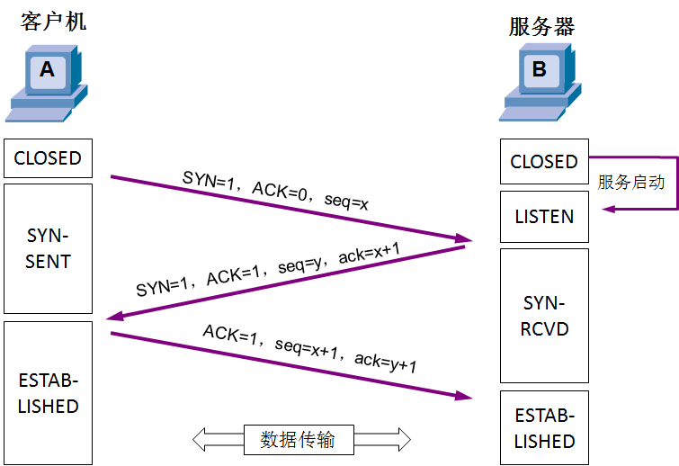

# 4. 传输层（Transport）

传输层有两个协议

- TCP（Transmission Control Protocol），传输控制协议
- UDP（User Datagram Protocol），用户数据报协议

|                  | TCP                        | UDP                                  |
| ---------------- | -------------------------- | ------------------------------------ |
| **连接性**       | 面向连接                   | 无连接                               |
| **可靠性**       | 可靠传输，不丢包           | 不可靠传输，尽最大努力交付，可能丢包 |
| **首都占用空间** | 大                         | 小                                   |
| **传输速率**     | 慢                         | 快                                   |
| **资源消耗**     | 大                         | 小                                   |
| **应用场景**     | 浏览器、文件传输、邮件发送 | 音视频通话、直播                     |
| **应用层协议**   | HTTP/HTTPS、FTP、SMTP、DNS | DNS                                  |

## TCP

### 数据格式

- 源端口  (Source Port)

  占16位，2字节

  发送方的端口号

  

- 目的端口  (Destination Port)

  占16位，2字节

  接收方的端口号

  

- 序号  (Sequence Number)

  占4字节

  首先，在传输过程的每一个字节都会有一个编号

  在建立连接后，序号代表：这一次传给对方的TCP数据部分的第一个字节的编号

  

- 确认号  (Acknowledgment Number)

  占4字节

  在建立连接后，确认号代表：期望对方下一次传过来的TCP数据部分的第一个字节的编号

- 数据偏移  (Data Offset)

  占1字节，4位，取值范围是 0x0101 ~ 0x1111

  表示TCP所传输的数据部分应该从TCP包得哪个位置开始计算，也可以看做是TCP的首部长度。结果乘以4表示为最终首部长度

  首部长度是 20~60字节

  

- 保留  (Reserved)

  占6位，目前全为0

  有些资料中，TCP首部的保留字段占3位，标志字段占9位

  

- 标志位  (Flags)

  占6位

  - **URG** （Urgent）

    当URG=1时，紧急指针字段才有效。表明当前报文段中有紧急数据，应优先尽快传送

  - **ACK** （Acknowledgment）

    当ACK=1时，确认号字段才有效。TCP规定，当连接建立后，ACK必须为1

  - **PSH** （Push）

    告诉对方收到该报文段后是否立即把数据推送给上层。如果值为1，表示应当立即把数据提交给上层，而不是缓存起来

  - **RST** （Reset）

    当RST=1时，表明连接中出现严重差错，必须释放连接，然后再重新建立连接

  - **SYN**（Synchronization）

    在建立连接时使用，用来同步序号。

    当SYN=1、ACK=0时，表示这是一个建立连接的报文段

    当SYN=1、ACK=1时，表示对方同意建立连接

    SYN=1时，说明这是一个请求建立连接或同意建立连接的报文，只有在前两次握手中SYN才为1

  - **FIN**（Finish）

    标记数据是否发送完毕。当FIN=1时，表明数据已经发送完毕，要求释放连接

    

- 窗口  (Window Size)

  占2字节 16位

  表示从Ack Number开始还可以接受多少字节的数据量，也表示当前接收端的接收窗口还有多少剩余空间。

  该字段可以用于TCP的流量控制

  

- 检验和  (Header and Data Checksum)

  占2字节 16位

  用于确认传输的数据是否有损坏。发送端基于数据内容校验生成一个数值，接收端根据接收的数据校验生成一个值。两个值必须相同，才能证明数据是有效的。如果两个值不同，则丢掉这个数据包
  
  跟UDP一样，TCP检验和的计算内容：**伪首部 + 首部 + 数据**

- 紧急指针  (Urgent Pointer)

  占2字节

  当前面的URG控制位为1时才有意义。它指出本数据段中为紧急数据的字节数，占16位。当所有紧急数据处理完毕后，TCP就会告诉应用程序恢复到正常操作。即使当前的窗口大小为0，也是可以发送紧急数据的，因为紧急数据无须缓存

  

- 选项 （Options）

  最多40字节
  
  长度不定，但长度必须是32bits的整数倍

### 可靠传输

#### 停止等待ARQ协议

ARQ（Automatic Repeat-request），自动重传请求

若重传N次依旧失败，则会根据系统的设置，重传5次还未成功就会发送reset报文（RST）断开TCP连接

#### 连续ARQ协议 + 滑动窗口协议

#### SACK（选择性确认）

在TCP通信过程中，如果发送序列中间某个数据包丢失（比如1，2，3，4，5中的 3 丢失了）

TCP会通过重传最后确认的分组后续的分组（最后确认的是2，会重传3，4，5）

这样原先已经正确传输的分组也可能重复发送（比如4，5），降低了TCP性能

为了改善上述情况，发展出了SACK（Selective Acknowledgment，选择性确认）技术

告诉发送方哪些数据丢失，哪些数据已经提前收到

使TCP只重新发送丢失的包（比如3），不用发送后续所有的分组（比如4，5）

SACK信息会放在TCP首部的选项部分

- Kind：占1字节，值为5代表这是SACK选项
- Length：占1字节，表明SACK选项一共占用多少字节
- Left Edge：占4字节，左边界
- Right Edge：占4字节，右边界

一对边界信息需要占用8字节，由于TCP首部的选项部分最多40字节，

所以SACK选项最多携带4组边界信息，

SACK选项的最大占用字节数 = 4 * 8 + 2 = 34

### 流量控制

如果接收方的缓存区满了，发送方还在疯狂着发送数据，接收方只能把收到的数据包丢掉，大量的丢包会极大的浪费网络资源

什么是流量控制？

让发送方的发送速率不要太快，让接收方来得及接收处理

- 通过确认报文中窗口字段来控制发送方的发送速率
- 发送方的发送窗口大小不能超过接收方给出窗口大小
- 当发送方收到接收窗口的大小为0时，发送方就会停止发送数据

当发送方收到0窗口通知时，这是发送方停止发送报文，并且同时开启一个定时器，隔一段时间就发个测试报文去询问接收方最新的窗口大小，如果接收的窗口大小还是为0，则发送方再次刷新启动定时器

### 拥塞控制

- 防止过多的数据注入到网络中
- 避免网络中的路由器或链路过载

拥塞控制是一个全局性的过程，涉及到所有的主机，路由器以及与降低网络传输性能有关的所有因素，是大家共同努力的结果

相比而言，流量控制是点对点通信的控制

常见缩写：

- MSS (Maximum Segment Size)：每个段最大的数据部分大小，在建立连接时确定

- cwnd（congestion window）：拥塞窗口

- rwnd（receive window）：接收窗口

- swnd（send window）：发送窗口   swnd = min(cwnd, rwnd)

  当rwnd < cwnd时，是接收方的接收能力限制发送窗口的最大值

  当cwnd < rwnd时，则是网络的拥塞限制发送窗口的最大值

#### 慢开始（slow start）

cwnd的初始值比较小，然后随着数据包被接收方确认（收到一个ACK），则cwnd就成倍增长（指数级）。

#### 拥塞避免（congestion avoidance）

- ssthresh（slow start threshold）：慢开始阈值，cwnd达到阈值后，以线性方式增加

- 拥塞避免（加法增大）：拥塞窗口缓慢增大，以防止网络过早出现阻塞

- 乘法减小：只要网络出现拥塞，把ssthresh减为拥塞峰值的一半，同时执行慢开始算法（cwnd又恢复到初始值）

- 当网络出现频繁拥塞时，ssthresh值就下降的很快

#### 快速重传（fast retransmit）

- **接收方**

  每收到一个失序的分组后就立即发出重复确认，使发送方及时知道有分组未到达，而不要等到自己发送数据时才进行确认

- **发送方**

  只要连续收到三个重复确认（总共4个相同的确认），就应当立即重传对方尚未收到的报文段，而不必继续等待重传计时器到期后再重传

#### 快速恢复（fast recovery）

当发送方连续收到三个重复确认，说明网络出现拥塞，就执行乘法减小算法，把ssthresh减为拥塞峰值的一半

与慢开始不同之处是现在不执行慢开始算法，即cwnd现在不恢复到初始值，而是把cwnd值设置为新的ssthresh值（减小后的值）

然后开始执行拥塞避免算法（加法增大），使拥塞窗口缓慢的线性增大

### 连接管理

#### 建立连接 （三次握手）

TCP是面向连接的协议，所以每次发出的请求都需要对方进行确认。TCP客户端与TCP服务器在通信之前需要完成三次握手才能建立连接

- SYN和ACK为标志位，seq表示请求序列号，ack表示确认序列号。x表示发送端初始化的随机序号，y表示接收端初始化的随机序号
- CLOSED: 客户端处于关闭状态
- LISTEN：服务端处于监听状态，等待客户端连接
- SYN-SENT：表示客户端已经发送 SYN 报文，等待服务端的第二次握手
- SYN-RCVD：表示服务端接收到了 SYN 报文，当收到客户端的 ACK 报文后，它会进入 ESTABLISHED 已连接状态
- ESTABLISHED：表示连接已经建立

##### 第一次握手

第一次握手建立连接时，客户端向服务器发送 SYN报文（SYN=1，ACK=0，seq=x），并进入到 SYN-SENT 状态，等待服务器确认

##### 第二次握手

第二次握手实际上是分两部分来完成的，即 SYN+ACK（请求和确认）报文

- 服务端收到了客户端的请求，向客户端回复一个确认信息（ACK=1，ack=x+1）
- 服务端再向客户端发送一个 SYN 包（SYN=1，seq=y）建立连接的请求，此时服务器进入 SYN-RCVD 状态

总结下来发送报文为 （SYN=1，ACK=1，seq=y，ack=x+1）

##### 第三次握手

第三次握手是客户端收到服务器的回复（SYN+ACK报文）。此时，客户端也要向服务器发送确认包（ACK=1，seq=x+1，ack=y+1），此包发送完毕客户端和服务器进入 ESTABLISHED 状态，完成三次握手

前两次握手的特点

- SYN 都设置为1

- 数据部分的长度都为0

- TCP头部的长度一般是32字节

  - 固定部分：20字节
  - 选项部分：12字节

  双方会交换确认一些信息，比如MSS，是否支持SACK，Window Scale（窗口缩放系数）等

  这些数据都放在了TCP头部的选项部分中（12字节）

为什么建立连接的时候要进行三次握手，两次不行吗？

- 主要目的是为了防止server端一直等待，浪费资源

假设client发出的第一个连接请求报文段，因为网络延迟，在连接释放后的某个时间才到达server

本来这是一个早已失效的连接请求，但server收到此失效的请求后，误以为是client再次发出的一个新的连接请求，于是server就向client发出确认报文段，同意建立连接

如果不采用 3次握手，那么只要server端确认，新的连接就建立了

由于现在的client并没有真正想连接服务器，因此不会理睬server的确认，也不会向server发送数据

但server却以为新的连接已经建立，并一直等待client发来数据，这样server的很多资源就白白浪费了

采用“三次握手”的办法可以防止此现象发生

- 例如上述情况，client没有向server的确认发出确认，server由于收不到确认，就知道client并没有要求建立连接

若第三次握手失败了，会怎么处理？

- 此时server的状态为 SYN-RCVD，若等不到client的ACK，server会重新发送 SYN+ACK （SYN=1, ACK=1）包
- 如果server多次重发 SYN+ACK 都等不到client的ACK，就会发送 RST 包，强制关闭连接

#### 释放连接（四次挥手）

当客户端与服务器不再进行通信时，都会以四次挥手的方式结束连接

- FIN-WAIT-1：表示想主动关闭连接

  向对方发送了FIN报文，此时进入到FIN-WAIT-1状态

- CLOSE-WAIT：表示在等待关闭

  - 当对方发送FIN给自己，自己会回应一个ACK报文给对方，此时则进入到CLOSE-WAIT状态

  - 在此状态下，需要考虑自己是否还有数据要发送给对方，如果没有，发送 FIN 报文给对方

- FIN-WAIT-2：只要对方发送ACK确认后，主动方就会处于 FIN-WAIT-2状态，然后等待对方发送FIN报文

- CLOSEING：一种比较罕见的例外状态

  - 表示你发送FIN报文后，并没有收到对方的ACK报文，反而却也收到了对方的FIN报文

  - 如果双方几乎在同时准备关闭连接的话，那么就出现了双方同时发送FIN报文的情况，也即会出现CLOSING状态
  - 表示双方都正在关闭连接

- LAST-ACK：被动关闭一方在发送FIN报文后，最后等待对方的ACK报文

  当收到ACK报文后，即可进入CLOSED关闭状态

- TIME-WAIT：表示收到了对方的FIN报文，并发送出了ACK报文，就等2MSL后即可进入CLOSED状态了

  - 如果FIN-WAIT-1状态下，收到了对方同时带FIN标志和ACK标志的报文时，可以直接进入到TIME-WAIT状态，而无须经过FIN-WAIT-2状态

- CLOSED：关闭状态

##### 第一次挥手

客户端向服务端发送断开TCP连接请求的 FIN 报文，序列号 seq=u，表示要断开TCP连接，此时客户端进入FIN-WAIT-1的状态下

（FIN=1，seq=u）

##### 第二次挥手

当服务端收到客户端发来的断开TCP连接请求后，回复发送ACK报文，表示已经收到断开请求。回复时，序列号 seq=v。由于回复的是客户端发来的请求，所以在客户端请求序号seq=u的情况下加1，得到ack=u+1

（ACK=1，seq=v，ack=u+1）

##### 第三次挥手

服务端在回复完客户端的TCP断开请求后，不会马上进行TCP连接的断开。服务端会先确认断开前，所有传输到客户端的数据是否已经传输完毕。确认传输完毕后才进行断开，向客户端发送 FIN=1，ACK=1，序列号seq=w。由于还是对客户端发来的TCP断开请求回复，所以ack还是ack=u+1

（FIN=1，ACK=1，seq=w，ack=u+1）

##### 第四次挥手

客户端收到服务器发来的TCP断开连接数据包后将进行回复，表示收到断开TCP连接数据包。向服务端发送ACK报文，生成一个序列号seq=u+1。由于回复的是服务器，所以ack字段为w+1

（ACK=1，seq=u+1，ack=w+1）

##### 

- MSL：

  客户端发送ACK后，需要有个TIME-WAIT阶段，等待一段时间后，再真正关闭连接。一般是等待2倍的MSL（Maximum Segment Lifetime，最大分段生成期）

  MSL是TCP报文在Internet上的最长生存时间

  每个具体的TCP实现都必须选择一个确定的MSL值，RFC建议是2分钟
  
  为了防止本次连接中产生的数据包误传到下一次连接中（因为本次连接中的数据包都会在2MSL时间内消失了）
  
  
  
- 为什么要等待2MSL?

  **为的是确认服务器端是否收到客户端发出的ACK确认报文**

  > 当客户端发出最后的ACK确认报文时，并不能确定服务器端能够收到该段报文。所以客户端在发送完ACK确认报文之后，会设置一个时长为2MSL的计时器。MSL指的是Maximum Segment Lifetime：一段TCP报文在传输过程中的最大生命周期。2MSL即是服务器端发出为FIN报文和客户端发出的ACK确认报文所能保持有效的最大时长。

  > 服务器端在1MSL内没有收到客户端发出的ACK确认报文，就会再次向客户端发出FIN报文；
  >
  > - 如果客户端在2MSL内，再次收到了来自服务器端的FIN报文，说明服务器端由于各种原因没有接收到客户端发出的ACK确认报文。客户端再次向服务器端发出ACK确认报文，计时器重置，重新开始2MSL的计时；
  > - 否则客户端在2MSL内没有再次收到来自服务器端的FIN报文，说明服务器端正常接收了ACK确认报文，客户端可以进入CLOSED阶段，完成“四次挥手”。

  **所以，客户端要经历时长为2SML的TIME-WAIT阶段；这也是为什么客户端比服务器端晚进入CLOSED阶段的原因**

- 为什么释放连接的时候，要进行四次挥手？

  > TCP释放连接时之所以需要“四次挥手”,是因为**FIN释放连接报文与ACK确认接收报文是分别由第二次和第三次"挥手"传输的**。为何建立连接时一起传输，释放连接时却要分开传输？
>
>- 建立连接时，被动方服务器端结束CLOSED阶段进入“握手”阶段并不需要任何准备，可以直接返回SYN和ACK报文，开始建立连接。
>- 释放连接时，被动方服务器，突然收到主动方客户端释放连接的请求时并不能立即释放连接，因为还有必要的数据需要处理，所以服务器先返回ACK确认收到报文，经过CLOSE-WAIT阶段准备好释放连接之后，才能返回FIN释放连接报文。

  

  TCP是全双工模式

  - 第一次挥手：当主机1发出FIN报文段时。表示主机1告诉主机2，主机1已经没有数据要发送了，但是，此时主机1还是可以接收来自主机2的数据
  - 第二次挥手：当主机2返回ACK报文段时。表示主机2已经知道主机1没有数据发送了，但是主机2还是可以发送数据给主机1的
  - 第三次挥手：当主机2也发送了FIN报文段时。表示主机2告诉主机1，主机2已经没有数据要发送了
  - 第四次挥手：当主机1返回ACK报文段时。表示主机1已经知道主机2没有数据发送了。随后正式断开整个TCP连接

- 三次挥手?

  有时候抓包时，可能只看到三次挥手。这其实是将第2、3次挥手合并了

  当服务端接收到客户端的FIN时，如果服务端后面也没有数据要发送给客户端了，这是服务端就可以将第2、3次挥手合并

## UDP

UDP是无连接的，减少了建立和释放连接的开销

UDP尽最大能力交付，不保证可靠交付

因此不需要维护一些复杂的参数，首部只有8个字节（TCP的首部至少20个字节）

- 源端口号（Source Port）

  占16位，2字节

  表示发送端端口号。该字段是可选项，有时可能不会设置源端口号。没有源端口号的时候该字段的值设置为0，可用于不需要返回的通信中

  

- 目的端口号（Destination Port）

  占16位，2字节

  接收端端口号

  

- UDP长度（Length）

  占16位，首部的长度 + 数据的长度

  

- UDP检验和（Checksum）

  检验和的计算内容：**伪首部 + 首部 + 数据**

  伪首部：仅在计算检验和时起作用，并不会传递给网络层

  

- 端口（Port）

  UDP首部中端口占用2个字节，可以推测出端口号的取值范围是：0 ~ 65535

  客户端的源端口是临时开启的随机端口

  | 协议  |  默认端口号  |
  | :---: | :----------: |
  | HTTP  |   TCP + 80   |
  | HTTPS |  TCP + 443   |
  |  FTP  |   TCP + 21   |
  | MySQL |  TCP + 3306  |
  |  DNS  | UDP/TCP + 53 |
  | SMTP  |   TCP + 25   |
  | POP3  |  TCP + 110   |

