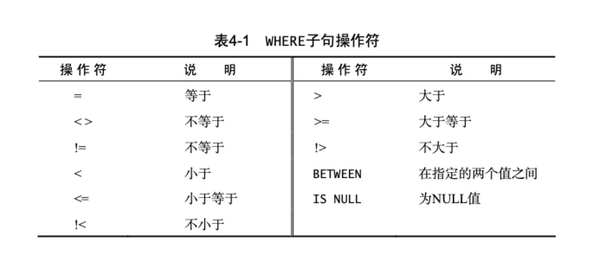
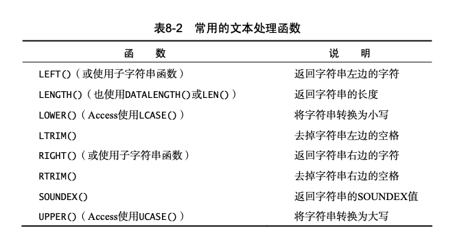
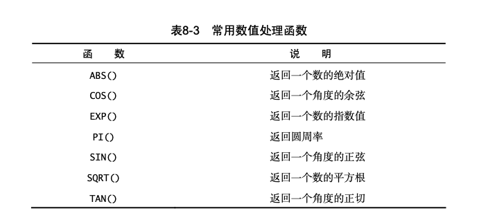
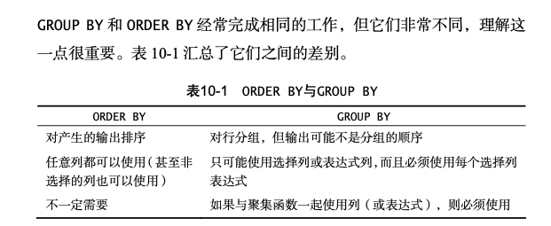
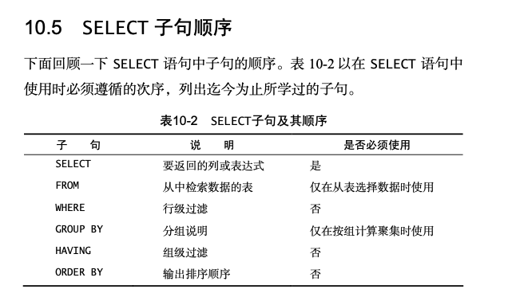

## 1. 数据库基础

- 数据库管理软件 （DBMS）

- 数据库 （database）

- 表 （table）

- 列 （column）

- 行 （row）

- 主键 （primary key）

  应该总是定义主键，方便以后数据操作和管理。

  表中任何列都可以作为主键，需要满足以下条件:

  - 任意两行都不具有相同的主键值
  - 每一行都必须具有一个主键值 (主键列不允许NULL值)
  - 主键列中的值不允许修改或更新
  - 主键值不能重用（如果某行从表中删除，它的主键不能赋予给以后的新行）

  也可以多列一起使用作为主键


## 2. 检索数据

- SELECT

  ```sql
  // 从Products表中查找prod_name列
  SELECT prod_name 
  FROM Products;
  
  // 多列
  SELECT prod_id, prod_name, prod_price
  FROM Products;
  
  // 所有列
  SELECT *
  FROM Products;
  ```

- DISTINCT

  只检索不同的值

  ``` sql
  SELECT DISTINCT vend_id
  FROM Products;
  ```

- LIMIT OFFSET

  ```sql
  // 检索从第5行起的5行数据
  SELECT prod_name
  FROM Products
  LIMIT 5 OFFSET 5;
  ```


## 3. 排序检索数据

- ORDER BY

  order by 必须要保证是select语句中最后一条字句

  ``` sql
  SELECT prod_name
  FROM Products
  ORDER BY prod_price, prod_name;
  ```

  ``` sql
  SELECT prod_id, prod_price, prod_name
  FROM Products
  ORDER BY 2, 3;
  ```

- DESC

  降序排列

  ``` sql
  SELECT prod_id, prod_price, prod_name
  FROM Products
  ORDER BY prod_price DESC;
  ```


## 4. 过滤数据

- WHERE

  ``` sql
  SELECT prod_name, prod_price FROM Products
  WHERE prod_price = 3.49;
  ```

  ``` sql
  SELECT prod_name, prod_price
  FROM Products
  WHERE prod_price BETWEEN 5 AND 10;
  ```

  ``` sql
  SELECT prod_name, prod_price
  FROM Products
  WHERE prod_price IS NULL;
  ```

  

  


## 5. 高级数据过滤

- AND

  ``` sql
  SELECT prod_name, prod_price
  FROM Products
  WHERE vend_id = 'DLL01' AND prod_price <= 4;
  ```

- OR

  ``` sql
  SELECT prod_name, prod_price
  FROM Products
  WHERE vend_id = 'DLL01' OR vend_id = ‘BRS01’;
  ```

  在使用AND OR 组合的时候，应使用小括号明确分组操作符

- IN

  IN 操作符用来指定条件范围，范围中的每个条件都可以进行匹配，IN 取值由都好分割，括在圆括号中的合法值。

  where子句中用来指定要匹配值得清单的关键字，功能与OR相当

  ``` sql
  SELECT prod_name, prod_price
  FROM Products
  WHERE vend_id IN ( 'DLL01', 'BRS01' )
  ORDER BY prod_name;
  ```

- NOT

  否定其后跟着的任何条件

  ``` sql
  SELECT prod_name
  FROM Products
  WHERE NOT vend_id = 'DLL01' 
  ORDER BY prod_name;
  ```


## 6. 用通配符进行过滤

- LIKE

  - %

    %表示任何字符出现任意次数，例如寻找Fish开头的所有产品，可以用以下sql语句 %告诉DBMS接受Fish之后的任意字符，不管有多少字符

    ``` sql
    SELECT prod_id, prod_name
    FROM Products
    WHERE prod_name LIKE 'Fish%';
    ```

    ``` sql
    SELECT prod_name
    FROM Products
    WHERE prod_name LIKE 'F%y';
    ```

    ``` sql
    SELECT prod_id, prod_name
    FROM Products
    WHERE prod_name LIKE '%bean bag%';
    ```

  - _

    下划线 _ 只匹配单个字符，而不是多个字符

    ``` sql
    SELECT prod_id, prod_name
    FROM Products
    WHERE prod_name LIKE '__ inch teddy bear';
    ```

sql的通配符很有用。但这种功能是有代价的，通配符搜索一般比其他搜索会消耗更长的处理事件。

- 不要过度使用通配符。如果其他操作符能达到相同的目的，应该使用其他操作符
- 在确实需要使用通配符时，也尽量不要把他们用在搜索模式的开始，把通配符用在开始处，搜索起来是最慢的
- 仔细注意通配符的位置，如果放错地方，可能不会返回想要的数据


## 7. 创建计算字段

- ||

  如果想要使返回的值拼接在一起，在sqlite中可以使用 || 进行拼接两个列

  ``` sql
  SELECT vend_name || ' (' || vend_country || ')'
  FROM Vendors
  ORDER BY vend_name;
  ```

- RTRIM()函数

  使用RTRIM函数去掉值右边的所有空格

  ``` sql
  SELECT RTRIM(vend_name) || ' (' || RTRIM(vend_country) || ')' FROM Vendors
  ORDER BY vend_name;
  ```

- AS

  别名（alias）。 通过拼接的字段并没有名字，对于客户端来说没法引用。

  为了解决这个问题，sql支持列别名，别名是一个字段或值得替换名。别名用AS关键字赋予

  别名有时也叫导出列（derived column）

  ``` sql
  SELECT RTRIM(vend_name) || ' (' || RTRIM(vend_country) || ')' AS vend_title
  FROM Vendors
  ORDER BY vend_name;
  ```

- 执行 + - * / 算术计算

  ``` sql
  SELECT prod_id,
         quantity,
  			 item_price,
         quantity*item_price AS expanded_price
  FROM OrderItems
  WHERE order_num = 20008;
  ```


## 8. 使用函数处理数据

### 文本处理函数



### 数值处理函数



### 日期处理函数


## 9. 汇总数据

- AVG()

  AVG返回某列的平均值。也可以用来返回特定列或行的平均值

  ``` sql
  SELECT AVG(prod_price) AS avg_price
  FROM Products;
  ```

- COUNT()

  COUNT()函数进行计数，可利用count()确定表中行的数目或符合特定条件的行的数目

  COUNT()函数有两种使用方式

  - 使用 COUNT(*) 对表中行的数目进行计数，不管表列中包含的是空置（null）还是非空值

    ```sql
    SELECT COUNT(*) AS num_cust
    FROM Customers;
    ```

  - 使用 COUNT(column) 对特定列中具有值的行进行计数，忽略NULL值

    ``` sql
    SELECT COUNT(cust_email) AS num_cust
    FROM Customers;
    ```

- MAX()

  返回指定列中的最大值。MAX()要求指定列名。忽略列值为null的行

  ``` sql
  // 返回Products表中最贵物品的价格
  SELECT MAX(prod_price) AS max_price
  FROM Products;
  ```

- MIN()

  返回指定列的最小值，MIN()要求指定列名

  ``` sql
  SELECT MIN(prod_price) AS min_price
  FROM Products;
  ```

- SUM()

  SUM()用来返回指定列值得和(总计)

  ``` sql
  SELECT SUM(quantity) AS items_ordered FROM OrderItems
  WHERE order_num = 20005;
  ```

- DISTINCT

  ``` sql
  SELECT AVG(DISTINCT prod_price) AS avg_price FROM Products
  WHERE vend_id = 'DLL01';
  ```

  DISTINCT不用用于count(*)

- 可组合函数使用

  ``` sql
  SELECT COUNT(*) AS num_items,
         MIN(prod_price) AS price_min,
         MAX(prod_price) AS price_max,
         AVG(prod_price) AS price_avg
  FROM Products;
  ```


## 10. 分组数据

- GROUP BY

  ``` sql
  SELECT vend_id, COUNT(*) AS num_prods
  FROM Products
  GROUP BY vend_id;
  ```

  vend_id包含产品供应商的ID，num_prod为计算字段（用count(*)函数建立）。group by子句指示DBMS按vend_id排序并分组数据。

  group by子句指示DBMS分组数据，然后对每个组而不是整个结果进行聚集。

  group by子句必须出现在where子句之后，order by子句之前

  


- HAVING

  ``` sql
  SELECT cust_id, COUNT(*) AS orders FROM Orders
  GROUP BY cust_id
  HAVING COUNT(*) >= 2;
  ```

  having过滤了两个订单以上的分组。

  having和where非常相似，唯一区别是having可以用来过滤分组，而where只能过滤行。




## 11. 子查询

### 利用子查询过滤

``` sql
SELECT cust_id
FROM Orders
WHERE order_num IN (SELECT order_num
                    FROM OrderItems
										WHERE prod_id = 'RGAN01');
```

子查询总是由内向外处理。先处理子句，把子句的结果传递给外部查询


``` sql
SELECT cust_name, cust_contact
FROM Customers
WHERE cust_id IN (SELECT cust_id
                  FROM Orders
                  WHERE order_num IN (SELECT order_num
                                      FROM OrderItems
																			WHERE prod_id = 'RGAN01'));
```

上面的sql实际上执行了三条select语句，最里边子查询返回订单号列表，此列表用于其外面的子查询的where子句。外面的子查询返回顾客ID列表，此顾客ID列表用于最外层查询的where子句。最外层查询返回所需的数据。

注意：子查询的select语句只能查询单个列，企图检索多个列会报错


### 作为计算字段使用子查询

``` sql
SELECT cust_name,
       cust_state,
       (SELECT COUNT(*)
       FROM Orders
       WHERE Orders.cust_id = Customers.cust_id) AS orders
FROM Customers
ORDER BY cust_name;
```

这条select语句对Customers表中每个顾客返回三列：cust_name、cust_state和orders。orders是一个计算字段，它是由圆括号中的子查询建立的。该子查询对检索出的每个顾客执行一次。在此例中，该子查询执行了5此，因为检索出了5个顾客。


## 12. 联结表

``` sql
SELECT vend_name, prod_name, prod_price 
FROM Vendors, Products
WHERE Vendors.vend_id = Products.vend_id;
```

vend_name字段存在于vendors表中，而prod_name和prod_price字段在同一个表（Products）中。

现在看FROM子句 ,与之前那select语句不一样,这条语句的FROM子句列出了两个表：Vendors和Products。它们就是这条select语句联结的两个表的名字。这两个表用where子句正确的联结，where子句指示DBMS将Vendors表中的vend_id与Products表中的vend_id匹配起来。 注意：需要完全限定列名


联结多个表: 

``` sql
SELECT prod_name, vend_name, prod_price, quantity 
FROM OrderItems, Products, Vendors
WHERE Products.vend_id = Vendors.vend_id
AND OrderItems.prod_id = Products.prod_id 
AND order_num = 20007;
```


- INNER JOIN

上面的等值联结基于两个表之间的相等测试。这种联结也成为内联结（inner join）。

``` sql
SELECT vend_name, prod_name, prod_price 
FROM Vendors INNER JOIN Products
ON Vendors.vend_id = Products.vend_id;
```

此语句中select与前面的select语句相同，但from子句不同。这里，两个表之间的管你西是以 INNER JOIN 指定的部分FROM子句。在使用这种语法时，联结条件用特定的 ON 子句而不是 where子句。传递给 on 的实际条件与传递给 where 的相同。


## 13. 创建高级联结

### 表别名

sql除了可以对列名和计算字段使用别名，还允许给表名起别名。

- 缩短sql语句
- 允许在一条select语句中多次使用相同的表

``` sql
SELECT cust_name, cust_contact
FROM Customers AS C, Orders AS O, OrderItems AS OI 
WHERE C.cust_id = O.cust_id
AND OI.order_num = O.order_num 
AND prod_id = 'RGAN01';
```

表别名可以用在where子句、select的列表、order by子句以及其他语句部分

### 不同类型的联结

- 自联结 ( self-join )

  ``` sql
  SELECT c1.cust_id, c1.cust_name, c1.cust_contact 
  FROM Customers AS c1, Customers AS c2
  WHERE c1.cust_name = c2.cust_name
  AND c2.cust_contact = 'Jim Jones';
  ```

  子查询方式如下：

  ``` sql
  SELECT cust_id, cust_name, cust_contact 
  FROM Customers
  WHERE cust_name = (SELECT cust_name
   									 FROM Customers
  									 WHERE cust_contact = 'Jim Jones');
  ```

  两种方式查询出的结果一致，但是使用联结比子查询效率更高

-  外联结 ( outer join )

  ``` sql
  SELECT Customers.cust_id, Orders.order_num 
  FROM Customers LEFT OUTER JOIN Orders
  ON Customers.cust_id = Orders.cust_id;
  ```

  外联结还包括没有关联行的行。在使用outer join预发时，必须使用right 或 left 关键字指定包括其所有行的表 （right指出的是outer join右边的表，left指出的是outer join左边的表）。上面的例子使用left outer join 从 from 子句左边的表（Customers 表）中选择所有行。为了从右边的表中选择所有行，需要使用right outer join。

  ``` sql
  SELECT Customers.cust_id, Orders.order_num 
  FROM Customers RIGHT OUTER JOIN Orders
  ON Orders.cust_id = Customers.cust_id;
  ```

  外联结有两种形式：左外联结和右外联结。它们之间的唯一区别就是所关联表的顺序。调整from或where子句中表的顺序，左外联结可以转换为右外联结。因此，这两种你那个外联结可以互换使用。

  

  还有一种联结，全外联结（full outer join）。它检索两个表中所有行并关联那些可以关联的行。( mysql 和 sqlite 不支持full outer join的语法 )

  ``` sql
  SELECT Customers.cust_id, Orders.order_num 
  FROM Orders FULL OUTER JOIN Customers
  ON Orders.cust_id = Customers.cust_id;
  ```

  

## 14. 组合查询

1. 在一个查询中从不同的表返回数据结构

2. 对一个表执行多个查询，按一个查询返回数据

- UNION

  利用union，可以将给出的多条select语句。组合成一个结果集返回

  ``` sql
  SELECT cust_name, cust_contact, cust_email
  FROM Customers
  WHERE cust_state IN ('IL','IN','MI')
  UNION
  SELECT cust_name, cust_contact, cust_email
  FROM Customers
  WHERE cust_name = 'Fun4All';
  ```

  ``` sql
  SELECT cust_name, cust_contact, cust_email
  FROM Customers
  WHERE cust_state IN ('IL','IN','MI')
  OR cust_name = 'Fun4All';
  ```

  两条sql等价

  union每个查询必须包含相同的列、表达式或聚集函数

  union会默认过滤相同的行。如果想要展示重复的行，使用 union all


## 15. 插入数据

### 数据插入

INSERT 用来将行插入（或添加）到数据库表。插入有几种方式：

- 插入完整的行
- 插入行的一部分
- 插入某些查询的结果

#### 插入完整行

``` sql
INSERT INTO Customers(cust_id,
                      cust_name,
                      cust_address,
                      cust_city,
                      cust_state,
                      cust_zip,
                      cust_country,
                      cust_contact,
                      cust_email)
VALUES('1000000006',
       'Toy Land',
       '123 Any Street',
       'New York',
       'NY',
       '11111',
       'USA',
       NULL,
       NULL);
```

不要使用没用明确给出列的insert语句。给出列能使sql代码继续发挥作用，即使表结构发生了变化。

values的数目必须正确。

- 如果不提供列名，则必须给每个表列提供一个值
- 如果提供列名，则必须给列出的每个列一个值

#### 插入部分行

``` sql
INSERT INTO Customers(cust_id,
                      cust_name,
                      cust_address,
                      cust_city,
                      cust_state,
                      cust_zip,
                      cust_country)
VALUES('1000000006',
       'Toy Land',
       '123 Any Street',
       'New York',
       'NY',
       '11111',
'USA');
```

如果表的定义允许，则可以在insert操作中省略某些列。省略的列必须满足以下某个条件

- 该列定义为允许NULL值（无值或空值）
- 在表定义中给出默认值。表示不给出值，则使用默认值

如果表中不允许有NULL值或默认值，却省略了表中的值。则报错插入不成功

#### 插入检索出的数据

``` sql
INSERT INTO Customers(cust_id,
                      cust_contact,
                      cust_email,
                      cust_name,
                      cust_address,
                      cust_city,
                      cust_state,
                      cust_zip,
                      cust_country)
SELECT cust_id,
       cust_contact,
       cust_email,
       cust_name,
       cust_address,
       cust_city,
       cust_state,
       cust_zip,
       cust_country
FROM CustNew;
```

将CustNew表中的数据插入到Customers表中

### 从一个表复制到另一个表 (select into)

``` sql
SELECT *
INTO CustCopy
FROM Customers;
```

这条select语句创建一个名为CustCopy的新表，并把Customers表的内容复制到新表中。因为这里使用的是 select * ，所以将在CustCopy表中创建（并填充）与Customers表中的每一列相同的列。要想只复制部分的列，可以明确给出列名，而不是使用*通配符。

Mysql和sqlite的语法稍有不同，如下：

``` sql
CREATE TABLE CustCopy AS
SELECT * FROM Customers;
```

- 任何select选项和子句都可以使用，包括 where和group by
- 可利用联结从多个表插入数据
- 不管从多少个表中检索数据，数据都只能插入到一个表中


## 16. 更新和删除数据

### 更新数据 (UPDATE)

有两种使用update的方式：

- 更新表中的特定行
- 更新表中的所有行

在使用update的时候，一定要注意不能省略where子句

update由三部分组成：

- 要更新的表
- 列名和它们的新值
- 确定要更新哪些行的过滤条件

``` sql
UPDATE Customers
SET cust_email = 'kim@thetoystore.com' 
WHERE cust_id = '1000000005';
```

``` sql
UPDATE Customers
SET cust_contact = 'Sam Roberts',
		cust_email = 'sam@toyland.com' 
WHERE cust_id = '1000000006';
```

更新多个列时，只需要使用一条 SET 命令，每个“列=值” 对之间用逗号分隔。

要删除某个列的值，可设置它为NULL：

``` sql
UPDATE Customers
SET cust_email = NULL
WHERE cust_id = '1000000005';
```

### 删除数据 (DELETE)

有两种使用DELETE的方式：

- 从表中删除特定的行
- 从表中删除所有行

使用delete的时候一定要注意不能省略where子句

delete只是删除表的内容，而不是删除表本身

``` sql
DELETE FROM Customers
WHERE cust_id = '1000000006';
```


## 17. 创建和操纵表

### 创建表 (CREATE TABLE)

必须给出下列信息：

- 新表的名字。在关键字 CREATE TABLE 之后给出
- 表列的名字和定义，用逗号分隔
- 有的DBMS还要求指定表的位置

``` sql
CREATE TABLE Orders
(
  order_num INTEGER NOT NULL,
  order_date DATETIME NOT NULL,
  cust_id		CHAR(10)  NOT NULL
);
```

### 更新表 (ALTER TABLE)

- 在alter table 之后给出要更改的表名（该表必须存在，否则将出错）
- 列出要做哪些更改

``` sql
ALTER TABLE Vendors
ADD vend_phone CHAR(20);
```

``` sql
ALTER TABLE Vendors
DROP COLUMN vend_phone;
```

也可以更改或删除列、增加约束或增加键

SQLite不支持使用ALTER TABLE定义主键和外键，这些必须在最初创建表时指定

### 删除表

``` sql
DROP TABLE CustCopy;
```


## 18. 使用视图

- 重用sql语句
- 简化复杂的sql操作。编写查询后，可以方便的重用它而不必知道其基本查询细节
- 使用表的一部分而不是整个表
- 保护数据。可以授予用户访问表的特定部分的权限，而不是整个表的访问权限
- 更改数据格式和表示。视图可返回与底层表的表示和格式不同的数据


创建和使用的规则如下：

- 与表一样，视图必须唯一命名
- 对于创建的视图数目没有限制

``` sql
CREATE VIEW ProductCustomers AS
SELECT cust_name, cust_contact, prod_id 
FROM Customers, Orders, OrderItems
WHERE Customers.cust_id = Orders.cust_id
AND OrderItems.order_num = Orders.order_num;
```

这条语句创建一个名为ProductCustomers的视图，它联结三个表，返回已订购了任意产品的所有顾客的列表。如果执行select * from ProductCustomers，将列出订购了任意产品的顾客

检索订购了产品RGAN01的顾客，可如下进行：

``` sql
SELECT cust_name, cust_contact 
FROM ProductCustomers
WHERE prod_id = 'RGAN01';
```

这条语句通过where子句从视图中检索特定数据。当DBMS处理此查询时，它将制定的where子句添加到视图查询中已有的where子句中，以便正确过滤数据


## 19. 事务 (TRANSACTION)

通过事务处理，确保成批的sql操作要么完全执行，要么完全不执行，来维护数据库的完整性

- 事务（transaction）指一组sql语句
- 回退（rollback）指撤销指定sql语句的过程
- 提交（commit）指将未存储的sql语句结果写入数据库表
- 保留点（savepoint）指事务处理中设置的临时占位符，可以对它发布回退（与回退整个事务处理不同）

事务处理用来管理insert、update和delete语句，不能回退select、create和drop操作

``` sql
BEGIN TRANSACTION 
...
COMMIT TRANSACTION
```

``` sql
ROLLBACK
```

``` sql
BEGIN TRANSACTION

INSERT INTO Customers(cust_id, cust_name) 
VALUES('1000000010', 'Toys Emporium');

SAVE TRANSACTION StartOrder;

INSERT INTO Orders(order_num, order_date, cust_id) VALUES(20100,'2001/12/1','1000000010');

IF @@ERROR <> 0 ROLLBACK TRANSACTION StartOrder;

INSERT INTO OrderItems(order_num, order_item, prod_id, quantity, item_price)
VALUES(20100, 1, 'BR01', 100, 5.49);

IF @@ERROR <> 0 ROLLBACK TRANSACTION StartOrder;

INSERT INTO OrderItems(order_num, order_item, prod_id, quantity, item_price)
VALUES(20100, 2, 'BR03', 100, 10.99);

IF @@ERROR <> 0 ROLLBACK TRANSACTION StartOrder;

COMMIT TRANSACTION
```


## 20. 高级特性

### 约束 ( constraint )

管理如何插入或处理数据库数据的规则

### 主键 （PRIMARY KEY）

- 任意两行的主键值都不相同
- 每行都具有一个主键值
- 包含主键值得列从不修改或更新
- 主键值不能重用。如果从表中删除某一行，其主键值不分配给新行

### 外键

### 索引 ( INDEX )

- 索引改善检索操作的性能，但降低了数据插入、修改和删除的性能。在执行这些操作时，DBMS必须动态更新索引
- 索引数据可能要占用大量的存储空间
- 并非所有数据都适合做索引。取值不多的数据没必要索引
- 索引用于数据过滤和数据排序。如果经常以某种特定的顺序排序数据，则该数据可能适合做索引
- 可以在索引中定义多个列

``` sql
CREATE INDEX prod_name_ind
ON Products (prod_name);
```


## 21. SQLite数据类型

https://www.runoob.com/sqlite/sqlite-data-types.html

