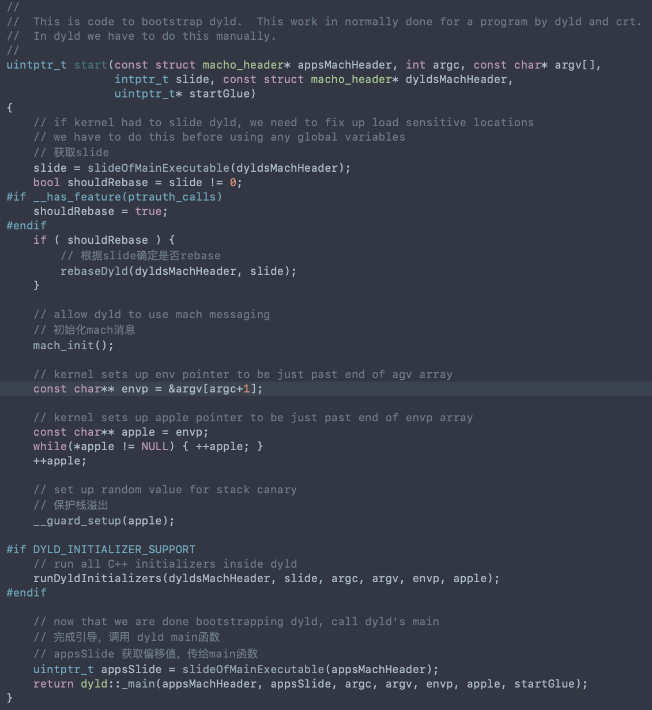

## 简介

内核加载mach-o文件，fork一条新的线程出来，分配内存，解析主程序的mach-o信息，读取主程序mach-o头信息，遍历主程序每条load command信息，装载进内存，解析dyld，讲entry_point入口地址改为dyld的入口地址。进入entry_point对应的入口，启动dyld，设置进程的主线程


**dyld**（the dynamic link editor）动态链接器。系统内核加载mach-o做完初始化操作之后，交由dyld处理


dyld主要做动态库加载，链接，初始化等操作，一直处理到调用程序的main()函数为止。


## dyld加载流程

首先在+load函数打断点，看一下之前的调用堆栈


从图中可以看到首先调用了dyld中的_dyld_start方法，再接着调用dyldbootstrap::start()方法。


### __dyld_start

[dyld]( https://opensource.apple.com/tarballs/dyld/)是开源的，这里讨论的是dyld2，下载源码，搜索_dyld_start在何处使用，找到是在`dyldStartup.s`汇编文件内，从汇编内注释看到调用了dyldbootstrap::start


### bootstrap::start()



start()内做了四步操作

- 根据slide确定是否rebaseDyld()
- 初始化mach消息
- 保护栈溢出
- 调用dyld::_main()函数进行下一步操作


### dyld::_main()

main()函数是dyld主要的加载步骤。

内核加载dyld并跳转到__dyld_start设置一些寄存器信息之后，调用此函数。 

返回主程序的main()函数，并在__dyld_start内实现跳转

``` objective-c
uintptr_t
_main(const macho_header* mainExecutableMH, uintptr_t mainExecutableSlide, 
		int argc, const char* argv[], const char* envp[], const char* apple[], 
		uintptr_t* startGlue)
{
	......
    
	uintptr_t result = 0;
	// mach-o
	sMainExecutableMachHeader = mainExecutableMH;
	// slide
	sMainExecutableSlide = mainExecutableSlide;

	CRSetCrashLogMessage("dyld: launch started");

	// 设置上下文(函数的参数，标识信息)
	setContext(mainExecutableMH, argc, argv, envp, apple);

	// Pickup the pointer to the exec path.
	// 执行路径的指针
	sExecPath = _simple_getenv(apple, "executable_path");

	// <rdar://problem/13868260> Remove interim apple[0] transition code from dyld
	if (!sExecPath) sExecPath = apple[0];
	
	// 若是相对路径，则使变为绝对路径
	if ( sExecPath[0] != '/' ) {
		// have relative path, use cwd to make absolute
		char cwdbuff[MAXPATHLEN];
	    if ( getcwd(cwdbuff, MAXPATHLEN) != NULL ) {
			// maybe use static buffer to avoid calling malloc so early...
			char* s = new char[strlen(cwdbuff) + strlen(sExecPath) + 2];
			strcpy(s, cwdbuff);
			strcat(s, "/");
			strcat(s, sExecPath);
			sExecPath = s;
		}
	}

	// Remember short name of process for later logging
	// 进程shortName
	sExecShortName = ::strrchr(sExecPath, '/');
	if ( sExecShortName != NULL )
		++sExecShortName;
	else
		sExecShortName = sExecPath;

	// 配置进程限制条件
    configureProcessRestrictions(mainExecutableMH);

	{
		// 检查环境变量
		checkEnvironmentVariables(envp);
		defaultUninitializedFallbackPaths(envp);
	}

	// 打印配置的环境变量
	if ( sEnv.DYLD_PRINT_OPTS )
		printOptions(argv);
	if ( sEnv.DYLD_PRINT_ENV ) 
		printEnvironmentVariables(envp);
	// 获取相关程序架构,到这里整个环境配置完成
	getHostInfo(mainExecutableMH, mainExecutableSlide);

	
	// load shared cache
	// 加载共享缓存, iOS必须开启
	checkSharedRegionDisable((dyld3::MachOLoaded*)mainExecutableMH, mainExecutableSlide);
#if TARGET_IPHONE_SIMULATOR
	// <HACK> until <rdar://30773711> is fixed
	gLinkContext.sharedRegionMode = ImageLoader::kUsePrivateSharedRegion;
	// </HACK>
#endif
	if ( gLinkContext.sharedRegionMode != ImageLoader::kDontUseSharedRegion ) {
		// 开启共享缓存，map
		mapSharedCache();
	}
  
	......

		CRSetCrashLogMessage(sLoadingCrashMessage);
		// instantiate ImageLoader for main executable
		// 初始化 ImageLoader 加载主程序
		sMainExecutable = instantiateFromLoadedImage(mainExecutableMH, mainExecutableSlide, sExecPath);
		gLinkContext.mainExecutable = sMainExecutable;
		// 签名信息
		gLinkContext.mainExecutableCodeSigned = hasCodeSignatureLoadCommand(mainExecutableMH);

	......

		// load any inserted libraries
		// 加载插入的动态库
		// 和主程序一起加入到sAllImages中
		if	( sEnv.DYLD_INSERT_LIBRARIES != NULL ) {
			for (const char* const* lib = sEnv.DYLD_INSERT_LIBRARIES; *lib != NULL; ++lib) 
				loadInsertedDylib(*lib);
		}
		// record count of inserted libraries so that a flat search will look at 
		// inserted libraries, then main, then others.
		// 记录插入的动态库的个数 -1是因为sAllImages中有一个是主程序
		sInsertedDylibCount = sAllImages.size()-1;

		// link main executable
		// 链接主可执行文件
		gLinkContext.linkingMainExecutable = true;
#if SUPPORT_ACCELERATE_TABLES
		if ( mainExcutableAlreadyRebased ) {
			// previous link() on main executable has already adjusted its internal pointers for ASLR
			// work around that by rebasing by inverse amount
			sMainExecutable->rebase(gLinkContext, -mainExecutableSlide);
		}
#endif
		// 链接
		link(sMainExecutable, sEnv.DYLD_BIND_AT_LAUNCH, true, ImageLoader::RPathChain(NULL, NULL), -1);
		sMainExecutable->setNeverUnloadRecursive();
		if ( sMainExecutable->forceFlat() ) {
			gLinkContext.bindFlat = true;
			gLinkContext.prebindUsage = ImageLoader::kUseNoPrebinding;
		}

		// link any inserted libraries
		// do this after linking main executable so that any dylibs pulled in by inserted 
		// dylibs (e.g. libSystem) will not be in front of dylibs the program uses
		// 链接插入的动态库
		// 在链接主程序之后执行此操作，为了使插入的动态库不会在主程序的动态库前面使用
		if ( sInsertedDylibCount > 0 ) {
			for(unsigned int i=0; i < sInsertedDylibCount; ++i) {
				ImageLoader* image = sAllImages[i+1];
				link(image, sEnv.DYLD_BIND_AT_LAUNCH, true, ImageLoader::RPathChain(NULL, NULL), -1);
				image->setNeverUnloadRecursive();
			}
			// only INSERTED libraries can interpose
			// register interposing info after all inserted libraries are bound so chaining works
			for(unsigned int i=0; i < sInsertedDylibCount; ++i) {
				ImageLoader* image = sAllImages[i+1];
				image->registerInterposing(gLinkContext);
			}
		}

		// <rdar://problem/19315404> dyld should support interposition even without DYLD_INSERT_LIBRARIES
		// 即使没有 DYLD_INSERT_LIBRARIES，dyld也应该支持插入
		for (long i=sInsertedDylibCount+1; i < sAllImages.size(); ++i) {
			ImageLoader* image = sAllImages[i];
			if ( image->inSharedCache() )
				continue;
			image->registerInterposing(gLinkContext);
		}
	#if SUPPORT_ACCELERATE_TABLES
		if ( (sAllCacheImagesProxy != NULL) && ImageLoader::haveInterposingTuples() ) {
			// Accelerator tables cannot be used with implicit interposing, so relaunch with accelerator tables disabled
			ImageLoader::clearInterposingTuples();
			// unmap all loaded dylibs (but not main executable)
			for (long i=1; i < sAllImages.size(); ++i) {
				ImageLoader* image = sAllImages[i];
				if ( image == sMainExecutable )
					continue;
				if ( image == sAllCacheImagesProxy )
					continue;
				image->setCanUnload();
				ImageLoader::deleteImage(image);
			}
			// note: we don't need to worry about inserted images because if DYLD_INSERT_LIBRARIES was set we would not be using the accelerator table
			sAllImages.clear();
			sImageRoots.clear();
			sImageFilesNeedingTermination.clear();
			sImageFilesNeedingDOFUnregistration.clear();
			sAddImageCallbacks.clear();
			sRemoveImageCallbacks.clear();
			sAddLoadImageCallbacks.clear();
			sDisableAcceleratorTables = true;
			sAllCacheImagesProxy = NULL;
			sMappedRangesStart = NULL;
			mainExcutableAlreadyRebased = true;
			gLinkContext.linkingMainExecutable = false;
			resetAllImages();
			goto reloadAllImages;
		}
	#endif

		// apply interposing to initial set of images
		// 对初始化images进行插入
		for(int i=0; i < sImageRoots.size(); ++i) {
			sImageRoots[i]->applyInterposing(gLinkContext);
		}
		ImageLoader::applyInterposingToDyldCache(gLinkContext);
		gLinkContext.linkingMainExecutable = false;

		// Bind and notify for the main executable now that interposing has been registered
		// 绑定 通知 主可执行文件
		uint64_t bindMainExecutableStartTime = mach_absolute_time();
		sMainExecutable->recursiveBindWithAccounting(gLinkContext, sEnv.DYLD_BIND_AT_LAUNCH, true);
		uint64_t bindMainExecutableEndTime = mach_absolute_time();
		ImageLoaderMachO::fgTotalBindTime += bindMainExecutableEndTime - bindMainExecutableStartTime;
		gLinkContext.notifyBatch(dyld_image_state_bound, false);

		// Bind and notify for the inserted images now interposing has been registered
		// 已插入和注册的images的绑定和通知
		if ( sInsertedDylibCount > 0 ) {
			for(unsigned int i=0; i < sInsertedDylibCount; ++i) {
				ImageLoader* image = sAllImages[i+1];
				image->recursiveBind(gLinkContext, sEnv.DYLD_BIND_AT_LAUNCH, true);
			}
		}
		
		// <rdar://problem/12186933> do weak binding only after all inserted images linked
		// 弱绑定
		sMainExecutable->weakBind(gLinkContext);

		// If cache has branch island dylibs, tell debugger about them
		if ( (sSharedCacheLoadInfo.loadAddress != NULL) && (sSharedCacheLoadInfo.loadAddress->header.mappingOffset >= 0x78) && (sSharedCacheLoadInfo.loadAddress->header.branchPoolsOffset != 0) ) {
			uint32_t count = sSharedCacheLoadInfo.loadAddress->header.branchPoolsCount;
			dyld_image_info info[count];
			const uint64_t* poolAddress = (uint64_t*)((char*)sSharedCacheLoadInfo.loadAddress + sSharedCacheLoadInfo.loadAddress->header.branchPoolsOffset);
			// <rdar://problem/20799203> empty branch pools can be in development cache
			if ( ((mach_header*)poolAddress)->magic == sMainExecutableMachHeader->magic ) {
				for (int poolIndex=0; poolIndex < count; ++poolIndex) {
					uint64_t poolAddr = poolAddress[poolIndex] + sSharedCacheLoadInfo.slide;
					info[poolIndex].imageLoadAddress = (mach_header*)(long)poolAddr;
					info[poolIndex].imageFilePath = "dyld_shared_cache_branch_islands";
					info[poolIndex].imageFileModDate = 0;
				}
				// add to all_images list
				addImagesToAllImages(count, info);
				// tell gdb about new branch island images
				gProcessInfo->notification(dyld_image_adding, count, info);
			}
		}

		CRSetCrashLogMessage("dyld: launch, running initializers");
	#if SUPPORT_OLD_CRT_INITIALIZATION
		// Old way is to run initializers via a callback from crt1.o
		if ( ! gRunInitializersOldWay ) 
			initializeMainExecutable(); 
	#else
		// run all initializers
		// 执行所有的初始化
		initializeMainExecutable(); 
	#endif

		// notify any montoring proccesses that this process is about to enter main()
		if (dyld3::kdebug_trace_dyld_enabled(DBG_DYLD_TIMING_LAUNCH_EXECUTABLE)) {
			dyld3::kdebug_trace_dyld_duration_end(launchTraceID, DBG_DYLD_TIMING_LAUNCH_EXECUTABLE, 0, 0, 2);
		}
		notifyMonitoringDyldMain();

		// find entry point for main executable
		// 找 main 函数的入口, 返回由start进行调用
		result = (uintptr_t)sMainExecutable->getEntryFromLC_MAIN();
		if ( result != 0 ) {
			// main executable uses LC_MAIN, we need to use helper in libdyld to call into main()
			if ( (gLibSystemHelpers != NULL) && (gLibSystemHelpers->version >= 9) )
				*startGlue = (uintptr_t)gLibSystemHelpers->startGlueToCallExit;
			else
				halt("libdyld.dylib support not present for LC_MAIN");
		}
		else {
			// main executable uses LC_UNIXTHREAD, dyld needs to let "start" in program set up for main()
			result = (uintptr_t)sMainExecutable->getEntryFromLC_UNIXTHREAD();
			*startGlue = 0;
		}
#if __has_feature(ptrauth_calls)
		// start() calls the result pointer as a function pointer so we need to sign it.
		result = (uintptr_t)__builtin_ptrauth_sign_unauthenticated((void*)result, 0, 0);
#endif
	}
	catch(const char* message) {
		syncAllImages();
		halt(message);
	}
	catch(...) {
		dyld::log("dyld: launch failed\n");
	}

	CRSetCrashLogMessage("dyld2 mode");

	if (sSkipMain) {
		if (dyld3::kdebug_trace_dyld_enabled(DBG_DYLD_TIMING_LAUNCH_EXECUTABLE)) {
			dyld3::kdebug_trace_dyld_duration_end(launchTraceID, DBG_DYLD_TIMING_LAUNCH_EXECUTABLE, 0, 0, 2);
		}
		result = (uintptr_t)&fake_main;
		*startGlue = (uintptr_t)gLibSystemHelpers->startGlueToCallExit;
	}
	
	return result;
}

```

以上是_main()函数经简化之后的代码，可以看出主要分为了几个步骤

- 设置检查运行环境
- 加载共享缓存，iOS必须开启
- 初始化 ImageLoader 加载主程序
- 加载插入的动态库
- 链接主程序
- 链接插入的动态库
- 执行所有初始化
- 查找main()函数并返回


#### 设置检查运行环境 

主要获取基本信息，设置上下文，配置环境变量，检查受限条件等等。

``` objective-c
	if (dyld3::kdebug_trace_dyld_enabled(DBG_DYLD_TIMING_LAUNCH_EXECUTABLE)) {
		launchTraceID = dyld3::kdebug_trace_dyld_duration_start(DBG_DYLD_TIMING_LAUNCH_EXECUTABLE, (uint64_t)mainExecutableMH, 0, 0);
	}

    // Grab the cdHash of the main executable from the environment
	// 从环境中获取主执行文件的hash
	uint8_t mainExecutableCDHashBuffer[20];
	const uint8_t* mainExecutableCDHash = nullptr;
	if ( hexToBytes(_simple_getenv(apple, "executable_cdhash"), 40, mainExecutableCDHashBuffer) )
		mainExecutableCDHash = mainExecutableCDHashBuffer;

	// Trace dyld's load
	// 跟踪dyld加载
	notifyKernelAboutImage((macho_header*)&__dso_handle, _simple_getenv(apple, "dyld_file"));
#if !TARGET_IPHONE_SIMULATOR
	// Trace the main executable's load
	// 非模拟器 跟踪主执行文件的load
	notifyKernelAboutImage(mainExecutableMH, _simple_getenv(apple, "executable_file"));
#endif

	uintptr_t result = 0;
	// mach-o
	sMainExecutableMachHeader = mainExecutableMH;
	// slide
	sMainExecutableSlide = mainExecutableSlide;

	CRSetCrashLogMessage("dyld: launch started");

	// 设置上下文(函数的参数，标识信息)
	setContext(mainExecutableMH, argc, argv, envp, apple);

	// Pickup the pointer to the exec path.
	// 执行路径的指针
	sExecPath = _simple_getenv(apple, "executable_path");

	// <rdar://problem/13868260> Remove interim apple[0] transition code from dyld
	if (!sExecPath) sExecPath = apple[0];
	
	// 若是相对路径，则使变为绝对路径
	if ( sExecPath[0] != '/' ) {
		// have relative path, use cwd to make absolute
		char cwdbuff[MAXPATHLEN];
	    if ( getcwd(cwdbuff, MAXPATHLEN) != NULL ) {
			// maybe use static buffer to avoid calling malloc so early...
			char* s = new char[strlen(cwdbuff) + strlen(sExecPath) + 2];
			strcpy(s, cwdbuff);
			strcat(s, "/");
			strcat(s, sExecPath);
			sExecPath = s;
		}
	}

	// Remember short name of process for later logging
	// 进程shortName
	sExecShortName = ::strrchr(sExecPath, '/');
	if ( sExecShortName != NULL )
		++sExecShortName;
	else
		sExecShortName = sExecPath;

	// 配置进程限制条件
    configureProcessRestrictions(mainExecutableMH);

	{
		// 检查环境变量
		checkEnvironmentVariables(envp);
		defaultUninitializedFallbackPaths(envp);
	}

	// 打印配置的环境变量
	if ( sEnv.DYLD_PRINT_OPTS )
		printOptions(argv);
	if ( sEnv.DYLD_PRINT_ENV ) 
		printEnvironmentVariables(envp);
	// 获取相关程序架构,到这里整个环境配置完成
	getHostInfo(mainExecutableMH, mainExecutableSlide);
```

如果在xcode内设置了`DYLD_PRINT_OPTS`或`DYLD_PRINT_ENV`环境变量，则进行打印


#### 加载共享缓存

``` objective-c
	// load shared cache
	// 加载共享缓存, iOS必须开启
	checkSharedRegionDisable((dyld3::MachOLoaded*)mainExecutableMH, mainExecutableSlide);
#if TARGET_IPHONE_SIMULATOR
	// <HACK> until <rdar://30773711> is fixed
	gLinkContext.sharedRegionMode = ImageLoader::kUsePrivateSharedRegion;
	// </HACK>
#endif
	if ( gLinkContext.sharedRegionMode != ImageLoader::kDontUseSharedRegion ) {
		// 开启共享缓存，map
		mapSharedCache();
	}
```

首先调用`checkSharedRegionDisable()`检查是否开启共享缓存，从方法内部可以看到iOS不能没有共享缓存。

检查之后调用`mapSharedCache()`函数映射共享缓存，`mapSharedCache()`内部调用了`loadDyldCache()`

``` objective-c
bool loadDyldCache(const SharedCacheOptions& options, SharedCacheLoadInfo* results)
{
    results->loadAddress        = 0;
    results->slide              = 0;
    results->errorMessage       = nullptr;

#if TARGET_IPHONE_SIMULATOR
    // simulator only supports mmap()ing cache privately into process
    return mapCachePrivate(options, results);
#else
    if ( options.forcePrivate ) {
        // mmap cache into this process only
        // 私有加载，仅加载到当前线程
        return mapCachePrivate(options, results);
    }
    else {
        // fast path: when cache is already mapped into shared region
        // 如果已经存在缓存，则不需要做处理。 若没有，则调用mapCacheSystemWide()第一次加载
        bool hasError = false;
        if ( reuseExistingCache(options, results) ) {
            hasError = (results->errorMessage != nullptr);
        } else {
            // slow path: this is first process to load cache
            hasError = mapCacheSystemWide(options, results);
        }
        return hasError;
    }
#endif
}
```

模拟器 调用mapCachePrivate()结束

真机分为三种情况

- 私有加载，仅加载到当前线程

- 如果已经存在缓存，则不需要做处理

- 如果没有，则调用则调用mapCacheSystemWide()进行第一次加载

  

#### 加载主程序

``` objective-c
		// instantiate ImageLoader for main executable
		// 初始化 ImageLoader 加载主程序
		sMainExecutable = instantiateFromLoadedImage(mainExecutableMH, mainExecutableSlide, sExecPath);
		gLinkContext.mainExecutable = sMainExecutable;
		// 签名信息
		gLinkContext.mainExecutableCodeSigned = hasCodeSignatureLoadCommand(mainExecutableMH);
```

调用`instantiateFromLoadedImage()`

``` objective-c
// The kernel maps in main executable before dyld gets control.  We need to 
// make an ImageLoader* for the already mapped in main executable.
// 在dyld获得控制权之前，内核映射到主可执行文件中。我们需要为已经映射到主可执行文件中的创建一个ImageLoader*。
static ImageLoaderMachO* instantiateFromLoadedImage(const macho_header* mh, uintptr_t slide, const char* path)
{
	// try mach-o loader
	// 验证mach-o类型是否支持
	if ( isCompatibleMachO((const uint8_t*)mh, path) ) {
		// 初始化主二进制文件
		ImageLoader* image = ImageLoaderMachO::instantiateMainExecutable(mh, slide, path, gLinkContext);
		// 添加主二进制文件到sAllImages数组中
		addImage(image);
		return (ImageLoaderMachO*)image;
	}
	
	throw "main executable not a known format";
}
```

先验证mach-o文件类型是否支持，验证通过之后调用`instantiateMainExecutable()`

``` objective-c
// create image for main executable
ImageLoader* ImageLoaderMachO::instantiateMainExecutable(const macho_header* mh, uintptr_t slide, const char* path, const LinkContext& context)
{
	//dyld::log("ImageLoader=%ld, ImageLoaderMachO=%ld, ImageLoaderMachOClassic=%ld, ImageLoaderMachOCompressed=%ld\n",
	//	sizeof(ImageLoader), sizeof(ImageLoaderMachO), sizeof(ImageLoaderMachOClassic), sizeof(ImageLoaderMachOCompressed));
	bool compressed;
	unsigned int segCount;
	unsigned int libCount;
	const linkedit_data_command* codeSigCmd;
	const encryption_info_command* encryptCmd;
	sniffLoadCommands(mh, path, false, &compressed, &segCount, &libCount, context, &codeSigCmd, &encryptCmd);
	// instantiate concrete class based on content of load commands
	// 基于load commands实例化具体类
	if ( compressed ) 
		return ImageLoaderMachOCompressed::instantiateMainExecutable(mh, slide, path, segCount, libCount, context);
	else
#if SUPPORT_CLASSIC_MACHO
		return ImageLoaderMachOClassic::instantiateMainExecutable(mh, slide, path, segCount, libCount, context);
#else
		throw "missing LC_DYLD_INFO load command";
#endif
}
```

`instantiateMainExecutable()`内部首先调用`sniffLoadCommands()`来确定mach-o内部是否有压缩，以及有多少segment。如果有LC_DYLD_INFO、LC_DYLD_INFO_ONLY则确定是compressed。 Mach-o segment的数量不能大于255，依赖库的个数不能大于4095

``` objective-c
	// fSegmentsArrayCount is only 8-bits
	// mach-o 段的数量，最大不能大于255个
	if ( *segCount > 255 )
		dyld::throwf("malformed mach-o image: more than 255 segments in %s", path);

	// fSegmentsArrayCount is only 8-bits
	// mach-o依赖库的个数，不能超过4095个
	if ( *libCount > 4095 )
		dyld::throwf("malformed mach-o image: more than 4095 dependent libraries in %s", path);
```

根据是否压缩，调用不同实例类的`instantiateMainExecutable()`函数进行初始化

最后初始化完成之后调用`addImage(image);`把主二进制文件添加到全局**sAllImages**数组中

ps: 我们在lldb调试时输入`image list`查看所有image，第一个出现的是主程序模块，就是因为这里是第一个把主程序添加到sAllImages数组内。


#### 加载插入的动态库

``` objective-c
		// load any inserted libraries
		// 加载插入的动态库
		// 和主程序一起加入到sAllImages中
		if	( sEnv.DYLD_INSERT_LIBRARIES != NULL ) {
			for (const char* const* lib = sEnv.DYLD_INSERT_LIBRARIES; *lib != NULL; ++lib) 
				loadInsertedDylib(*lib);
		}
		// record count of inserted libraries so that a flat search will look at 
		// inserted libraries, then main, then others.
		// 记录插入的动态库的个数 -1是因为sAllImages中有一个是主程序
		sInsertedDylibCount = sAllImages.size()-1;
```

根据系统环境变量 **DYLD_INSERT_LIBRARIES**来确定是否有要插入的动态库，在越狱手机内就是通过这个变量把动态库注入到app内实现hook。

调用`loadInsertedDylib()`函数，内部再调用`load()`、`loadPhase0()`、`loadPhase2cache()`....

加载完毕之后同样添加到**sAllImages**数组内，并记录插入的动态库的数量sInsertedDylibCount


#### 链接主程序

``` objective-c
		// 链接
		link(sMainExecutable, sEnv.DYLD_BIND_AT_LAUNCH, true, ImageLoader::RPathChain(NULL, NULL), -1);
```

``` objective-c
#warning link链接
void ImageLoader::link(const LinkContext& context, bool forceLazysBound, bool preflightOnly, bool neverUnload, const RPathChain& loaderRPaths, const char* imagePath)
{
	//dyld::log("ImageLoader::link(%s) refCount=%d, neverUnload=%d\n", imagePath, fDlopenReferenceCount, fNeverUnload);
	
	// clear error strings
	(*context.setErrorStrings)(0, NULL, NULL, NULL);

	uint64_t t0 = mach_absolute_time();
	// 递归加载依赖库
	// 在链接的时候，不仅仅是对主程序进行链接，还有很多依赖库也需要进行链接，所以首先循环加载依赖库
	this->recursiveLoadLibraries(context, preflightOnly, loaderRPaths, imagePath);
	context.notifyBatch(dyld_image_state_dependents_mapped, preflightOnly);

	// we only do the loading step for preflights
	if ( preflightOnly )
		return;

	uint64_t t1 = mach_absolute_time();
	context.clearAllDepths();
	// 递归依赖层级
	this->recursiveUpdateDepth(context.imageCount());

	__block uint64_t t2, t3, t4, t5;
	{
		dyld3::ScopedTimer(DBG_DYLD_TIMING_APPLY_FIXUPS, 0, 0, 0);
		t2 = mach_absolute_time();
		// 递归进行rebase
		this->recursiveRebase(context);
		context.notifyBatch(dyld_image_state_rebased, false);

		t3 = mach_absolute_time();
		if ( !context.linkingMainExecutable )
			// 递归进行符号绑定
			this->recursiveBindWithAccounting(context, forceLazysBound, neverUnload);

		t4 = mach_absolute_time();
		if ( !context.linkingMainExecutable )
			// 弱绑定
			this->weakBind(context);
		t5 = mach_absolute_time();
	}

    if ( !context.linkingMainExecutable )
        context.notifyBatch(dyld_image_state_bound, false);
	uint64_t t6 = mach_absolute_time();	

	// 注册DOF
	std::vector<DOFInfo> dofs;
	this->recursiveGetDOFSections(context, dofs);
	context.registerDOFs(dofs);
	uint64_t t7 = mach_absolute_time();	

	// interpose any dynamically loaded images
	if ( !context.linkingMainExecutable && (fgInterposingTuples.size() != 0) ) {
		dyld3::ScopedTimer timer(DBG_DYLD_TIMING_APPLY_INTERPOSING, 0, 0, 0);
		this->recursiveApplyInterposing(context);
	}

	// clear error strings
	(*context.setErrorStrings)(0, NULL, NULL, NULL);

	fgTotalLoadLibrariesTime += t1 - t0;
	fgTotalRebaseTime += t3 - t2;
	fgTotalBindTime += t4 - t3;
	fgTotalWeakBindTime += t5 - t4;
	fgTotalDOF += t7 - t6;
	
	// done with initial dylib loads
	fgNextPIEDylibAddress = 0;
}
```

- recursiveLoadLibraries()递归加载依赖库，在链接的时候，不仅仅是对主程序进行链接，还有很多依赖库也需要进行链接，所以首先循环加载依赖库

- recursiveUpdateDepth递归依赖层级

- recursiveRebase递归进行符号rebase

- recursiveBindWithAccounting递归进行符号绑定

- weakBind弱绑定

- registerDOFs注册[DOF](https://www.jianshu.com/p/6acd36976fba)

  

#### 链接插入的动态库

``` objective-c
		// link any inserted libraries
		// do this after linking main executable so that any dylibs pulled in by inserted 
		// dylibs (e.g. libSystem) will not be in front of dylibs the program uses
		// 链接插入的动态库
		// 在链接主程序之后执行此操作，为了使插入的动态库不会在主程序的动态库前面使用
		if ( sInsertedDylibCount > 0 ) {
			for(unsigned int i=0; i < sInsertedDylibCount; ++i) {
				ImageLoader* image = sAllImages[i+1];
				link(image, sEnv.DYLD_BIND_AT_LAUNCH, true, ImageLoader::RPathChain(NULL, NULL), -1);
				image->setNeverUnloadRecursive();
			}
			// only INSERTED libraries can interpose
			// register interposing info after all inserted libraries are bound so chaining works
			for(unsigned int i=0; i < sInsertedDylibCount; ++i) {
				ImageLoader* image = sAllImages[i+1];
				image->registerInterposing(gLinkContext);
			}
		}
```

首先取上文保存的sInsertedDylibCount来判断。i+1取出是因为第一个保存的是主二进制文件。


#### 执行所有初始化

``` objective-c
		CRSetCrashLogMessage("dyld: launch, running initializers");
	#if SUPPORT_OLD_CRT_INITIALIZATION
		// Old way is to run initializers via a callback from crt1.o
		if ( ! gRunInitializersOldWay ) 
			initializeMainExecutable(); 
	#else
		// run all initializers
		// 执行所有的初始化
		initializeMainExecutable(); 
	#endif
```

`initializeMainExecutable`开始执行初始化操作，可以看到方法内有针对`DYLD_PRINT_STATISTICS`、`DYLD_PRINT_STATISTICS_DETAILS`这两个环境变量的打印操作，我们在打印pre-main启动时间的时候会用到这个环境变量

``` objective-c
void initializeMainExecutable()
{
	// record that we've reached this step
	// 记录已经到此步骤
	gLinkContext.startedInitializingMainExecutable = true;

	// run initialzers for any inserted dylibs
	// 执行初始化为已插入的动态库
	ImageLoader::InitializerTimingList initializerTimes[allImagesCount()];
	initializerTimes[0].count = 0;
	const size_t rootCount = sImageRoots.size();
	if ( rootCount > 1 ) {
		for(size_t i=1; i < rootCount; ++i) {
			sImageRoots[i]->runInitializers(gLinkContext, initializerTimes[0]);
		}
	}
	
	// run initializers for main executable and everything it brings up
	// 为主可执行文件及其引发的所有内容运行初始化程序
	sMainExecutable->runInitializers(gLinkContext, initializerTimes[0]);
	
	// register cxa_atexit() handler to run static terminators in all loaded images when this process exits
	if ( gLibSystemHelpers != NULL ) 
		(*gLibSystemHelpers->cxa_atexit)(&runAllStaticTerminators, NULL, NULL);

	// dump info if requested
	// 如果设置了打印参数，打印具体的启动时间
	if ( sEnv.DYLD_PRINT_STATISTICS )
		ImageLoader::printStatistics((unsigned int)allImagesCount(), initializerTimes[0]);
	if ( sEnv.DYLD_PRINT_STATISTICS_DETAILS )
		ImageLoaderMachO::printStatisticsDetails((unsigned int)allImagesCount(), initializerTimes[0]);
}
```

内部调用了`runInitializers()`

``` objective-c
void ImageLoader::runInitializers(const LinkContext& context, InitializerTimingList& timingInfo)
{
	uint64_t t1 = mach_absolute_time();
	mach_port_t thisThread = mach_thread_self();
	ImageLoader::UninitedUpwards up;
	up.count = 1;
	up.images[0] = this;
	processInitializers(context, thisThread, timingInfo, up);
	context.notifyBatch(dyld_image_state_initialized, false);
	mach_port_deallocate(mach_task_self(), thisThread);
	uint64_t t2 = mach_absolute_time();
	fgTotalInitTime += (t2 - t1);
}
```

接着调用了`processInitializers()`

``` objective-c
// <rdar://problem/14412057> upward dylib initializers can be run too soon
// To handle dangling dylibs which are upward linked but not downward, all upward linked dylibs
// have their initialization postponed until after the recursion through downward dylibs
// has completed.
// 向上dylib初始化程序可能运行得太快为了处理向上链接而不是向下链接的悬挂dylib，所有向上链接的dylib的初始化都被推迟到向下dylib的递归完成之后
void ImageLoader::processInitializers(const LinkContext& context, mach_port_t thisThread,
									 InitializerTimingList& timingInfo, ImageLoader::UninitedUpwards& images)
{
	uint32_t maxImageCount = context.imageCount()+2;
	ImageLoader::UninitedUpwards upsBuffer[maxImageCount];
	ImageLoader::UninitedUpwards& ups = upsBuffer[0];
	ups.count = 0;
	// Calling recursive init on all images in images list, building a new list of
	// uninitialized upward dependencies.
	for (uintptr_t i=0; i < images.count; ++i) {
		images.images[i]->recursiveInitialization(context, thisThread, images.images[i]->getPath(), timingInfo, ups);
	}
	// If any upward dependencies remain, init them.
	if ( ups.count > 0 )
		processInitializers(context, thisThread, timingInfo, ups);
}
```

`processInitializers`内部调用了`recursiveInitialization()`

``` objective-c
void ImageLoader::recursiveInitialization(const LinkContext& context, mach_port_t this_thread, const char* pathToInitialize,
										  InitializerTimingList& timingInfo, UninitedUpwards& uninitUps)
{
	recursive_lock lock_info(this_thread);
	recursiveSpinLock(lock_info);

	if ( fState < dyld_image_state_dependents_initialized-1 ) {
		uint8_t oldState = fState;
		// break cycles
		fState = dyld_image_state_dependents_initialized-1;
		try {
			// initialize lower level libraries first
			for(unsigned int i=0; i < libraryCount(); ++i) {
				ImageLoader* dependentImage = libImage(i);
				if ( dependentImage != NULL ) {
					// don't try to initialize stuff "above" me yet
					if ( libIsUpward(i) ) {
						uninitUps.images[uninitUps.count] = dependentImage;
						uninitUps.count++;
					}
					else if ( dependentImage->fDepth >= fDepth ) {
						dependentImage->recursiveInitialization(context, this_thread, libPath(i), timingInfo, uninitUps);
					}
                }
			}
			
			// record termination order
			if ( this->needsTermination() )
				context.terminationRecorder(this);
			
			// let objc know we are about to initialize this image
			// 通知objc即将初始化此image
			uint64_t t1 = mach_absolute_time();
			fState = dyld_image_state_dependents_initialized;
			oldState = fState;
			context.notifySingle(dyld_image_state_dependents_initialized, this, &timingInfo);
			
			// initialize this image
			bool hasInitializers = this->doInitialization(context);

			// let anyone know we finished initializing this image
			// 通知所有人已经完成初始化此image
			fState = dyld_image_state_initialized;
			oldState = fState;
			context.notifySingle(dyld_image_state_initialized, this, NULL);
			
			if ( hasInitializers ) {
				uint64_t t2 = mach_absolute_time();
				timingInfo.addTime(this->getShortName(), t2-t1);
			}
		}
		catch (const char* msg) {
			// this image is not initialized
			fState = oldState;
			recursiveSpinUnLock();
			throw;
		}
	}
	
	recursiveSpinUnLock();
}
```

接着看notifySingle函数

``` objective-c
static void notifySingle(dyld_image_states state, const ImageLoader* image, ImageLoader::InitializerTimingList* timingInfo)
{
	......
	if ( (state == dyld_image_state_dependents_initialized) && (sNotifyObjCInit != NULL) && image->notifyObjC() ) {
		uint64_t t0 = mach_absolute_time();
		dyld3::ScopedTimer timer(DBG_DYLD_TIMING_OBJC_INIT, (uint64_t)image->machHeader(), 0, 0);
		(*sNotifyObjCInit)(image->getRealPath(), image->machHeader());
		uint64_t t1 = mach_absolute_time();
		uint64_t t2 = mach_absolute_time();
		uint64_t timeInObjC = t1-t0;
		uint64_t emptyTime = (t2-t1)*100;
		if ( (timeInObjC > emptyTime) && (timingInfo != NULL) ) {
			timingInfo->addTime(image->getShortName(), timeInObjC);
		}
	}
	......
}
```

搜索`sNotifyObjCInit`，找到是在`registerObjCNotifiers()`函数内赋值，接着全局搜索什么地方调用了registerObjCNotifiers()

``` objective-c
void _dyld_objc_notify_register(_dyld_objc_notify_mapped    mapped,
                                _dyld_objc_notify_init      init,
                                _dyld_objc_notify_unmapped  unmapped)
{
	dyld::registerObjCNotifiers(mapped, init, unmapped);
}
```

此时在代码层面已经无法继续跟进，我们需要在在项目内打符号断点查看_dyld_objc_notify_register在何处调用


从断点可以看出是`_objc_init`注册了这个通知，接下来我们打开[runtime的开源库](https://opensource.apple.com/tarballs/objc4/)，找到_objc_init方法

``` objective-c
/***********************************************************************
* _objc_init
* Bootstrap initialization. Registers our image notifier with dyld.
* Called by libSystem BEFORE library initialization time
**********************************************************************/

void _objc_init(void)
{
    static bool initialized = false;
    if (initialized) return;
    initialized = true;
    
    // fixme defer initialization until an objc-using image is found?
    environ_init();
    tls_init();
    static_init();
    lock_init();
    exception_init();

    _dyld_objc_notify_register(&map_images, load_images, unmap_image);
}
```

可以看到这里的确注册了这个通知，我们再来看load_images方法

``` objective-c
void
load_images(const char *path __unused, const struct mach_header *mh)
{
    // Return without taking locks if there are no +load methods here.
    if (!hasLoadMethods((const headerType *)mh)) return;

    recursive_mutex_locker_t lock(loadMethodLock);

    // Discover load methods
    {
        mutex_locker_t lock2(runtimeLock);
        prepare_load_methods((const headerType *)mh);
    }

    // Call +load methods (without runtimeLock - re-entrant)
    call_load_methods();
}
```

首先去查找类和分类文件，如果没有+load方法，则直接返回

接下来调用`call_load_methods()`调用+load方法

``` objective-c
void call_load_methods(void)
{
		......
    // 加载所有类和分类的+load
    do {
        // 1. Repeatedly call class +loads until there aren't any more
        while (loadable_classes_used > 0) {
            call_class_loads();
        }

        // 2. Call category +loads ONCE
        more_categories = call_category_loads();

        // 3. Run more +loads if there are classes OR more untried categories
    } while (loadable_classes_used > 0  ||  more_categories);
		......
}
```

所以，由此得出，项目内的所有+load方法是在这一步调用的，所有+load过多会影响启动速度。


接着回来看`recursiveInitialization()`这个函数

``` objective-c
// initialize this image
bool hasInitializers = this->doInitialization(context);
```

在通知之后，会调用doInitialization()函数

``` objective-c
bool ImageLoaderMachO::doInitialization(const LinkContext& context)
{
	CRSetCrashLogMessage2(this->getPath());

	// mach-o has -init and static initializers
	// 加载c++的构造函数 __mod_init_func
	doImageInit(context);
	doModInitFunctions(context);
	
	CRSetCrashLogMessage2(NULL);
	
	return (fHasDashInit || fHasInitializers);
}
```

在doInitialization()函数内会调用doModInitFunctions()，在这一步会加载c++的构造函数和`__attribute__((constructor))`，所以减少启动速度也可以在这一点进行优化。


至此，初始化阶段工作完成，下面简单总结一下调用步骤

- dyld::initializeMainExecutable()
- ImageLoader::runInitializers()
- ImageLoader::processInitializers()
- ImageLoader::recursiveInitialization()
- dyld::notifySingle()
  - _dyld_objc_notify_init
  - _objc_init.  _dyld_objc_notify_register +load

- ImageLoaderMachO::doInitialization()

  -  ImageLoaderMachO::doModInitFunctions(). c++构造函数

  

#### 查找main()函数

``` objective-c
// find entry point for main executable
		// 找 main 函数的入口, 返回由start进行调用
		result = (uintptr_t)sMainExecutable->getEntryFromLC_MAIN();
		if ( result != 0 ) {
			// main executable uses LC_MAIN, we need to use helper in libdyld to call into main()
			if ( (gLibSystemHelpers != NULL) && (gLibSystemHelpers->version >= 9) )
				*startGlue = (uintptr_t)gLibSystemHelpers->startGlueToCallExit;
			else
				halt("libdyld.dylib support not present for LC_MAIN");
		}
		else {
			// main executable uses LC_UNIXTHREAD, dyld needs to let "start" in program set up for main()
			result = (uintptr_t)sMainExecutable->getEntryFromLC_UNIXTHREAD();
			*startGlue = 0;
		}
```

通过`getEntryFromLC_MAIN()`查找从mach-o的LC_MAIN segment 查找main()函数入口

如果没有，通过`getEntryFromLC_UNIXTHREAD()`查找入口

``` objective-c
void* ImageLoaderMachO::getEntryFromLC_MAIN() const
{
	const uint32_t cmd_count = ((macho_header*)fMachOData)->ncmds;
	const struct load_command* const cmds = (struct load_command*)&fMachOData[sizeof(macho_header)];
	const struct load_command* cmd = cmds;
	for (uint32_t i = 0; i < cmd_count; ++i) {
		if ( cmd->cmd == LC_MAIN ) {
			entry_point_command* mainCmd = (entry_point_command*)cmd;
			void* entry = (void*)(mainCmd->entryoff + (char*)fMachOData);
			// <rdar://problem/8543820&9228031> verify entry point is in image
			if ( this->containsAddress(entry) )
				return entry;
			else
				throw "LC_MAIN entryoff is out of range";
		}
		cmd = (const struct load_command*)(((char*)cmd)+cmd->cmdsize);
	}
	return NULL;
}


void* ImageLoaderMachO::getEntryFromLC_UNIXTHREAD() const
{
	const uint32_t cmd_count = ((macho_header*)fMachOData)->ncmds;
	const struct load_command* const cmds = (struct load_command*)&fMachOData[sizeof(macho_header)];
	const struct load_command* cmd = cmds;
	for (uint32_t i = 0; i < cmd_count; ++i) {
		if ( cmd->cmd == LC_UNIXTHREAD ) {
	#if __i386__
			const i386_thread_state_t* registers = (i386_thread_state_t*)(((char*)cmd) + 16);
			void* entry = (void*)(registers->eip + fSlide);
			// <rdar://problem/8543820&9228031> verify entry point is in image
			if ( this->containsAddress(entry) )
				return entry;
	#elif __x86_64__
			const x86_thread_state64_t* registers = (x86_thread_state64_t*)(((char*)cmd) + 16);
			void* entry = (void*)(registers->rip + fSlide);
			// <rdar://problem/8543820&9228031> verify entry point is in image
			if ( this->containsAddress(entry) )
				return entry;
	#elif __arm64__ && !__arm64e__
			// temp support until <rdar://39514191> is fixed
			const uint64_t* regs64 = (uint64_t*)(((char*)cmd) + 16);
			void* entry = (void*)(regs64[32] + fSlide); // arm_thread_state64_t.__pc
			// <rdar://problem/8543820&9228031> verify entry point is in image
			if ( this->containsAddress(entry) )
				return entry;
	#endif
		}
		cmd = (const struct load_command*)(((char*)cmd)+cmd->cmdsize);
	}
	throw "no valid entry point";
}
```

查找到main()函数之后返回有__dyld_start调用。 至此，启动流程结束，进入主程序的main()函数


## dyld3

WWDC2017推出了dyld3，应用在系统的app中。在iOS13开放给三方的app，极大优化了启动速度。


dyld2是纯碎的in-process，也就是在程序进程内执行的，也就意味着只有当应用程序被启动的时候，dyld2才能开始执行任务。


针对于dyld2的流程，dyld3优化有以下两点思路

- 识别安全性敏感的组件：解析 mach-o 文件并寻找依赖是安全性敏感的，因为恶意篡改的 mach-o 头部可以进行某些攻击，如果一个 app 使用了 @rpath，那么恶意修改路径或者将一些库插入到特定的地方，攻击者就可以毁坏 app。所以这部分工作需要被搬到进程外来完成，比如搬到一个 daemon 进程中。

- 识别可以被缓存的部分：符号查找就是其中一个，因为在一个特定的库中，除非软件更新或者这个库被改变，不然每个符号都应该有固定的偏移量。

在 dyld 3.0 中，mach-o 头部解析和符号查找工作完成后，这些执行结果会被作为“启动闭包（launch closure）写入硬盘。

因此iOS操作系统的后台守护进程可以完成所有的这些工作。然后我们确定大量占用资源的部分，也就是占用缓冲的部分。它们是符号查找，因为在给定的库中，除非进行软件更新或者在磁盘上更改库，符号将始终位于库中的相同的偏移位置。

Dyld3中，将这些部分移到上层（图中红色的部分），然后向磁盘写入闭包处理 “Write closure to disk”。这样，启动闭包处理就成了启动程序的重要环节。稍后可以在APP的进程中使用 dyld 3包含的这三个部分，

启动闭包比mach-o更简单。它们是内存映射文件，不需要用复杂的方法进行分析。


dyld3包含了3个组件

- 进程外的mach-o解析编译器
- 进程内的执行launch closures的解析引擎
- launch closure的缓存服务


### out-of-process mach-o parser


在dyld 2的加载流程中，Parse mach-o headers和Find Dependencies存在安全风险（可以通过修改mach-o header及添加非法@rpath进行攻击），而Perform symbol lookups会耗费较多的CPU时间，因为一个库文件不变时，符号将始终位于库中相同的偏移位置，这两部分在dyld 3中将采用提前写入把结果数据缓存成文件的方式构成一个”lauch closure“（可以理解为缓存文件）。

- 处理了所有可能影响启动速度的 search path，@rpaths 和环境变量
- 解析 mach-o 二进制文件，分析其依赖的动态库
- 执行所有符号查找的工作
- 最后它将这些工作的结果创建成了启动闭包，写入缓存，这样，在应用启动的时候，就可以直接从缓存中读取数据，加快加载速度。

- 这是一个普通的 daemon 进程，可以使用通常的测试架构。

out-of-process是一个普通的后台守护程序，因为从各个APP进程抽离出来了，可以提高dyld3的可测试性。


### in-process engine


进程内验证launch closure是否正确，映射所有的动态库，执行初始化并跳转到main()函数。

不需要解析mach-o头文件或者查找符号，这是花费大部分时间的地方，优化了这一部分，所以带来了更快的启动


### launch closure cache


- 系统的app的`launch closures`直接构建到共享的缓存内，可以运行和分析系统中每一个mach-o文件
- 对于第三方的app，将在程序安装期间构建`launch closures`，在系统更新期间重新构建。因为那时候的系统库已经发生更改。这样就能保证`lauch closure`总是在APP打开之前准备好。启动闭包会被写到到一个文件里，下次启动则直接读取和验证这个文件。
- 在 iOS，tvOS，watchOS 中，一切（生成启动闭包）都是在 app 启动之前做完的。在 macOS 上，由于有 sideload app，进程内引擎会在首次启动时启动一个 daemon，之后就可以使用启动闭包了。总之大部分情景下，这些工作都在 app 启动之前完成了。

总体来说，dyld 3把pre-main()阶段很多耗时的操作都提前处理好了，极大提升了启动速度。


## 参考文档

[opensource]( https://opensource.apple.com/tarballs/dyld/)

[dyld启动流程]([https://leylfl.github.io/2018/05/28/dyld%E5%90%AF%E5%8A%A8%E6%B5%81%E7%A8%8B/](https://leylfl.github.io/2018/05/28/dyld启动流程/))

[WWDC2019之启动时间与Dyld3](http://www.zoomfeng.com/blog/launch-optimize-from-wwdc2019.html)

[App Startup Time: Past, Present, and Future](https://developer.apple.com/videos/play/wwdc2017/413/)

[dyld详解](https://www.dllhook.com/post/238.html)

[dyld简介及加载过程分析](https://www.jianshu.com/p/be413358cd45)

