# 简介

[fishhook](https://github.com/facebook/fishhook) 是Facebook开源的用来动态修改C语言函数实现的库。

iOS中`Method swizzing`通过交换IMP可以hook OC的方法，但是对于C的函数是没有办法的，而fishhook通过交换函数实现 可以hook系统的静态C函数。


# 使用

先来看一下使用方法和达到的效果，随后再慢慢解析。我们这里就拿printf为例进行hook，下面来看一下代码，非常简单就可以实现效果

```c
static int (*old_printf)(const char *, ...);

int newPrintf(const char *arg1, ...) {
    return old_printf("新的print: %s \n", arg1);
}


int main(int argc, const char * argv[]) {

    struct rebinding printBind;
    // name
    printBind.name = "printf";
    // 新实现的函数地址
    printBind.replacement = newPrintf;
    // 用于保存原始函数地址变量的指针
    printBind.replaced = (void *)&old_printf;

    // 结构体数组，可以同时传入多个要hook的结构体
    struct rebinding binds[] = {printBind};
    rebind_symbols(binds, 1);

    printf("测试printf");
  
    return 0;
}
```

看一下运行结果

```
新的print: 测试printf 
Program ended with exit code: 0
```

可以看到已经实现了hook printf的目的。从代码来看，调用printf的时候，应该是调用了我们的newPrintf函数，在我们的函数内部做一些事情之后再调用会到原本的函数实现，本质来说就是函数指针的交换。


# 原理

## 编译链接简单介绍

- 编译（Compile）

  编译的时候会把每一个.m文件经过预处理、词法分析、语法分析、语义分析等一系列步骤最终编译成为一个.o文件，这个.o文件称为`目标文件`。编译结束后会生成一个一个的.o文件

- 静态链接（Link）

  在我们实际开发中，不可能将所有代码都放在一个文件内，所以就会有多个.m文件，这些.m文件之间肯定有所依赖，比如引用了函数或者变量等。但是每一个.m文件都是单独编译成为.o文件的，为了维持这种依赖关系，则需要将这些目标文件进行链接并且进行符号解析重定位等，从而形成一个可执行程序。这就是静态链接

- 动态链接

  动态链接是把程序拆分成不同的模块，等到程序启动的时候再进行链接，而不是像静态链接一样在编译时候就把所有的模块都链接在一起成功一个可执行文件。

  苹果所有的系统框架都是动态库，放在一个共享缓存内，供所有的程序使用

  动态链接的好处就是节省了空间，而且更新方便。坏处就是由于链接放在启动时候，所以就会造成一些性能损耗。

  

## 地址无关代码 

地址无关代码，也叫PIC（Position-indendent Code），使用PIC的Mach-O文件，在引用符号（比如printf）的时候，并不是直接去找到符号的地址（编译期并不知道运行时printf的函数地址），而是通过在`__DATA` Segment上创建一个指针，等到启动的时候，dyld动态的去做绑定（bind），这样__DATA Segment上的指针就指向了printf的实现。fishhook利用PIC技术，针对`DATA` 段上的符号绑定的指针进行替换


## 懒加载符号和非懒加载符号

操作系统为了加快启动速度，将符号分成了懒加载符号和非懒加载符号。将一些符号的绑定重定位等放到第一次加载的时候。

- 非懒加载符号在动态库链接的时候就会绑定真实的值
- 懒加载符号会在程序中第一次用到的时候再进行绑定

fishhook在懒加载符号第一次使用时进行绑定这个机制来进行指针替换，达到hook的效果。也是正因为这样，所有fishhook无法hook程序内自定义的c函数，因为自己的c函数在启动的时候已绑定完地址。

下面就以printf为例，printf就是一个懒加载符号，只有在用到的时候才会绑定。我们分别来看一下第一次调用和第二次调用有什么不一样。

```c
printf("测试printf 第一次");
printf("测试printf 第二次");
```

调用两次，都打上断点。转到反汇编

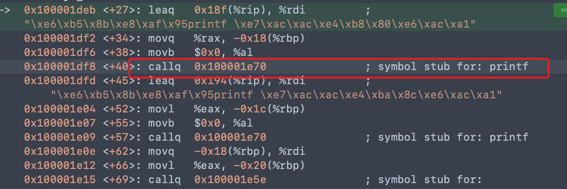

这是第一次调用，call 0x100001e70，我们接着来看0x100001e70这个地址是什么

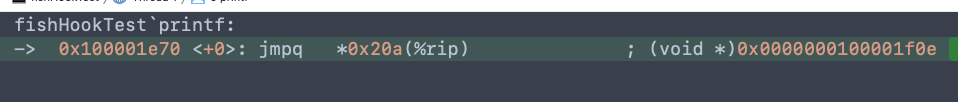

继续跳转到0x100001f0e，再来看这个地址

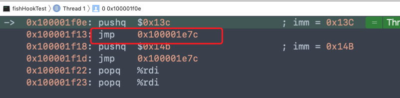

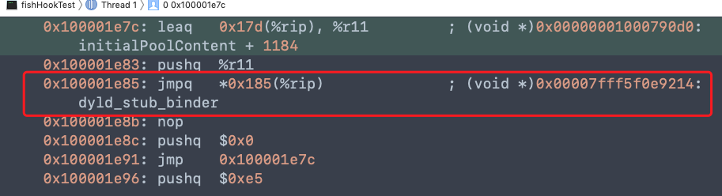

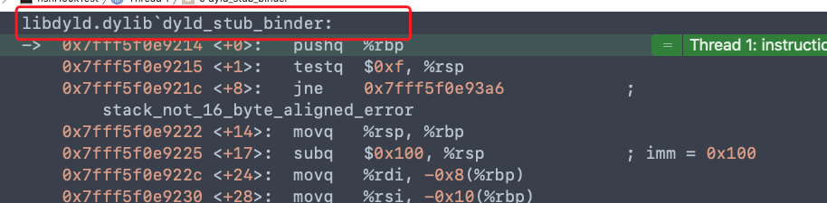

最终我们看到调用了`dyld_stub_binder` 这个函数，动态绑定符号是由这个函数实现的。具体实现可以在[dyld](https://opensource.apple.com/tarballs/dyld/) 中找到。


接下来我们过掉第一次调用的断点，来到第二个断点

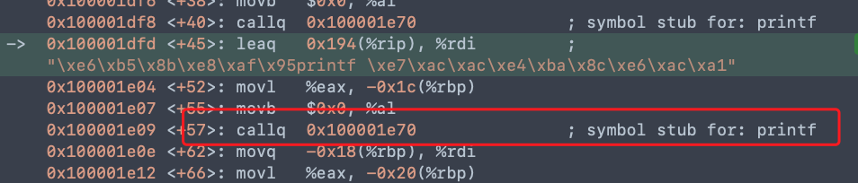

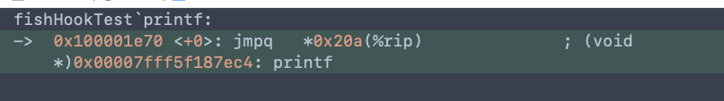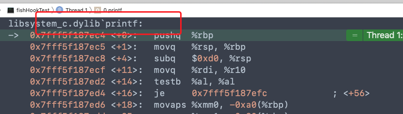

可以看到这一次直接就是找到printf的函数实现地址


## fishhook的绑定验证

看完上面一堆乱七八糟的之后，我们接下来看一下经过hook之后，函数的地址是怎么样变化的

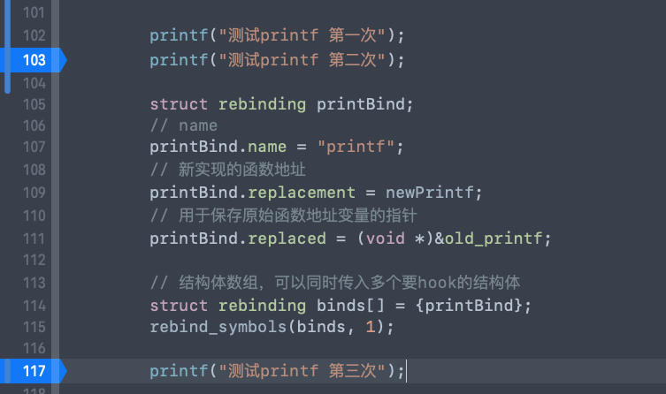

先观察第一次触发断点的时候，printf的实现函数

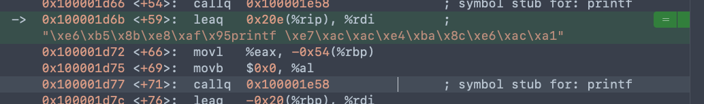

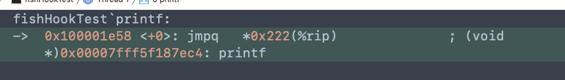


可以看到这是正常实现，最后调用了system的printf函数。


接下来看实现hook之后，第三次调用的情况

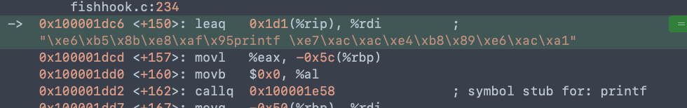

调用0x100001e58

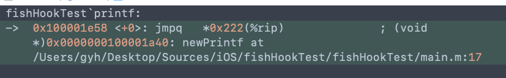

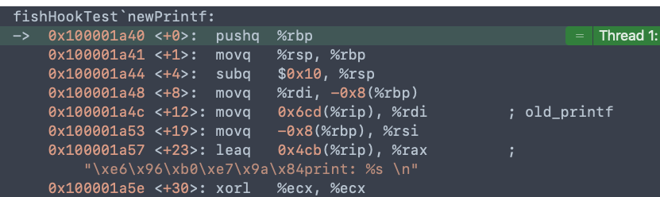

这下就发现不一样了，刚才我们调用的是system的printf函数，而现在我们看到直接调用了我们新写的newPrintf函数。这就说明了fishhook的内部实际是对函数实现的替换。

但是fishhook是怎样就根据一个传入的printf字符串就能找到具体的函数实现并替换呢？接下来就来看一看查找的流程。


## fishhook查找流程


这是官方给的查找流程图。根据在 __ DATA， __la_symbol_ptr 中的偏移，找到在Indirect Symbol Table中的位置，Indirect Symbol Table中的偏移值是在Symbol Table中的偏移，然后取出在Symbol Table中的偏移值，这个偏移值是在String Table中的偏移，在String Table中找到对应的符号。如果匹配证明查找正确。

 整个流程大致是这个样子，下面我们以懒加载符号NSLog为例，来探究一下具体的查找流程

1. 首先来看`Load Commands` -> `LC_SEGMENT_64(__DATA)` -> `Section64 Header(__la_symbol_ptr)`  

   - `Address` 的值指的是懒加载符号对应实现的虚拟内存地址，通过100002018找到了`Section64(__DATA,__la_symbol_ptr)` ，这一段代表的就是符号的具体实现，这里的顺序跟在符号表内的顺序是一致的

   - `Indirect Sym Index` 的值18代表的是在`Dynamic Symbol Table`中的索引，从符号表中偏移18，就可以找到NSLog，按照顺序就可以找到其他对应的符号
   - `Symbol Table`、`String Table` 和 `Dynamic Symbol Table`  的地址可以通过`Load Commands` -> `LC_SYMTAB` / `LC_DYSYMTAB` 找到对应的起始地址

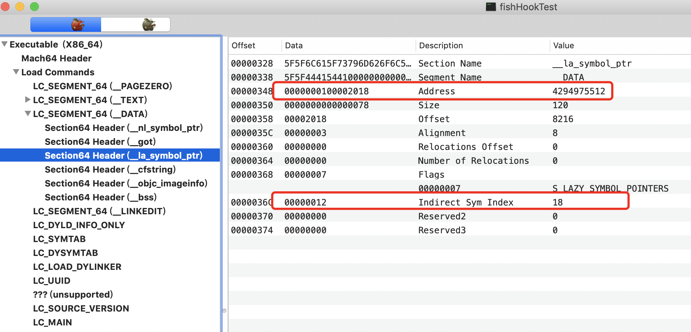

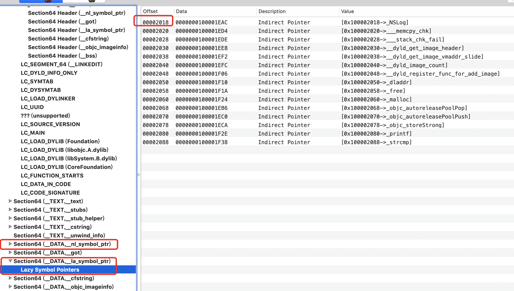

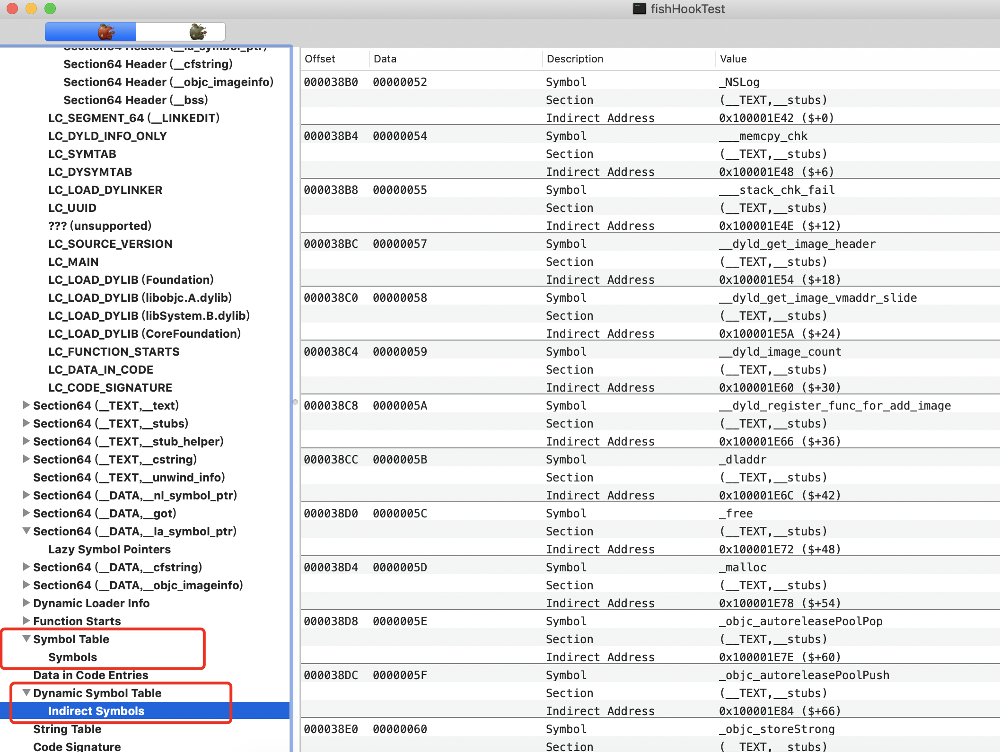


2. 根据索引18在`Dynamic Symbol Table` 中找到了_NSLog， 第二列的值00000052就是在`Symbol Table`中的索引，这个52是十六进制，我们转成十进制就是82

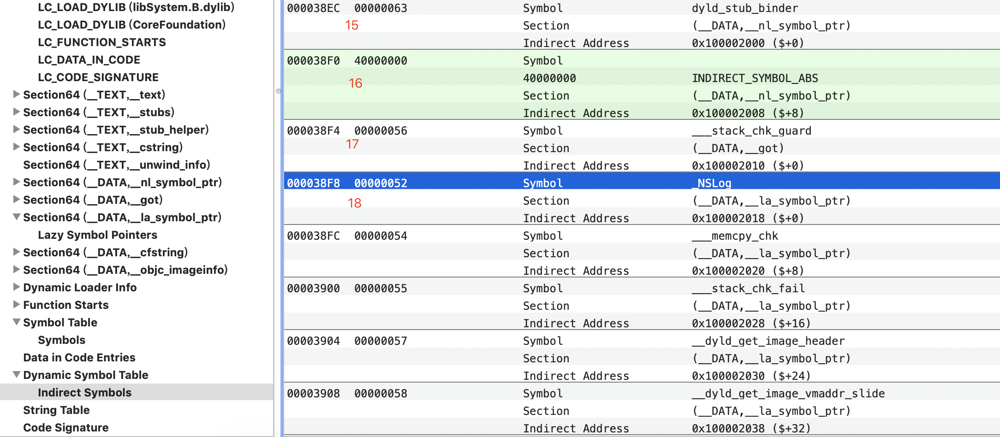


3. 在`Symbol Table`中找到82的位置，我们看到也是__NSLog，这说明目前我们的查找是没问题的。拿到第二列的值55，这个值就是在`String Table`中的偏移

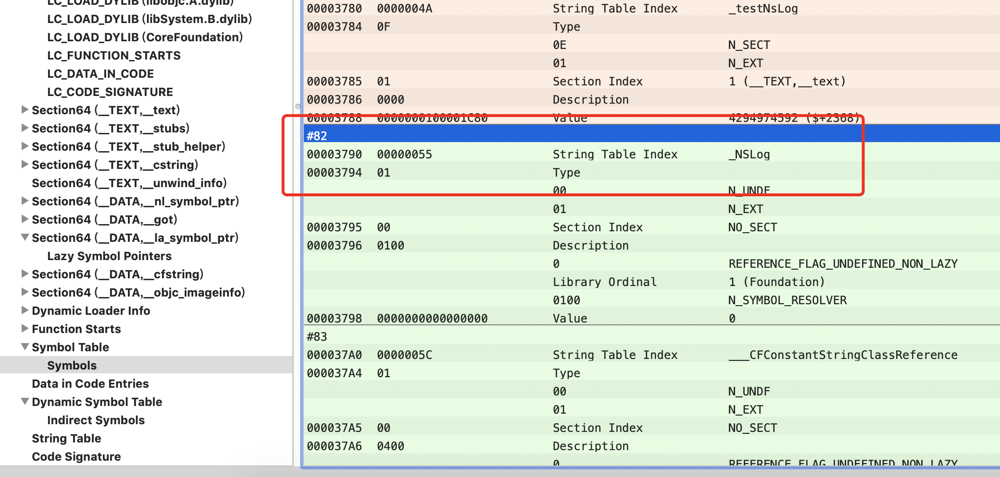


4. 找到`String Table`的起始地址38B4，加上我们刚刚得到的偏移55，通过计算器相加=0x3909，然后找到具体的位置，可以看到就是`_NSLog`，前后的.是分隔符

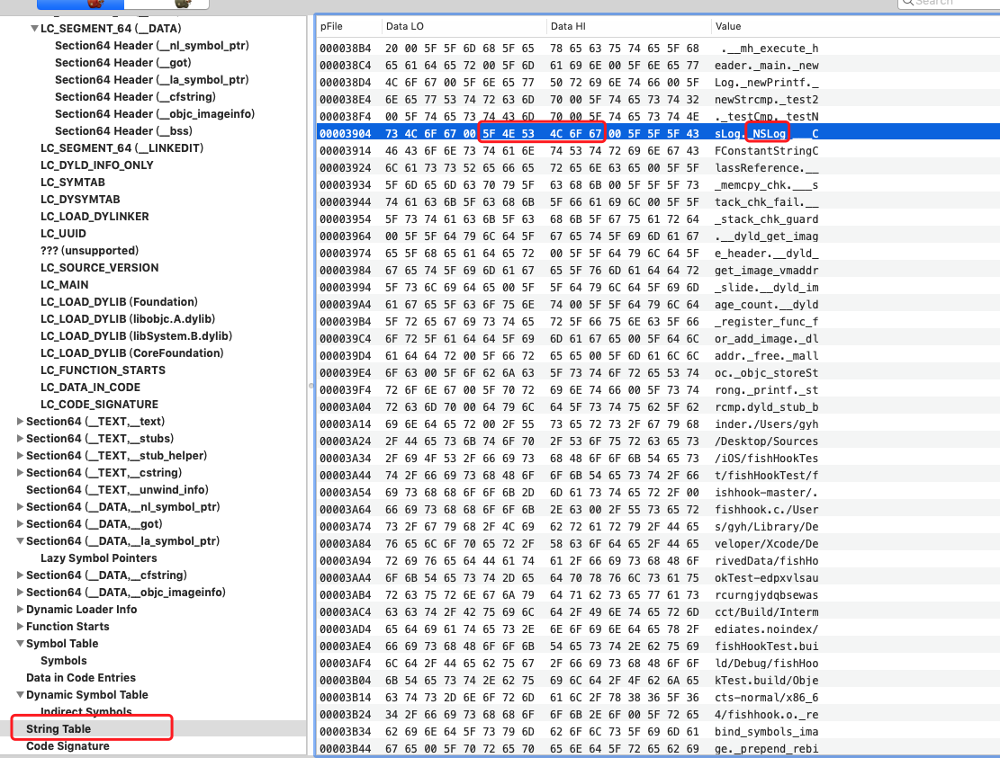


# 源码

```c
/*
 * A structure representing a particular intended rebinding from a symbol
 * name to its replacement
 */
struct rebinding {
  const char *name;
  void *replacement;
  void **replaced;
};

/*
 * For each rebinding in rebindings, rebinds references to external, indirect
 * symbols with the specified name to instead point at replacement for each
 * image in the calling process as well as for all future images that are loaded
 * by the process. If rebind_functions is called more than once, the symbols to
 * rebind are added to the existing list of rebindings, and if a given symbol
 * is rebound more than once, the later rebinding will take precedence.
 */
FISHHOOK_VISIBILITY
int rebind_symbols(struct rebinding rebindings[], size_t rebindings_nel);
```

fishhook主要函数就是rebind_symbols()，传入两个参数，第一个参数为rebinding结构体数组，第二个参数为结构体数组个数。

看一下rebinding结构体

- `char *name` 需要hook的函数名称。若需hook printf()函数，则为"printf"

- `void *replacement` 新实现的函数地址

- `void **replaced` *replaced是一个函数指针 **replaced是指向函数指针的指针，为了取出函数的地址，可以在被调函数内修改

  

接下来看一下rebind_symbols()函数的实现

```C
int rebind_symbols(struct rebinding rebindings[], size_t rebindings_nel) {
  int retval = prepend_rebindings(&_rebindings_head, rebindings, rebindings_nel);
  if (retval < 0) {
    return retval;
  }
  // If this was the first call, register callback for image additions (which is also invoked for
  // existing images, otherwise, just run on existing images
  if (!_rebindings_head->next) {
    _dyld_register_func_for_add_image(_rebind_symbols_for_image);
  } else {
    uint32_t c = _dyld_image_count();
    for (uint32_t i = 0; i < c; i++) {
      _rebind_symbols_for_image(_dyld_get_image_header(i), _dyld_get_image_vmaddr_slide(i));
    }
  }
  return retval;
}
```

首先调用 `prepend_rebindings()`  函数做一些初始化准备工作，传入三个参数，第一个参数`_rebindings_head`是一个指向`rebindings_entry`结构体的指针，从结构体定义可以看出这是一个单向链表的结构。`rebindings`是一个指向`rebinding`结构体的指针，`next`指向下一个节点。会把外部传入的`rebindings`全部插入到此链表中串起来。第二三个参数则是rebindings结构体数组，`prepend_rebindings`函数内部会把第二三个参数插入到第一个参数内。

```c
struct rebindings_entry {
  struct rebinding *rebindings;
  size_t rebindings_nel;
  struct rebindings_entry *next;
};

static struct rebindings_entry *_rebindings_head;


static int prepend_rebindings(struct rebindings_entry **rebindings_head,
                              struct rebinding rebindings[],
                              size_t nel) {
  // 开辟 rebindings_entry 堆空间
  struct rebindings_entry *new_entry = (struct rebindings_entry *) malloc(sizeof(struct rebindings_entry));
  if (!new_entry) {
    return -1;
  }
  // 开辟 new_entry->rebindings 堆空间
  // 如果失败，释放空间 返回
  new_entry->rebindings = (struct rebinding *) malloc(sizeof(struct rebinding) * nel);
  if (!new_entry->rebindings) {
    free(new_entry);
    return -1;
  }
  // 拷贝外部rebinding结构体内容 -> 内部结构体 rebindings_entry->rebindings
  // 添加 new_entry 到 _rebindings_head 这个链表结构的头部 成为新的头节点
  memcpy(new_entry->rebindings, rebindings, sizeof(struct rebinding) * nel);
  new_entry->rebindings_nel = nel;
  new_entry->next = *rebindings_head;
  *rebindings_head = new_entry;
  return 0;
}
```

准备工作没问题之后，接下来执行一个判断，`!_rebindings_head->next` 若链表内无内容，说明第一次执行，则调用`_dyld_register_func_for_add_image`方法，当调用`_dyld_register_func_for_add_image`注册监听方法后，当前已经装载的image等会立刻触发回调，之后的image会在装载的时候触发回调，调用通知内的`_rebind_symbols_for_image`方法

若next有值，则进行加载动态库的遍历，也调用`_rebind_symbols_for_image` 方法。

```c
static void _rebind_symbols_for_image(const struct mach_header *header,
                                      intptr_t slide) {
    rebind_symbols_for_image(_rebindings_head, header, slide);
}
```

`_rebind_symbols_for_image`实际调用的是`rebind_symbols_for_image` ，`rebind_symbols_for_image` 是核心方法，主要是解析mach-o，查找`S_LAZY_SYMBOL_POINTERS` `S_NON_LAZY_SYMBOL_POINTERS` 位置，找到之后调用`perform_rebinding_with_section` 方法真正的实现函数替换。

```c
static void rebind_symbols_for_image(struct rebindings_entry *rebindings,
                                     const struct mach_header *header,
                                     intptr_t slide) {
  Dl_info info;
  if (dladdr(header, &info) == 0) {
    return;
  }

  segment_command_t *cur_seg_cmd;
  segment_command_t *linkedit_segment = NULL;
  struct symtab_command* symtab_cmd = NULL;
  struct dysymtab_command* dysymtab_cmd = NULL;

  uintptr_t cur = (uintptr_t)header + sizeof(mach_header_t);
  for (uint i = 0; i < header->ncmds; i++, cur += cur_seg_cmd->cmdsize) {
    cur_seg_cmd = (segment_command_t *)cur;
    if (cur_seg_cmd->cmd == LC_SEGMENT_ARCH_DEPENDENT) {
      if (strcmp(cur_seg_cmd->segname, SEG_LINKEDIT) == 0) {
        linkedit_segment = cur_seg_cmd;
      }
    } else if (cur_seg_cmd->cmd == LC_SYMTAB) {
      symtab_cmd = (struct symtab_command*)cur_seg_cmd;
    } else if (cur_seg_cmd->cmd == LC_DYSYMTAB) {
      dysymtab_cmd = (struct dysymtab_command*)cur_seg_cmd;
    }
  }

  if (!symtab_cmd || !dysymtab_cmd || !linkedit_segment ||
      !dysymtab_cmd->nindirectsyms) {
    return;
  }

  // Find base symbol/string table addresses
  uintptr_t linkedit_base = (uintptr_t)slide + linkedit_segment->vmaddr - linkedit_segment->fileoff;
  nlist_t *symtab = (nlist_t *)(linkedit_base + symtab_cmd->symoff);
  char *strtab = (char *)(linkedit_base + symtab_cmd->stroff);

  // Get indirect symbol table (array of uint32_t indices into symbol table)
  uint32_t *indirect_symtab = (uint32_t *)(linkedit_base + dysymtab_cmd->indirectsymoff);

  cur = (uintptr_t)header + sizeof(mach_header_t);
  for (uint i = 0; i < header->ncmds; i++, cur += cur_seg_cmd->cmdsize) {
    cur_seg_cmd = (segment_command_t *)cur;
    if (cur_seg_cmd->cmd == LC_SEGMENT_ARCH_DEPENDENT) {
      if (strcmp(cur_seg_cmd->segname, SEG_DATA) != 0 &&
          strcmp(cur_seg_cmd->segname, SEG_DATA_CONST) != 0) {
        continue;
      }
      for (uint j = 0; j < cur_seg_cmd->nsects; j++) {
        section_t *sect =
          (section_t *)(cur + sizeof(segment_command_t)) + j;
        if ((sect->flags & SECTION_TYPE) == S_LAZY_SYMBOL_POINTERS) {
          perform_rebinding_with_section(rebindings, sect, slide, symtab, strtab, indirect_symtab);
        }
        if ((sect->flags & SECTION_TYPE) == S_NON_LAZY_SYMBOL_POINTERS) {
          perform_rebinding_with_section(rebindings, sect, slide, symtab, strtab, indirect_symtab);
        }
      }
    }
  }
}
```

在`perform_rebinding_with_section`的内部真正实现替换，会拿结构体内需hook的符号名进行对比，如果符号名称一致，而且没有被替换过，则会拿我们自己的函数指针保存原来的实现，然后把指针指向我们自定义的实现。这样就实现了替换，既完成了函数替换，也保存了原有实现，待在自定义函数内完成了工作后，可以调用原来的实现恢复正常工作。

```c
static void perform_rebinding_with_section(struct rebindings_entry *rebindings,
                                           section_t *section,
                                           intptr_t slide,
                                           nlist_t *symtab,
                                           char *strtab,
                                           uint32_t *indirect_symtab) {
  uint32_t *indirect_symbol_indices = indirect_symtab + section->reserved1;
  void **indirect_symbol_bindings = (void **)((uintptr_t)slide + section->addr);
  for (uint i = 0; i < section->size / sizeof(void *); i++) {
    uint32_t symtab_index = indirect_symbol_indices[i];
    if (symtab_index == INDIRECT_SYMBOL_ABS || symtab_index == INDIRECT_SYMBOL_LOCAL ||
        symtab_index == (INDIRECT_SYMBOL_LOCAL   | INDIRECT_SYMBOL_ABS)) {
      continue;
    }
    uint32_t strtab_offset = symtab[symtab_index].n_un.n_strx;
    char *symbol_name = strtab + strtab_offset;
    bool symbol_name_longer_than_1 = symbol_name[0] && symbol_name[1];
    struct rebindings_entry *cur = rebindings;
    // 遍历所有结构体内需要替换的函数，进行替换
    while (cur) {
      for (uint j = 0; j < cur->rebindings_nel; j++) {
        // 比较符号名称和外部传入需hook的符号名，如果一致则进行下一步替换
        if (symbol_name_longer_than_1 &&
            strcmp(&symbol_name[1], cur->rebindings[j].name) == 0) {
          if (cur->rebindings[j].replaced != NULL &&
              indirect_symbol_bindings[i] != cur->rebindings[j].replacement) {
            // 取出函数指针的指向的地址，存入函数原有的方法实现
            *(cur->rebindings[j].replaced) = indirect_symbol_bindings[i];
          }
          // 把原有的函数实现替换为自定义的replacement
          indirect_symbol_bindings[i] = cur->rebindings[j].replacement;
          goto symbol_loop;
        }
      }
      cur = cur->next;
    }
  symbol_loop:;
  }
}
```


# 参考资料

- https://github.com/facebook/fishhook
- [fishhook的实现原理浅析](https://juejin.im/post/5c7b43976fb9a04a05406312)

- [fishhook使用场景&源码分析](https://juejin.im/post/5c810294f265da2db91297f1)

- [Fishhook替换C函数的原理](https://blog.csdn.net/Hello_Hwc/article/details/78444203)

