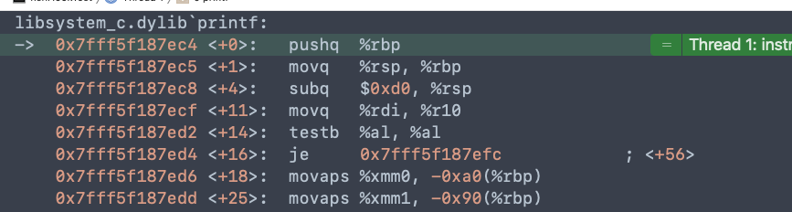

# 简介

[fishhook](https://github.com/facebook/fishhook) 是Facebook开源的用来动态修改C语言函数实现的库。

iOS中`Method swizzing`通过交换IMP可以hook OC的方法，但是对于C的函数是没有办法的，而fishhook通过交换函数实现 可以hook系统的静态C函数。


# 使用

先来看一下使用方法和达到的效果，随后再慢慢解析。我们这里就拿printf为例进行hook，下面来看一下代码，非常简单就可以实现效果

```c
static int (*old_printf)(const char *, ...);

int newPrintf(const char *arg1, ...) {
    return old_printf("新的print: %s \n", arg1);
}


int main(int argc, const char * argv[]) {

    struct rebinding printBind;
    // name
    printBind.name = "printf";
    // 新实现的函数地址
    printBind.replacement = newPrintf;
    // 用于保存原始函数地址变量的指针
    printBind.replaced = (void *)&old_printf;

    // 结构体数组，可以同时传入多个要hook的结构体
    struct rebinding binds[] = {printBind};
    rebind_symbols(binds, 1);

    printf("测试printf");
  
    return 0;
}
```

看一下运行结果

```
新的print: 测试printf 
Program ended with exit code: 0
```

可以看到已经实现了hook printf的目的。从代码字面意识上来看，调用printf的时候，应该是调用了我们的newPrintf函数，在我们的函数内部做一些事情之后再调用会到原本的函数实现，这和oc method swizzing的原理是差不多的。下面就来深入的了解一下


# 原理

## 编译链接简单介绍

- 编译（Compile）

  编译的时候会把每一个.m文件经过预处理、词法分析、语法分析、语义分析等一系列步骤最终编译成为一个.o文件，这个.o文件称为`目标文件`。编译结束后会生成一个一个的.o文件

- 静态链接（Link）

  在我们实际开发中，不可能将所有代码都放在一个文件内，所以就会有多个.m文件，这些.m文件之间肯定有所依赖，比如引用了函数或者变量等。但是每一个.m文件都是单独编译成为.o文件的，为了维持这种依赖关系，则需要将这些目标文件进行链接并且进行符号解析重定位等，从而形成一个可执行程序。这就是静态链接

- 动态链接

  动态链接是把程序拆分成不同的模块，等到程序启动的时候再进行链接，而不是像静态链接一样在编译时候就把所有的模块都链接在一起成功一个可执行文件。

  苹果所有的系统框架都是动态库，放在一个共享缓存内，供所有的程序使用

  动态链接的好处就是节省了空间，而且更新方便。坏处就是由于链接放在启动时候，所以就会造成一些性能损耗。

  

## 地址无关代码 

地址无关代码，也叫PIC（Position-indendent Code）。


## 懒加载符号和非懒加载符号

苹果为了加快系统的启动速度，将符号分成了懒加载符号和非懒加载符号。将一些符号的绑定重定位等放到第一次加载的时候。

- 非懒加载符号在动态库链接的时候就会绑定真是的值
- 懒加载符号会在程序中第一次用到的时候再进行绑定

下面就以printf为例，printf就是一个懒加载符号，只有在用到的时候才会绑定。我们分别来看一下第一次调用和第二次调用有什么不一样。

```c
printf("测试printf 第一次");
printf("测试printf 第二次");
```

调用两次，都打上断点。转到反汇编


这是第一次调用，call 0x100001e70，我们接着来看0x100001e70这个地址是什么


继续跳转到0x100001f0e，再来看这个地址


最终我们看到调用了`dyld_stub_binder` 这个函数，动态绑定符号是由这个函数实现的。具体实现可以在[dyld](https://opensource.apple.com/tarballs/dyld/) 中找到。


接下来我们过掉第一次调用的断点，来到第二个断点


可以看到这一次直接就是找到printf的函数实现地址


## fishhook的绑定验证

看完上面一堆乱七八糟的之后，我们接下来看一下经过hook之后，函数的地址是怎么样变化的


先观察第一次触发断点的时候，printf的实现函数




可以看到这是正常实现，最后调用了system的printf函数。


接下来看实现hook之后，第三次调用的情况


调用0x100001e58


这下就发现不一样了，刚才我们调用的是system的printf函数，而现在我们看到直接调用了我们新写的newPrintf函数。这就说明了fishhook的内部实际是对函数实现的替换。

但是fishhook是怎样就根据一个传入的printf字符串就能找到具体的函数实现并替换呢？接下来就来看一看查找的流程。


## fishhook查找流程


这是官方给的查找流程图。我们来一步步的探究一下


# 源码解析

