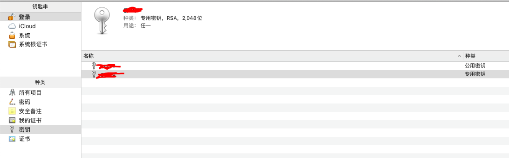

苹果为了保证app的安全性，需要所有用户安装到手机上的app都是经过苹果官方允许的。所以有了一套自己的签名机制来保证安全性。


## 证书

我们平时开发中，如果需要真机调试，则需要进行一系列复杂的操作，那么每一步的目的都是什么呢？.cer .mobileprovision 这些文件都是什么东西呢？下面安装平时的操作流程一步一步来看


### 1. 生成`.cerSigningRequest` 文件 （CSR）

在Mac电脑 钥匙串 -> 证书助理 -> 从证书颁发机构请求证书，输入个人信息（邮箱以及名称）生成了`CertificateSigningRequest.certSigningRequest`文件，保存在磁盘。

这一步操作执行完成之后就会在 钥匙串中 新增一对非对称密钥对，名字就是刚申请时填写的常用名称。CSR文件内包含了公钥和申请者的身份信息。后续提供给苹果后台生成证书使用



可通过下面的命令查看CSR文件的内容

```
openssl asn1parse -i -in CertificateSigningRequest.certSigningRequest
```

其中包含了

- 申请者信息 （邮箱和名称）
- 申请者公钥（和申请者私钥对应）
- 摘要算法（sha256）和 公钥加密算法（rsa）

```
    0:d=0  hl=4 l= 643 cons: SEQUENCE          
    4:d=1  hl=4 l= 363 cons:  SEQUENCE          
    8:d=2  hl=2 l=   1 prim:   INTEGER           :00
   11:d=2  hl=2 l=  62 cons:   SEQUENCE          
   13:d=3  hl=2 l=  31 cons:    SET               
   15:d=4  hl=2 l=  29 cons:     SEQUENCE          
   17:d=5  hl=2 l=   9 prim:      OBJECT            :emailAddress
   28:d=5  hl=2 l=  16 prim:      IA5STRING         :771331372@qq.com
   46:d=3  hl=2 l=  14 cons:    SET               
   48:d=4  hl=2 l=  12 cons:     SEQUENCE          
   50:d=5  hl=2 l=   3 prim:      OBJECT            :commonName
   55:d=5  hl=2 l=   5 prim:      UTF8STRING        :gaoyu
   62:d=3  hl=2 l=  11 cons:    SET               
   64:d=4  hl=2 l=   9 cons:     SEQUENCE          
   66:d=5  hl=2 l=   3 prim:      OBJECT            :countryName
   71:d=5  hl=2 l=   2 prim:      PRINTABLESTRING   :CN
   75:d=2  hl=4 l= 290 cons:   SEQUENCE          
   79:d=3  hl=2 l=  13 cons:    SEQUENCE          
   81:d=4  hl=2 l=   9 prim:     OBJECT            :rsaEncryption
   92:d=4  hl=2 l=   0 prim:     NULL              
   94:d=3  hl=4 l= 271 prim:    BIT STRING        
  369:d=2  hl=2 l=   0 cons:   cont [ 0 ]        
  371:d=1  hl=2 l=  13 cons:  SEQUENCE          
  373:d=2  hl=2 l=   9 prim:   OBJECT            :sha256WithRSAEncryption
  384:d=2  hl=2 l=   0 prim:   NULL              
  386:d=1  hl=4 l= 257 prim:  BIT STRING       
```


### 2. 在苹果后台生成`.cer`证书

根据开发环境和正式环境分别上传CSR文件，然后苹果后台生成对应的证书（ios_development.cer / ios_distribution.cer）。下载双击安装之后就会存在于钥匙串我的证书中，展开之后可以看到证书对应的私钥。

这一步是利用苹果的私钥对Mac设备的公钥信息进行签名，生成的证书文件。证书的主要作用就是确保公钥的可信性

通过下面命令可以查看.cer文件包含的内容

```
openssl x509 -inform der -in development.cer -noout -text
```

cer文件包含了

- 申请者信息
- 申请者公钥
- 通过苹果私钥加密的数字签名

```
Certificate:
    Data:
        Version: 3 (0x2)
        Serial Number: xxx (xxx)
    Signature Algorithm: sha256WithRSAEncryption
        Issuer: C=US, O=Apple Inc., OU=Apple Worldwide Developer Relations, CN=Apple Worldwide Developer Relations Certification Authority
        Validity
            Not Before: Jan  2 03:13:34 2020 GMT
            Not After : Jan  1 03:13:34 2021 GMT
        Subject: UID=5VZ7SRDKHQ, CN=Apple Development: xx Wang (xx), OU=xx, O=xx., C=US
        Subject Public Key Info:
            Public Key Algorithm: rsaEncryption
                Public-Key: (2048 bit)
                Modulus:
                    00:b1:2e:6b:9e:f6:72:d0:fb:a8:66:d9:92:f3:9a:
                    73:bc:d2:91:cb:4b:8d:96:46:d5:54:8e:26:27:89:
                    36:55:9d:11:7f:b7:33:2e:58:fc:14:10:c7:e0:37:
                    90:48:c6:8e:bd:c6:39:07:0d:99:b9:9b:a3:f5:2b:
                    6f:1f:e5:09:77:64:a9:c3:5f:e0:a3:9c:11:ea:43:
                    72:62:d2:c0:24:f4:95:8d:46:de:12:e5:61:1e:54:
                    8a:72:6a:f7:30:17:c5:16:9b:69:df:ea:9b:66:c7:
                    7e:bc:75:e2:93:c7:95:33:ad:c7:dc:34:54:e6:58:
                    c8:c6:be:03:1e:f8:87:52:01:8f:3c:6d:b1:32:40:
                    3e:5d:4f:bd:d3:2d:da:f3:b9:a8:07:8b:42:32:f3:
                    5b:5e:a2:db:d0:ae:7b:81:23:ee:98:77:7e:e0:ab:
                    2d:1c:d5:ac:a3:80:20:53:ca:76:19:96:8f:12:df:
                    76:6b:65:20:ed:b0:95:a4:25:55:0e:56:c8:b4:b5:
                    01:59:30:db:65:a5:7d:c3:3e:2a:43:e8:b9:24:3d:
                    7e:29:9f:7c:54:9c:15:ca:f8:89:29:19:0d:09:ba:
                    d6:75:11:a4:fc:cd:3d:6d:7a:49:63:b9:bc:3a:4c:
                    ad:d4:b2:27:3f:77:a0:6b:1a:68:0d:06:ef:43:64:
                    21:f7
                Exponent: 65537 (0x10001)
        X509v3 extensions:
            X509v3 Basic Constraints: critical
                CA:FALSE
            X509v3 Authority Key Identifier: 
                keyid:88:27:17:09:A9:B6:18:60:8B:EC:EB:BA:F6:47:59:C5:52:54:A3:B7

            Authority Information Access: 
                OCSP - URI:http://ocsp.apple.com/ocsp03-wwdr19

            X509v3 Certificate Policies: 
                Policy: 1.2.840.113635.100.5.1
                  User Notice:
                    Explicit Text: Reliance on this certificate by any party assumes acceptance of the then applicable standard terms and conditions of use, certificate policy and certification practice statements.
                  CPS: http://www.apple.com/certificateauthority/

            X509v3 Extended Key Usage: critical
                Code Signing
            X509v3 Subject Key Identifier: 
                39:FC:07:C6:11:7B:8D:34:D7:75:81:7B:28:18:BA:5F:B4:AE:28:12
            X509v3 Key Usage: critical
                Digital Signature
            1.2.840.113635.100.6.1.2: critical
                ..
            1.2.840.113635.100.6.1.12: critical
                ..
    Signature Algorithm: sha256WithRSAEncryption
         3b:96:c2:4e:d8:8d:43:fc:eb:dc:25:34:eb:31:29:86:be:97:
         89:35:12:6c:2c:e4:f3:9d:e2:6a:c2:0b:c6:e3:03:d4:03:1f:
         c0:ae:46:d1:34:66:e9:ea:6c:13:6f:e7:d9:0f:eb:b0:8c:d5:
         66:9f:6b:41:8a:cb:01:ca:56:02:e7:1c:e4:0b:6c:24:fd:f3:
         4a:29:25:1c:b0:30:4d:d3:e2:1c:34:54:12:94:9b:f5:05:a2:
         a1:30:58:8d:91:6d:e0:c3:bb:1f:88:71:68:fd:fc:3e:86:42:
         ab:f0:de:bb:b1:de:ce:ca:f1:a5:b9:79:f4:88:1e:55:6b:65:
         dd:14:12:b9:63:66:ae:6d:d6:5f:9d:22:12:4c:f3:9e:65:b5:
         40:d8:8b:0c:8b:c5:79:4e:f4:93:f3:75:aa:74:b7:0f:70:c3:
         ce:41:bf:e0:02:a7:ee:08:e9:13:3c:27:a1:af:9e:e9:89:83:
         2a:92:54:bc:ef:68:3c:61:6d:84:16:67:ca:a2:4e:7c:ec:ca:
         ba:ca:e4:21:a2:66:16:48:7f:c6:2f:b0:1c:39:4b:20:48:a8:
         27:6e:ac:04:d7:c2:ad:80:11:a6:7a:2e:a9:ec:9f:85:89:4c:
         bc:d4:53:62:b4:0f:72:89:05:91:aa:66:5b:2a:86:18:50:4e:
         ff:62:f3:48
```

证书生成之后只是包含了对应的公钥信息，公钥又不具备签名的能力，而私钥只存储在申请者电脑的钥匙串中。那么其他的开发者怎么才能进行调试或者发布呢？

所以我们需要将完整的公钥和私钥导出生成个人信息文件（.p12）。这样其他开发人员安装之后才可以进行调试或者发布。p12里包含了CSR公钥信息和对应的私钥。 

导出p12有两个用处：

- 证书共享，团队协作。其他开发人员安装之后就可以进行调试或发布

- 相当于对证书进行备份，后期不小心删除了钥匙串中的信息，也可以通过p12进行安装

  

### 3. 添加App ID、注册devices

证书生成完成之后，下一步就是添加App ID和添加设备信息。App ID内部会包含了一些对应的权限


### 4. 生成`.mobileprovision`  描述文件

最后一步就是生成描述文件。通过上面我们知道公钥包含在证书里，证书又包含在配置文件里面，配置文件在打包app的时候会被复制到.app目录下面，除了证书，配置文件还包含了以下内容：

- App ID
- Entitlements授权文件
- 使用的证书
- 可安装的设备列表


```
security cms -D -i JBTest.mobileprovision > JBTest.plist
```

通过命令转换mobileprovision描述文件为plist文件，查看描述文件包含的具体内容


- AppIDName

- ApplicationIdentifierPrefix

  完整的App ID的前缀（TeamIdentifier.*）

- CreationDate

  描述文件创建时间

- Platform

  支持的平台

- IsXcodeManaged

  是否是xcode自动管理的

- DeveloperCertificates

  包含了可以为使用该配置文件应用签名的所有证书。证书基于base64编码，符合PEM(PrivacyEnhanced Mail, RFC 1848)格式

- Entitlements

  权限列表 (get-task-allow 代表的是是否需要调试器自动附加)

- ExpirationDate

  描述文件的过期时间

- Name

  描述文件的名称

- ProvisionedDevices

  该描述文件包含的设备id

- TeamIdentifier

- TeamName

- TimeToLive

- UUID

  该描述文件的唯一id，真实文件名

- Version


至此，我们的证书已经全部生成完毕。下载证书安装和下载描述文件之后就可以进行真机调试了。


## 签名及验证流程

### 数字签名


这里简单介绍一下数字签名的流程。数字签名技术可以防止篡改和伪装，还可以防止否认。

数字签名中，生成签名和验证签名这两个行为需要使用各自专用的密钥来完成。 数字签名对签名密钥和验证密钥进行了区分，使用验证密钥是无法生成签名的。 签名密钥只能由签名的人持有，而验证密钥则是任何需要验证签名的人都可以持有。


### 签名流程

下图为苹果的签名和验证流程，整个流程结合了非对称加密、单向散列函数、数字签名以及证书，充分确保了app的合法完整性。


1. mac上存在了生成CSR时对应的公钥和私钥
2. Apple后台存在了对应的私钥A ，称为Apple私钥，Apple公钥存在每一个iOS设备内
3. 第三步和第四步我们之前都已经操作完毕，对应的是证书和描述文件
4. 我们在开发完app时，编译结束会利用Mac的私钥对app进行签名，同时把描述文件（embedded.mobileprovision）拷贝到包文件夹内，最后压缩为ipa文件


### 验证流程

1. 首先会通过iOS设备存在的Apple公钥对描述文件进行验证，如果验证通过，说明描述文件内包含的设备id权限等内容是有效的，此时再一项一项的进行校验。
2. 接着继续利用Apple公钥对证书进行验证，如果验证通过，说明证书内包含的Mac公钥是真实有效的，此时取出Mac公钥
3. 取出Mac公钥之后，继续对app包得签名进行验证，如果验证通过，说明app包未被篡改。此时就可以执行安装了


## 重签名

在逆向开发中，例如我们针对一款app进行了一些功能修改，在越狱手机上可以正常使用，因为越狱手机不会进行签名校验。但是如果我们想在非越狱手机上使用，该怎么办呢？由于我们进行了修改，在安装的时候签名不对，就安装不上。 此时就引出了重签名机制，简单来说就是使用我们自己的开发证书对三方app进行重新签名，这样在非越狱手机上则不会出现因为签名失败的情况导致不能安装

具体操作步骤可[参考这里]([https://github.com/gaonian/HexoDocument/blob/master/iOS/iOSJailBreak.md#%E9%87%8D%E7%AD%BE%E5%90%8D](https://github.com/gaonian/HexoDocument/blob/master/iOS/iOSJailBreak.md#重签名))


## 参考资料

- [图解密码技术]([https://baike.baidu.com/item/%E5%9B%BE%E8%A7%A3%E5%AF%86%E7%A0%81%E6%8A%80%E6%9C%AF/18603034?fr=aladdin](https://baike.baidu.com/item/图解密码技术/18603034?fr=aladdin))
- [iOS App 签名原理](http://blog.cnbang.net/tech/3386/)
- [Apple Developer之Provisioning Profile(Certificate)](https://blog.csdn.net/kevindongkun/article/details/51033970)
- [iOS Jailbreak](https://github.com/gaonian/HexoDocument/blob/master/iOS/iOSJailBreak.md)


