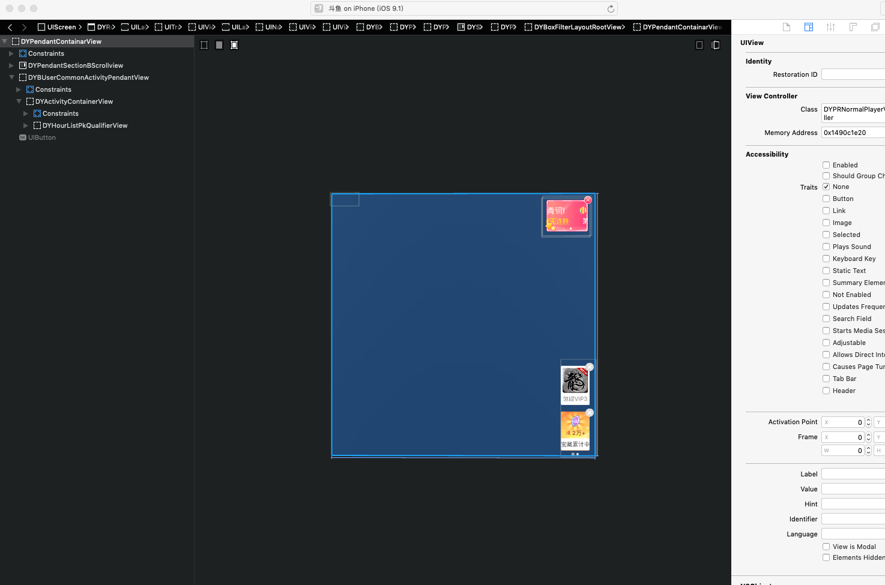

# 前言

## 什么是越狱？

越狱是指通过分析iOS系统的代码，找出iOS系统的漏洞，绕过系统的安全权限检查，最终获取系统root权限的过程。

如果没有越狱，所有的操作就只能局限于沙盒，系统的目录层级我们也不清楚，所有的一切学习都是停留在表面中，无法得知背后的道理。而越狱之后我们就可以访问设备的整个文件系统，更改一些设置，编写一些工具注入指定app等等。设备越狱可以帮助我们更加深入的了解iOS系统的结构，分析系统的行为，为日后的学习和使用打下坚实的基础！

## 准备工作

开始之前，我们需要做一些准备工作:

- 一台完美越狱的手机 (安装了`cydia`)
- phone上在cydia安装 `adv-cmds` ，用于查看当前进程 (`ps -A`)
- mac 上安装 `iFunBox` ，用于查看手机上文件目录

## 目录结构 


- `Applications`  存放所有系统的App和来自Cydia的App，不包括从App Store下载的App
- `Library`  系统资源，用户设置。系统日志、系统自带铃声等。重要目录为`Library/MobileSubstrate`，里面存放的是所有基于Cydia Substrate的插件，之后自己开发的插件也是存放在此目录下
- `User`  用户目录，实际指向的是`var/mobile` 
  - `/Users/Media` 存放相册等
  - `/Users/Library`  存放短信，邮件等

- `bin`  存放用户级二进制文件，例如：mv，ls等
- `etc`  存放系统脚本，hosts配置，SSH配置文件等，实际指向`private/etc`
- `sbin`  存放系统级二进制文件，例如：reboot，mount等
- `usr`  用户工具和程序、`/usr/include` 中存放标准`c`头文件。`/usr/lib` 中存放库文件
- `var` 一些经常改动的文件，包括`keychains`、临时文件、从App Store下载的应用
- …...

## 逆向思路

- 界面分析
  - Cycript 内存分析调试
  - Reveal UI层级分析
  - ...
- 代码分析
  - class-dump导出头文件
  - Hopper 反汇编分析
  - ...
- 动态调试
  - LLDB断点调试分析
  - ...
- 编写代码
  - tweak编写
  - CaptainHook
  - ...

- 重签名app，打包安装

#  SSH

iOS和MacOS都是基于Darwin（苹果的一个基于Unix的开源系统内核），所以iOS中同样支持终端操作。SSH是一种网络协议，用于计算机之间的加密登录。

## OpenSSH

- openSSH是SSH协议的免费开源实现，我们通过OpenSSH登录iPhone

- 在iPhone Cydia上搜索安装OpenSSH，安装成功之后可以通过 OpenSSH Access How-To 查看使用说明

- 确保mac和iPhone在同一wifi下，从mac登录iPhone，账户名`root@ip地址`，密码默认为`alpine` 

  ```shell
  ssh root@192.168.124.15
  ```

  ```
  ➜  ~ ssh root@192.168.124.15
  iPhone:~ root# 
  ```

- 登录成功之后，修改登录密码

  ```
  iPhone:~ root# passwd
  ```


## usbmuxd

在wifi不稳定的情况下，通过ssh连接的在输入命令时可能会出现卡顿的情况（ssh走的是tcp协议，mac是通过网络连接的方式连接到wifi的）。所以为了加快传输速度，还可以通过USB

  连接的方式连接到iPhone。

mac上有一个服务程序`usbmuxd`，可以将mac的数据通过USB传输到iPhone

- 下载工具包 https://cgit.sukimashita.com/usbmuxd.git/snapshot/usbmuxd-1.0.8.tar.gz

  ```
  python python-client/tcprelay.py -t 22:10010
  ```

  将iPhone上的22端口映射到mac本地的10010端口

  

- 新开终端窗口，访问本地的10010端口，同样连接到iPhone上

  ```
  ➜  ~ ssh root@localhost -p 10010
  iPhone:~ root# 
  ```

  

# Cycript

Cycript 是一个允许开发者使用Objective-C++ 和 JavaScript 组合语法查看及修改运行时App内存信息的工具。官网 http://www.cycript.org/ 提供了一些经典使用方法


- 在iPhone Cydia中搜索Cycript并安装

  

- 基本使用

  ```shell
  iPhone:~ root# cycript
  cy# var a = 3
  3
  cy# var b = 4
  4
  cy# a + b
  7
  cy# 
  
  iPhone:~ root# cycript -p SpringBoard
  cy# UIApp
  #"<SpringBoard: 0x15481c200>"
  cy# NSHomeDirectory()
  @"/var/mobile"
  
  ...
  ```

- 通过Cycript分析应用

  ```shell
  iPhone:~ root# cycript -p WeChat
  cy# [NSBundle mainBundle].bundleIdentifier
  @"com.tencent.xin"
  cy# [NSBundle mainBundle].bundlePath
  @"/var/mobile/Containers/Bundle/Application/C2F6EDC4-2B37-4A1E-B974-D9DE607CF2A8/WeChat.app"
  cy# NSSearchPathForDirectoriesInDomains(NSDocumentDirectory, NSUserDomainMask, YES)[0]
  @"/var/mobile/Containers/Data/Application/36F8BF2B-D67D-4072-8B0F-FCCD21FBA31F/Documents"
  cy# UIApp.keyWindow.rootViewController
  #"<MMUINavigationController: 0x1400a9800>"
  cy# 
  ```

- Cycript高级应用，自定义脚本

  Cycript本身支持加载自己的脚本，具体可参考 https://github.com/CoderMJLee/mjcript

  ```shell
  iPhone:~ root# cycript -p WeChat
  cy# @import mjcript
  {}
  cy# MJAppId
  @"com.tencent.xin"
  cy# MJAppPath
  @"/var/mobile/Containers/Bundle/Application/C2F6EDC4-2B37-4A1E-B974-D9DE607CF2A8/WeChat.app"
  cy# MJDocPath 
  @"/var/mobile/Containers/Data/Application/36F8BF2B-D67D-4072-8B0F-FCCD21FBA31F/Documents"
  cy# MJFrontVc()
  #"<WCAccountMainLoginViewController: 0x13faaf600>"
  ```

  

# 脱壳

应用上传至App Store后，苹果会对其进行加密，当应用运行时才会动态解密，在这样的情况下是无法使用一些工具对app进行分析破解的。所以，我们要先对加密过的app进行解密，也就是脱壳操作。iOS中主要脱壳工具有两种 `Clutch` `dumpdecrypted`

## 如何查看是否脱壳

- MachOView

  https://github.com/gdbinit/MachOView/ 

  在MachOView中查看`Load Commands` -> `LC_ENCRYPTION_INFO` -> `Crypt ID` ，0代表未加密，1代表加密

  

- 通过otool命令查看

  ```shell
  ➜  Desktop otool -l iQiYiPhoneVideo.decrypted | grep crypt
  iQiYiPhoneVideo.decrypted:
       cryptoff 16384
      cryptsize 97370112
        cryptid 0
  ➜  Desktop 
  ```

## Clutch

https://github.com/KJCracks/Clutch/releases ，下载最新release版本，建议去掉版本号，将`Clutch` 文件拷贝到iPhone的`/usr/bin` 目录下，赋予执行权限并使用

- `Clutch -i` 列出设备上安装的app和bundle id

```shell
iPhone:~ root# Clutch -i
Installed apps:
1:   爱奇艺-破冰行动全网独播 <com.qiyi.iphone>
2:   喜马拉雅FM「听书社区」电台有声小说相声评书 <com.gemd.iting>
```

- `Clutch -d 1` `Clutch -d com.qiyi.iphone` 输入序号或者bundleId进行脱壳操作，成功之后会生成一个新的ipa文件

```shell
iPhone:~ root# Clutch -d 1
Zipping iQiYiPhoneVideo.app
...
...
DONE: /private/var/mobile/Documents/Dumped/com.qiyi.iphone-iOS9.0-(Clutch-2.0.4).ipa
Finished dumping com.qiyi.iphone in 65.5 seconds

iPhone:~ root# 
```

## dumpdecrypted

- https://github.com/stefanesser/dumpdecrypted ，下载源代码，然后切换到目录下，执行`make` 进行编译，编译完成会生成一个`dumpdecrypted.dylib` 动态库文件


- 将dylib拷贝到iPhone上`/var/root` 目录下，连接iPhone，终端进入dylib所在目录，使用环境变量`DYLD_INSERT_LIBRARIES` 将dylib注入到需要脱壳的可执行文件

  `DYLD_INSERT_LIBRARIES=dumpdecrypted.dylib 可执行文件路径`

  `xx.decrypted`就是脱壳后的ipa文件


# class-dump

class-dump是一个用于从可执行文件中获取类，方法和属性信息的工具，下载地址（https://github.com/nygard/class-dump），下载后把class-dump二进制文件拷贝到`/usr/local/bin` 目录下，可供全局访问。class-dump通过解析mach-o文件，来得到类的信息，具体实现过程可以进一步阅读源码。

```
class-dump -H 可执行文件 -o 生成头文件存放目录
```

```shell
➜  Desktop class-dump -H iQiYiPhoneVideo.decrypted -o iqiyiHeaders
2019-07-07 18:21:53.488 class-dump[10899:565880] Warning: Parsing instance variable type failed, marker
2019-07-07 18:21:56.056 class-dump[10899:565880] Warning: Parsing instance variable type failed, _pendingCount
2019-07-07 18:21:59.021 class-dump[10899:565880] Warning: Parsing instance variable type failed, _cameraTextureUploaded
2019-07-07 18:21:59.024 class-dump[10899:565880] Warning: Parsing instance variable type failed, _needUpdateEffect
2019-07-07 18:21:59.253 class-dump[10899:565880] Warning: Parsing method types failed, SetNofityTarget:
2019-07-07 18:21:59.254 class-dump[10899:565880] Warning: Parsing method types failed, wrapper
2019-07-07 18:21:59.255 class-dump[10899:565880] Warning: Parsing instance variable type failed, wrapper
2019-07-07 18:22:21.618 class-dump[10899:565880] Warning: Parsing method types failed, SetNofityTarget:
```


# Reveal

Reveal是iOS上用于查看程序界面结构和调试界面的工具，和xcode中的UI调试有点像。官网地址（https://revealapp.com/）。Reveal可以在开发过程中动态调试修改程序的样式，也可以注入第三方查看应用的界面结构。

- mac安装Reveal

- 在iPhone Cydia中搜索`Reveal Loader` 安装，安装成功之后在系统设置直接会有 Reveal 选项，点击进入可以选择要调试的app

  

  

- 找到mac的Reveal中的RevealServer文件，覆盖iPhone的`/Library/RHRevealLoader/RevealServer` 文件，重启iPhone

  


安装成功之后在iPhone上打开进程，可以直接在Reveal中选择调试


# Hopper

Hopper 是一款反汇编工具，提供Mac和Linux版本。Hopper可以显示被分析文件的反汇编代码、流程图及伪代码，也可以直接修改汇编指令，生成新的可执行文件


# 动态调试

动态调试与静态分析是相辅相成的。静态分析只能分析静态的函数内部执行，动态调试可以获取程序在运行时的参数传递，执行流程及寄存器内存等信息。

## LLDB

LLDB是xcode自带的调试工具，当使用xcode调试app时，xcode会自动将debugserver安装到iPhone`/Developer/usr/bin/debugserver` 目录上，iPhone启动服务，等待xcode进行连接远程调试。

### debugserver权限问题

debugserver只能调试自己开发的app，调试第三方app是没有权限的

如果希望debugserver调试其他app，则需要对debugserver赋予一定的权限，并重新签名

- get-task-allow
- task_for_pid-allow

### 重签debugserver

- 拷贝debugserver到mac上，导出debugserver原来的签名权限

  ```shell
  ➜  Desktop ldid -e debugserver > debugserver.entitlements
  ```

- 给debugserver.entitlements添加get-task-allow、task_for_pid-allow权限

- 通过ldid命令重新签名

  ```shell
  ➜  Desktop ldid -Sdebugserver.entitlements debugserver
  ```

- 将重新签名的debugserver放到iPhone `/usr/bin` 目录下

### debugserver使用

- iPhone，debugserver在iPhone上要附加到某一个正在运行的进程中

  `debugserver *:端口号 -a 进程`

  端口号：使用iPhone某个端口启动debugserver服务（除保留端口外）

  进程：app的进程信息，进程id或者进程名称，建议进程名称

  ```
  iPhone:~ root# debugserver *:10011 -a iQiYiPhoneVideo
  ```

- mac上启动lldb服务，连接debugserver服务

  ```shell
  ➜  Desktop lldb
  (lldb) process connect connect://localhost:10011
  ```

  连接成功之后被附加的app会处在断点状态，可按`c` 让程序继续运行

### 常用LLDB指令

```
(lldb) expression a
(int) $0 = 10
(lldb) p a
(int) $1 = 10
(lldb) po a
10

// bt (thread backtrace)
// 打印当前线程的堆栈信息
(lldb) bt
* thread #1, queue = 'com.apple.main-thread', stop reason = breakpoint 2.1
  * frame #0: 0x0000000100000edf Test`test at main.m:15:17
    frame #1: 0x0000000100000f35 Test`main(argc=1, argv=0x00007ffeefbff570) at main.m:23:9
    frame #2: 0x00007fff6de233d5 libdyld.dylib`start + 1
    
// 设置断点 Person.m test方法设置断点
(lldb) breakpoint set -f Person.m -n test
(lldb) breakpoint set -n "-[Person test]"
// Person.m 12行设置断点
(lldb) breakpoint set -f Person.m -l 12

// 查看所有断点
(lldb) breakpoint list

// 删除某个断点
(lldb) breakpoint delete 3

// frame 
// frame即是帧，其实就是当前的程序堆栈，我们输入bt命令，打印出来的其实是当前线程的frame。
// 在调试中，一般我们比较关心当前堆栈的变量值，我们可以使用frame variable来获取全部变量值。
// 当然也可以输入特定变量名，来获取单独的变量值，如frame v a来获取a的值。
(lldb) frame variable
(int) argc = 1
(const char **) argv = 0x00007ffeefbff570

(lldb) frame variable
(int) a = 10
(int) b = 20
(int) c = 30

(lldb) frame variable a
(int) a = 10

(lldb) frame info
frame #0: 0x0000000100000edf Test`test at main.m:15:17

// 根据地址或name查看信心或对应文件的位置
(lldb) image lookup -n test
(lldb) image lookup -a 0x000000010a1c3e36

// 查看Person的类型，LLDB会把Person所有的属性和成员变量都打印出来
(lldb) image lookup -t Person
```


# restore-symbol

https://github.com/tobefuturer/restore-symbol 还原符号表

# Theos

逆向过程中，我们在分析完毕基本确认需要修改某个函数之后，剩下的就是写代码去hook了。幸运的是已经有大牛为我们编写了注入拦截函数的工具`Theos` 

https://github.com/theos/theos/wiki 官方wiki

## 安装

1. Install the following prerequisites:

   - [Homebrew](https://brew.sh/)
   - [Xcode](https://itunes.apple.com/us/app/xcode/id497799835?ls=1&mt=12)1 is mandatory. The Command Line Tools package isn’t sufficient for Theos to work. Xcode includes toolchains for all Apple platforms.

   1 Xcode 5.0 or newer. Xcode 4.4 supported, but only when building for ARMv6 (1st/2nd generation iPhone/iPod touch).

   ```
    brew install ldid xz
   ```

2. Set up the `THEOS` environment variable:

   ```shell
    echo "export THEOS=~/theos" >> ~/.bash_profile
    echo "export PATH=$THEOS/bin:$PATH" >> ~/.bash_profile
    source ~/.bash_profile
   ```

   For this change to take effect, you must restart your shell. Open a new tab and do `echo $THEOS` on your shell to check if this is working.

3. Clone Theos to your device:

   ```
    git clone --recursive https://github.com/theos/theos.git $THEOS
   ```

## 创建项目

Theos 提供了很多模块来创建不同类型的项目。我们在这里选择`tweak`。

打开终端，选择任意目录。 输入 “ nic.pl ” ，选择10 tweak项目，按回车之后会生成一些配置需要填写，填写完毕之后就会在当前目录下生成一个项目，这个项目就是我们要编写代码的tweak项目。


配置选项说明：

- `Project Name (required)` : 项目名称

- `Package Name [com.yourcompany.testtweak]` : 创建包得唯一ID，回车即可，有默认值

- `Author/Maintainer Name` : 创建者名称，默认mac用户名

- `MobileSubstrate Bundle filter` : 需要注入的目标应用的Bundle ID

- `List of applications to terminate upon installation` : 安装成功后杀掉指定的进程，回车即可

  

项目结构：


- `Makefile` : makefile文件

  ```makefile
  INSTALL_TARGET_PROCESSES = SpringBoard
  
  include $(THEOS)/makefiles/common.mk
  
  TWEAK_NAME = testTweak
  
  testTweak_FILES = Tweak.x
  testTweak_CFLAGS = -fobjc-arc
  
  include $(THEOS_MAKE_PATH)/tweak.mk
  ```

  需要在文件顶部加入连接phone的环境变量

  ```makefile
  export THEOS_DEVICE_IP=127.0.0.1
  export THEOS_DEVICE_PORT=10010
  ```

  也可以设置全局环境变量，这样就不需要每个文件单独写了

  ```
  echo "export THEOS_DEVICE_IP=127.0.0.1" >> ~/.bash_profile
  echo "export THEOS_DEVICE_PORT=10010" >> ~/.bash_profile
  source ~/.bash_profile
  ```

- `Tweak.x` : 编写代码的文件

- `control` : 指定deb包得一些信息，包括名字，描述等

  ```
  Package: com.yourcompany.testtweak
  Name: testTweak
  Depends: mobilesubstrate
  Version: 0.0.1
  Architecture: iphoneos-arm
  Description: An awesome MobileSubstrate tweak!
  Maintainer: gyh
  Author: gyh
  Section: Tweaks
  ```

- `testTweak.plist` : 用户指定需要注入的目标文件的Bundle ID

  ```
  { Filter = { Bundles = ( "com.qiyi.iphone" ); }; }
  ```


## 基础语法介绍

- **%hook 类名**    **%end**

  hook指定的类，并在里面写需要hook的方法，比如说想hook ViewController 的viewDidLoad方法

  ```
  %hook ViewController
  
   - (void)viewDidLoad {
  
   }
  
  %end
  ```

  这样就hook成功viewDidLoad方法了，当app调用viewDidLoad的时候，会先来到我们这个地方。所以就可以在此时做一些事情。 注意，%hook 和 %end是成对出现的，%end代表hook一个类的结束

- **%log**

  打印方法调用详情，会把传入的参数都打印出来。可通过mac的控制台应用查看phone输出的日志

  ```
  %hook ViewController
  
   - (void)viewDidLoad {
   	%log;
   }
  
  - (void)messageName:(int)arg1 arg2:(int)arg2 {
  	%log;
  }
  
  %end
  ```

- **%orig**

  调用原来的方法，使程序走回原来的方法，不影响正常流程

  ```
  %hook ViewController
  
   - (void)viewDidLoad {
   	%log;
  	%orig;
   }
  
  - (void)messageName:(int)arg1 arg2:(int)arg2 {
  	%log;
  	%orig;
  }
  
  %end
  ```

- **%new**

  如果需要给当前类添加一个新的方法，就需要使用`%new` 来实现

  ```
  %new
  - (void)newMethod {
  }
  ```

- **%c**

  用来生成某个类的对象方法，%c(ClassName) ，实质上是调用了oc的objc_getClass()方法

  ```
  SettingController *svc = [[%c(SettingController) alloc] init];
  
  // 这种写法是报错的 ×
  SettingController *svc = [[SettingController alloc] init];
  ```

- **%ctor** **%dtor**

  - %ctor 程序启动加载动态库时调用，做一些初始化动作
  - %dtor 程序退出的时候调用，处理一些尾巴
  - %ctor %dtor 相当于构造函数和析构函数

  ```
  %ctor {
  	printf("开始\n");
  }
  
  %dtor {
  	printf("结束\n");
  }
  ```

更多语法可参考Logos语法文档 http://iphonedevwiki.net/index.php/Logos

## 编写代码

了解基础的语法之后，我们来根据刚刚所学的来做一个小的练习。这里以斗鱼app为例，去除直播页面的小广告，见下图


1. 打开app，打开mac上的Reveal UI工具，查看层级，经过层层分析，我们发现这个广告view是 `DYPendantContainarView` ，意外收获是三个小广告全在一个view上，初步思考，是不是只要把这个view干掉就可以了。接下来我们就要通过头文件找到这个类看一下具体的代码

   

   

2. 我们把脱过壳的斗鱼mach-o文件从手机拷贝到电脑上，通过class-dump导出头文件，成功之后把头文件拖到sublime中，找到刚刚的 `DYPendantContainarView` 这个类。

3. 简单编写代码。对于这种附加到上层的view，hook最简单的办法就是初始化的时候直接return nil，创建不成功，自然不会显示了。

   ```
   %hook DYPendantContainarView
   
   - (id)initWithFrame:(struct CGRect)arg1 {
   	NSLog(@"-------- initWithFrame ------ ");
   	return nil;
   }
   
   %end
   
   %ctor {
   	NSLog(@"----斗鱼 hook ------");
   	NSLog(@"----斗鱼 hook ------");
   	NSLog(@"----斗鱼 hook ------");
   	NSLog(@"----斗鱼 hook ------");
   	NSLog(@"----斗鱼 hook ------");
   }
   ```


## 编译打包安装

在上一步我们已经分析完，代码也写完了，这一步我们做的就是如何把刚才写的代码添加到手机上并起作用呢。

代码写完之后我们要执行三步操作

1. `make` 命令执行makefile编译

2. ```shell
   ➜  douyutweak make
   > Making all for tweak douyuTweak…
   ==> Preprocessing Tweak.x…
   ==> Compiling Tweak.x (armv7)…
   ==> Linking tweak douyuTweak (armv7)…
   ld: warning: OS version (6.0.0) too small, changing to 7.0.0
   ld: warning: building for iOS, but linking in .tbd file (/Users/gyh/theos/vendor/lib/CydiaSubstrate.framework/CydiaSubstrate.tbd) built for iOS Simulator
   ==> Generating debug symbols for douyuTweak…
   rm /Users/gyh/Desktop/douyutweak/.theos/obj/debug/armv7/Tweak.x.m
   ==> Preprocessing Tweak.x…
   ==> Compiling Tweak.x (arm64)…
   ==> Linking tweak douyuTweak (arm64)…
   ld: warning: OS version (6.0.0) too small, changing to 7.0.0
   ld: warning: building for iOS, but linking in .tbd file (/Users/gyh/theos/vendor/lib/CydiaSubstrate.framework/CydiaSubstrate.tbd) built for iOS Simulator
   ==> Generating debug symbols for douyuTweak…
   rm /Users/gyh/Desktop/douyutweak/.theos/obj/debug/arm64/Tweak.x.m
   ==> Preprocessing Tweak.x…
   ==> Compiling Tweak.x (arm64e)…
   ==> Linking tweak douyuTweak (arm64e)…
   ld: warning: OS version (6.0.0) too small, changing to 7.0.0
   ld: warning: building for iOS, but linking in .tbd file (/Users/gyh/theos/vendor/lib/CydiaSubstrate.framework/CydiaSubstrate.tbd) built for iOS Simulator
   ==> Generating debug symbols for douyuTweak…
   rm /Users/gyh/Desktop/douyutweak/.theos/obj/debug/arm64e/Tweak.x.m
   ==> Merging tweak douyuTweak…
   ==> Signing douyuTweak…
   ➜  douyutweak 
   ```

2. 编译完成之后打包成deb，会在packages文件夹下生成一个deb包

   ```shell
   ➜  douyutweak make package
   > Making all for tweak douyuTweak…
   make[2]: Nothing to be done for `internal-library-compile'.
   > Making stage for tweak douyuTweak…
   dm.pl: building package `com.yourcompany.douyutweak:iphoneos-arm' in `./packages/com.yourcompany.douyutweak_0.0.1-7+debug_iphoneos-arm.deb'
   ➜  douyutweak 
   ```

3. 安装

   ```
   ➜  douyutweak make install
   ==> Installing…
   (Reading database ... 4267 files and directories currently installed.)
   Preparing to replace com.yourcompany.douyutweak 0.0.1-6+debug (using /tmp/_theos_install.deb) ...
   Unpacking replacement com.yourcompany.douyutweak ...
   Setting up com.yourcompany.douyutweak (0.0.1-7+debug) ...
   ==> Unloading SpringBoard…
   ➜  douyutweak 
   ```

   执行完成之后会重启SpringBoard，插件会安装在`/Library/MobileSubstrate/DynamicLibraries` 这个位置下

   

以上三步就将编写好的代码打成包安装到手机上，接下来就是验证刚才写的代码了。

注意，以上三步操作也可以合成一步操作

```
➜  make package install        
```

## 运行

启动app，此时Cydia Substrate会根据plist中的Bundle ID将我们的动态库插入到对应的app中。

打开系统控制台，查看手机的日志。可以看到先加载了我们的动态库，紧接着我们的构造函数就调用了，此时说明已经成功的hook了。


接下来就进入直播界面，看一下是否执行`DYPendantContainarView` 的initwihitframe方法


可以看到我们自己的日志已经打出来了，说明我们之前的猜想都是正确的，如果没问题的话广告的view没有创建成功，则广告不会展示，看下图


## 总结


# 重签名


# MonkeyDev

