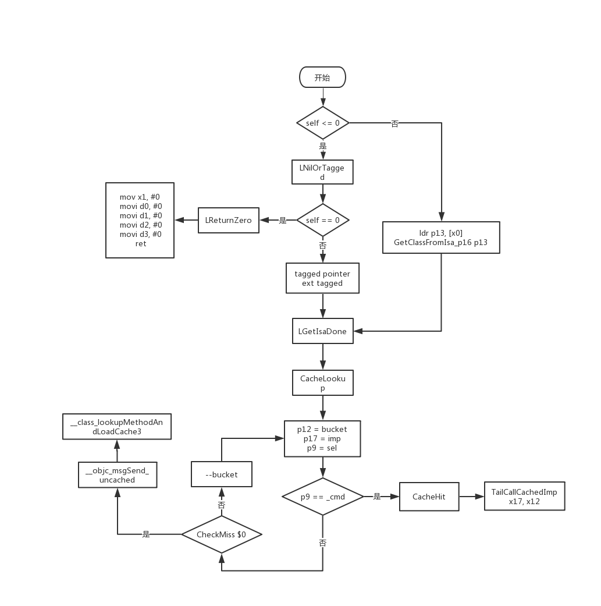

##  Overview

Every Objective-C object has a class, and every Objective-C class has a list of methods. Each method has a selector, a function pointer to the implementation, and some metadata. The job of `objc_msgSend` is to take the object and selector that's passed in, look up the corresponding method's function pointer, and then jump to that function pointer.

每个Objective-C对象都有一个类，每个Objective-C类都有一个方法列表。每个method都有一个selector、一个指向实现的函数指针和一些元数据。objc_msgSend的工作是获取传入的对象和selector，查找对应方法的函数指针，然后跳转到那个函数指针。


Looking up a method can be extremely complicated. If a method isn't found on a class, then it needs to continue searching in the superclasses. If no method is found at all, then it needs to call into the runtime's message forwarding code. If this is the very first message being sent to a particular class, then it has to call that class's `+initialize` method.

查找方法可能非常复杂。如果在类中没有找到方法，则需要继续在父类中搜索。如果根本找不到方法，则需要调用runtime的消息转发。如果这是发送到特定类的第一个消息，那么它必须调用该类的`+initialize`方法。


Looking up a method also needs to be extremely fast in the common case, since it's done for every method call. This, of course, is in conflict with the complicated lookup process.

在一般情况下，查找方法也需要非常快，因为每个方法调用都需要这样做。当然，这与复杂的查找过程相冲突。


Objective-C's solution to this conflict is the method cache. Each class has a cache which stores methods as pairs of selectors and function pointers, known in Objective-C as `IMP`s. They're organized as a hash table so lookups are fast. When looking up a method, the runtime first consults the cache. If the method isn't in the cache, it follows the slow, complicated procedure, and then places the result into the cache so that the next time can be fast.

Objective-C解决这个冲突的方法是方法缓存。每个类都有一个缓存，它以selectors和函数指针对的形式存储方法，在Objective-C中称为`IMP`。它们被组织成hash table，所以查找很快。当查找方法时，runtime首先查询缓存。如果该方法不在缓存中，它将执行缓慢而复杂的过程，然后将结果放入缓存中，以便下一次可以快速执行。


`objc_msgSend` is written in assembly. There are two reasons for this: one is that it's not possible to write a function which preserves unknown arguments and jumps to an arbitrary function pointer in C. The language just doesn't have the necessary features to express such a thing. The other reason is that it's extremely important for `objc_msgSend` to be fast, so every last instruction of it is written by hand so it can go as fast as possible.

`objc_msgSend`是用汇编语言编写的。这样做有两个原因: 一是不可能编写一个保留未知参数并跳转到c中的任意函数指针的函数。编程语言没有对应的特性来表达这种东西。另一个原因是objc_msgSend的速度非常重要，所以它的每一条指令都是手写的，这样它就可以运行得尽可能快。


Naturally, you don't want to write the whole complicated message lookup procedure in assembly langauge. It's not necessary, either, because things are going to be slow no matter what the moment you start going through it. The message send code can be divided into two parts: there's the *fast path* in `objc_msgSend` itself, which is written in assembly, and the *slow path* implemented in C. The assembly part looks up the method in the cache and jump to it if it's found. If the method is not in the cache, then it calls into the C code to handle things.

当然，您不希望用汇编语言编写整个复杂的消息查找过程。也没有必要，因为不管你从什么时候开始，事情都会变慢。消息发送代码可以分为两部分: objc_msgSend本身的fast path是用汇编写的，而slow path是用c语言实现的。汇编部分在缓存中查找方法，如果找到，实现跳转。如果方法不在缓存中，那么它会调用C代码来处理事情。


Therefore, when looking at `objc_msgSend` itself, it does the following:

1. Get the class of the object passed in.
2. Get the method cache of that class.
3. Use the selector passed in to look up the method in the cache.
4. If it's not in the cache, call into the C code.
5. Jump to the `IMP` for the method.

How does it do all of that? Let's see!

因此，当查看 `objc_msgSend` 本身时，它执行以下操作:

1. 获取传入的对象的类
2. 获取该类的方法缓存
3. 使用传入的selector在缓存中查找方法
4. 如果不在缓存中，则调用C代码
5. 跳转到方法的`IMP`

让我们看看它是如何做到这些的呢?


## Instruction by Instruction

`objc_msgSend` has a few different paths it can take depending on circumstances. It has special code for handling things like messages to `nil`, tagged pointers, and hash table collisions. I'll start by looking at the most common, straight-line case where a message is sent to a non-`nil`, non-tagged pointer and the method is found in the cache without any need to scan. I'll note the various branching-off points as we go through them, and then once we're done with the common path I'll circle back and look at all of the others.

根据不同的情况，objc_msgSend可以采用几种不同的路径。它有特殊的代码来处理收到消息为nil的代码、tagged pointers和哈希表冲突等问题。我将从最常见的情况开始，即消息被发送到非nil、非tagged pointer对象，然后在缓存中找到方法，而不需要进行额外的扫描。描述完正常情况后，我们将会回来再看一下其他的一些分支情况。


I'll list each instruction or group of instructions followed by a description of what it does and why. Just remember to look *up* to find the instruction any given piece of text is discussing.

我将列出每条指令或一组指令，然后描述它的功能和原因。为什么这么做。我会在罗列出来的指令下面做描述。


Each instruction is preceded by its offset from the beginning of the function. This serves as a counter, and lets you identify jump targets.

每条指令前都会有一个相对函数开始处的偏移量。这可以方便你辨识跳转到哪个目标代码。


ARM64 has 31 integer registers which are 64 bits wide. They're referred to with the notation `x0` through `x30`. It's also possible to access the lower 32 bits of each register as if it were a separate register, using `w0` through `w30`. Registers `x0` through `x7` are used to pass the first eight parameters to a function. That means that `objc_msgSend` receives the `self` parameter in `x0` and the selector `_cmd` parameter in `x1`.

ARM64有31个64位的整数寄存器。它们用`x0`到`x30`来表示。还可以使用`w0`到`w30`访问每个寄存器的低32位，就好像它是一个单独的寄存器一样。寄存器`x0`到`x7`用于将前八个参数传递给一个函数。这就表示`objc_msgSend`收到的`self`参数是保存在`x0`中，selector `_cmd`参数在`x1`里。


Let's begin!

``` assembly
0x0000 cmp     x0, #0x0
0x0004 b.le    0x6c
```

This performs a signed comparison of `self` with `0` and jumps elsewhere if the value is less than or equal to zero. A value of zero is `nil`, so this handles the special case of messages to nil. This also handles [tagged pointers](https://www.mikeash.com/pyblog/friday-qa-2012-07-27-lets-build-tagged-pointers.html). Tagged pointers on ARM64 are indicated by setting the high bit of the pointer. (This is an interesting contrast with x86-64, where it's the low bit.) If the high bit is set, then the value is negative when interpreted as a signed integer. For the common case of `self` being a normal pointer, the branch is not taken.

这将执行self与0的带符号比较，如果值小于或等于0，则跳转到其他地方。0的值是nil，因此它处理消息为nil的特殊情况。这也处理标记的指针。ARM64上的标记指针是通过设置指针的高位来指示的。(这与x86-64形成了有趣的对比，后者的bit较低。)如果设置了高位，那么在解释为带符号整数时该值为负。对于self是普通指针的常见情况，不会采取分支。

这里执行了 `self` 和 `0` 的带符号比较，如果结果小于等于0，则跳转到`0x6c`。如果值等于0则说明是`nil`，所以跳转到的地方就是执行当发送消息给`nil`的情况。这里也处理了[tagged pointer](https://www.mikeash.com/pyblog/friday-qa-2012-07-27-lets-build-tagged-pointers.html)的情况。在ARM64上 通过设置指针的高位来指明是tagged pointer。（x86-64上是设置低位）。如果高位被设置了1，且被作为一个带符号的整型解析的时候，那么值就是负数。一般情况下`self`是正常的，不会进入这些分支。

``` assembly
0x0008 ldr    x13, [x0]
```

This loads `self`'s `isa` by loading the 64-bit quantity pointed to by `x0`, which contains `self`. The `x13` register now contains the `isa`.

这条指令通过加载`x0`所指向的内存中的64位，来加载`self`的`isa`指针。因为一个对象的第一个指针就是`isa`指针。此时`x13`寄存器包含了`isa`

``` assembly
0x000c and    x16, x13, #0xffffffff8
```

ARM64 can use [non-pointer isas](http://www.sealiesoftware.com/blog/archive/2013/09/24/objc_explain_Non-pointer_isa.html). Traditionally the `isa` points to the object's class, but non-pointer `isa` takes advantage of spare bits by cramming some other information into the `isa` as well. This instruction performs a logical AND to mask off all the extra bits, and leaves the actual class pointer in `x16`.

ARM64可以使用[非指针的isa](http://www.sealiesoftware.com/blog/archive/2013/09/24/objc_explain_Non-pointer_isa.html)。通常isa指针指向的是对象的类，但是非指针的isa利用了备用的bit位，填充了一些其他的信息。这条汇编指令执行了一个逻辑与运算，掩盖掉了所有额外的位，把实际的指向类的指针保存在x16寄存器中

``` assembly
0x0010 ldp    x10, x11, [x16, #0x10]
```

This is my favorite instruction in `objc_msgSend`. It loads the class's cache information into `x10` and `x11`. The `ldp` instruction loads *two* registers' worth of data from memory into the registers named in the first two arguments. The third argument describes where to load the data, in this case at offset `16` from `x16`, which is the area of the class which holds the cache information. The cache itself looks like this:

这是`objc_msgSend`中我最喜欢的指令。它把类的缓存信息加载到`x10`和`x11`中。`ldp`指令从内存中提取了两个寄存器的数据保存到前两个参数指定的寄存器中。第三个参数告诉从哪里加载数据，这里我们看到的是在`x16`寄存器中的值再偏移16，这块属于保存了持有缓存信息的类的区域。缓存的结构如下：

``` c
typedef uint32_t mask_t;

struct cache_t {
    struct bucket_t *_buckets;
    mask_t _mask;
    mask_t _occupied;
}
```

Following the `ldp` instruction, `x10` contains the value of `_buckets`, and `x11` contains `_occupied` in its high 32 bits, and `_mask` in its low 32 bits.

`ldp`指令执行完后，`x10`包含了`_buckets`的值，`x11`在它的高32位保存了`_occupied`，低32位保存了`_mask`


`_occupied` specifies how many entries the hash table contains, and plays no role in `objc_msgSend`. `_mask` is important: it describes the size of the hash table as a convenient AND-able mask. Its value is always a power of two minus 1, or in binary terms something that looks like `000000001111111` with a variable number of 1s at the end. This value is needed to figure out the lookup index for a selector, and to wrap around the end when searching the table.

`_occupied`指定了哈希表中包含了多少条目，在`objc_msgSend`中不起什么作用。`_mask`很重要：它描述了哈希表的尺寸，方便用于与运算的掩码。它的值总是一个2的幂减一，用二进制的方法描述看起来就像是`000000001111111`，末尾是可变数量的1。通过这个值可以知道selector的查找索引，并在查找表的时候包裹着结尾

``` assembly
0x0014 and    w12, w1, w11
```

This instruction computes the starting hash table index for the selector passed in as `_cmd`. `x1` contains `_cmd`, so `w1` contains the bottom 32 bits of `_cmd`. `w11` contains `_mask` as mentioned above. This instruction ANDs the two together and places the result into `w12`. The result is the equivalent of computing `_cmd % table_size` but without the expensive modulo operation.

这条指令用于计算传入的selector的起始哈希表的索引，selector是作为`_cmd`传入的。`x1`中包含`_cmd`，所以w1包含了`_cmd`的低32位。`w11`包含了上面提到的`_mask`。这条指令将这两个值做与运算并将结果放到`w12`中。结果相当于是计算`_cmd % table_size`，但是避免了开销很大的模运算。

``` assembly
0x0018 add    x12, x10, x12, lsl #4
```

The index is not enough. To start loading data from the table, we need the actual address to load from. This instruction computes that address by adding the table index to the table pointer. It shifts the table index left by `4` bits first, which multiplies it by `16`, because each table bucket is `16` bytes. `x12` now contains the address of the first bucket to search.

光有索引还不够。为了从表里加载数据，我们需要一个实际的地址来加载。这个指令通过表索引加上表的指针来计算这个地址。它先将表索引向左位移4，相当于是乘以16，因为每个表的bucket是16字节。`x12`现在包含了第一个查找的bucket的地址

``` assembly
0x001c ldp    x9, x17, [x12]
```

Our friend `ldp` makes another appearance. This time it's loading from the pointer in `x12`, which points to the bucket to search. Each bucket contains a selector and an `IMP`. `x9` now contains the selector for the current bucket, and `x17` contains the `IMP`.

我们的朋友`ldp`又出现了。这次是从保存在`x12`中的指针加载，这个指针指向了查找的bucket。每个bucket包含一个selector和一个`IMP`。`x9`现在包含了当前bucket的selector，`x17`中包含的是`IMP`

``` assembly
0x0020 cmp    x9, x1
0x0024 b.ne   0x2c
```

These instructions compare the bucket's selector in `x9` with `_cmd` in `x1`. If they're not equal then this bucket does not contain an entry for the selector we're looking for, and in that case the second instruction jumps to offset `0x2c`, which handles non-matching buckets. If the selectors do match, then we've found the entry we're looking for, and execution continues with the next instruction.

这两条指令首先对`x9`中的selector和`x1`中的`cmd`做一个比较。如果他们不相等，说明这个bucket中不包含我们正在查找的selector的条目，随后跳转到`0x2c`的位置，处理bucket不相等的逻辑。如果`x9`中的selector和我们正在查找的条目匹配，则执行接下去的指令。

``` assembly
0x0028 br    x17
```

This performs an unconditional jump to `x17`, which contains the `IMP` loaded from the current bucket. From here, execution will continue in the actual implementation of the target method, and this is the end of `objc_msgSend's` fast path. All of the argument registers have been left undisturbed, so the target method will receive all passed in arguments just as if it had been called directly

这将执行一个无条件的跳转到`x17`，包含了从当前bucket中加载的`IMP`。从这里开始，接下去就是执行目标方法的代码了，`objc_msgSend`的fast path到此已经结束了。所有参数寄存器不会受到干扰，原封不动的传给目标方法，就好像直接调用了目标方法一样。


When everything is cached and all the stars align, this path can execute in less than 3 nanoseconds on modern hardware.

当所有东西都被缓存，在现代硬件上，这条路径可以在不到3纳秒的时间内执行。


That's the fast path, how about the rest of the code? Let's continue with the code for a non-matching bucket.

这是fast path，让我们继续看一下没有匹配到bucket的情况

``` assembly
0x002c cbz    x9, __objc_msgSend_uncached
```

`x9` contains the selector loaded from the bucket. This instruction compares it with zero and jumps to `__objc_msgSend_uncached` if it's zero. A zero selector indicates an empty bucket, and an empty bucket means that the search has failed. The target method isn't in the cache, and it's time to fall back to the C code that performs a more comprehensive lookup.

 `__objc_msgSend_uncached` handles that. Otherwise, the bucket doesn't match but isn't empty, and the search continues.

`x9`包含了从bucket加载到的selector。这条指令先是用它和0作比较，如果等于0则跳转到`__objc_msgSend_uncached`。这说明这是一个空的bucket，并且意味着这次查找失败了。目标方法不在缓存中，这时候会回到C代码执行更详细的查找。否则就说明bucket不是空的，只是没有匹配，则继续查找。

``` assembly
0x0030 cmp    x12, x10
0x0034 b.eq   0x40
```

This instruction compares the current bucket address in `x12` with the beginning of the hash table in `x10`. If they match, it jumps to code that wraps the search back to the end of the hash table. We haven't seen it yet, but the hash table search being performed here actually runs backwards. The search examines decreasing indexes until it hits the beginning of the table, then it starts over at the end. I'm not sure why it works this way rather than the more common approach of increasing addresses that wrap to the beginning, but it's a safe bet that it's because it ends up being faster this way.

Offset `0x40` handles the wraparound case. Otherwise, execution proceeds to the next instruction.

这里将`x12`中当前bucket的地址和`x10`中的，哈希表的开头做比较。如果他们匹配，则跳转到查找到哈希表末端后需要执行的代码块。我们还没有看到，但是哈希表的查找实际上是向后执行。搜索检查会逐渐减小索引，直到它命中表的开头，就结束了。这样做的原因是，表的开头我们是已知的，但是表的结尾是未知的，索引递增的查找需要更多的指令来判断是否已经到达表尾。

偏移量`0x40`的代码处理了这种情况。如果不匹配，继续执行接下去的指令。

``` assembly
0x0038 ldp    x9, x17, [x12, #-0x10]!
```

Another `ldp`, once again loading a cache bucket. This time, it loads from offset `0x10` to the address of the current cache bucket. The exclamation point at the end of the address reference is an interesting feature. This indicates a register write-back, which means that the register is updated with the newly computed value. In this case, it's effectively doing `x12 -= 16` in addition to loading the new bucket, which makes `x12` point to that new bucket.

又出现`ldp`了，再一次从缓存的bucket中加载。这次他从偏移量为0x10的地方加载当前缓存bucket的地址。地址引用末尾的感叹号是一个有趣的特性。这指定一个寄存器进行回写，意思就是寄存器会更新为计算后的值。这条指令有效的执行了`x12 -= 16`来加载新的bucket，并使`x12`指向这个新的bucket

``` assembly
0x003c b      0x20
```

Now that the new bucket is loaded, execution can resume with the code that checks to see if the current bucket is a match. This loops back up to the instruction labeled `0x0020` above, and runs through all of that code again with the new values. If it continues to find non-matching buckets, this code will keep running until it finds a match, an empty bucket, or hits the beginning of the table.

现在已经加载了一个新的bucket，所以接下去的执行就要回到之前的检查当前bucket是否匹配的代码。这条指令代表回到上面的`0x0020`，使用新的值再执行一次所有代码。如果仍然没有找到匹配的bucket，这些代码会持续执行，直到找到匹配的，或者空的bucket，或者命中表的开头。

``` assembly
0x0040 add    x12, x12, w11, uxtw #4
```

This is the target for when the search wraps. `x12` contains a pointer to the current bucket, which in this case is also the first bucket. `w11` contains the table mask, which is the size of the table. This adds the two together, while also shifting `w11` left by 4 bits, multiplying it by `16`. The result is that `x12` now points to the end of the table, and the search can resume from there.

`x12`包含了当前bucket的指针，这里同样指的是第一个bucket。`w11`包含了表的掩码，即表的大小。这里将两个值做了相加，同时将`w11`左移4位。现在`x12`中的结果是指向表的末尾，并且从这里可以恢复查找。

``` assembly
0x0044 ldp    x9, x17, [x12]
```

The now-familiar `ldp` loads the new bucket into `x9` and `x17`.

`ldp`加载了一个新的bucket到`x9`和`x17`。

``` assembly
0x0048 cmp    x9, x1
0x004c b.ne   0x54
0x0050 br     x17
```

This code checks to see if the bucket matches and jumps to the bucket's `IMP`. It's a duplicate of the code at `0x0020` above.

这段代码检查bucket是否匹配，并跳转到bucket的`IMP`。这和`0x0020`处的代码是重复的。

``` assembly
0x0054 cbz    x9, __objc_msgSend_uncached
```

Just like before, if the bucket is empty then it's a cache miss and execution proceeds into the comprehensive lookup code implemented in C.

就像之前一样，如果bucket为空就说明缓存miss了，接下去用C实现去执行更完整更详尽的查找。

``` assembly
0x0058 cmp    x12, x10
0x005c b.eq   0x68
```

This checks for wraparound *again*, and jumps to `0x68` if we've hit the beginning of the table a second time. In this case, it jumps into the comprehensive lookup code implemented in C:

这一步再次检查是否已到表头，如果再次命中表头的话就跳转到`0x68`。这里的情况是直接跳到C实现的，进行全面查找的代码：

``` assembly
0x0068 b      __objc_msgSend_uncached
```

This is something that should never actually happen. The table grows as entries are added to it, and it's never 100% full. Hash tables become inefficient when they're too full because collisions become too common.

这种情况应该不会发生。表会随着条目的增加而增长，并且它永远不会100%满。哈希表会太满会变得很低效，因为经常会发生哈希碰撞。

Why is this here? A comment in the source code explains:

为什么这段代码会在这，源码中有一段注释做了解释：

> Clone scanning loop to miss instead of hang when cache is corrupt. The slow path may detect any corruption and halt later.

>当缓存被破坏时，循环扫描将会miss而不是挂起。
>缓慢的路径（C实现的代码）可能会检测到破坏，并在之后终止。


I doubt that this is common, but evidently the folks at Apple have seen memory corruption which caused the cache to be filled with bad entries, and jumping into the C code improves the diagnostics.

还有一种情况，当有另一个线程同时修改缓存时会引起这个线程即不命中也不miss。C代码做了额外的工作来解决竞争。之前一个版本的`objc_msgSend`的做法是错误的，它会立即终止，而不是回到C代码，这样做的话运气不好的时候会发生罕见的崩溃。


The existence of this check should have minimal impact on code that doesn't suffer from this corruption. Without it, the original loop could be reused, which would save a bit of instruction cache space, but the effect is minimal. This wraparound handler is not the common case anyway. It will only be invoked for selectors that get sorted near the beginning of the hash table, and then only if there's a collision and all the prior entries are occupied.

额外的二次扫描检查是为了在遇到内存被破坏或者无效对象时，防止陷入无限循环而榨干性能。举个例子，堆损坏能够在缓存中塞满非0的数据，或者设置缓存的掩码为0，缓存不命中就会一直循环执行缓存扫描。额外的检查可以停止循环，将问题转变为崩溃日志。

``` assembly
0x0060 ldp    x9, x17, [x12, #-0x10]!
0x0064 b      0x48
```

The remainder of this loop is the same as before. Load the next bucket into `x9` and `x17`, update the bucket pointer in `x12`, and go back to the top of the loop.

这个循环的其余部分与前面相同。将下一个bucket加载到`x9`和`x17`中，更新`x12`中的bucket指针，然后回到循环的顶部。

That's the end of the main body of `objc_msgSend`. What remains are special cases for `nil` and tagged pointers.

`objc_msgSend`主体的结束。剩下的就是`nil`和`tagged pointers`的特殊情况。


## Tagged Pointer Handler

You'll recall that the very first instructions checked for those and jumped to offset `0x6c` to handle them. Let's continue from there:

您还记得，第一个指令检查了这些值，然后跳到偏移`0x6c`来处理它们。让我们继续来看:

``` assembly
0x006c b.eq    0xa4
```

We've arrived here because `self` is less than or equal to zero. Less than zero indicates a tagged pointer, and zero is `nil`. The two cases are handled completely differently, so the first thing the code does here is check to see whether `self` is `nil` or not. If `self` is equal to zero then this instruction branches to `0xa4`, which is where the `nil` handler lives. Otherwise, it's a tagged pointer, and execution continues with the next instruction.

我们来到这是因为 `self`小于等于0，小于0表明这是一个`tagged pointer`，而0是`nil`。

这两种情况的处理方式是完全不同的，因此这里代码要做的第一件事是检查`self`是否为`nil`。如果`self`等于0，那么这个指令会到`0xa4`，这里处理nil程序所在的位置。否则，它就是一个`tagged pointer`，将继续执行下一条指令。


Before we move on, let's briefly discuss how tagged pointers work. Tagged pointers support multiple classes. The top four bits of the tagged pointer (on ARM64) indicate which class the "object" is. They are essentially the tagged pointer's isa. Of course, four bits isn't nearly enough to hold a class pointer. Instead, there's a special table which stores the available tagged pointer classes. The class of a tagged pointer "object" is found by looking up the index in that table which corresponds to the top four bits.

在我们继续往下之前，简单讨论下tagged pointer是如何工作的。tagged pointer支持多个类。tagged pointer的前四位（ARM 64上）指明对象的类是哪个。本质上就是tagged pointer的isa。当然4位不够保存一个类的指针。实际上，有一张特殊的表存储了可用的tagged pointer的类。这个对象的类的查找是通过搜索这张表中的索引，是否对应于这个tagged pointer的前4位。

tagged pointer（至少在AMR64上）也支持扩展类。当前四位都设置为1，接下去的8位用于索引tagged pointer扩展类的表。减少存储他们的代价，就允许运行时能够支持更多的tagged pointer类。

``` assembly
0x0070 mov    x10, #-0x1000000000000000
```

This sets `x10` to an integer value with the top four bits set and all other bits set to zero. This will serve as a mask to extract the tag bits from `self`.

这里将`x10`设置成一个整型值，只有前四位被设置，其余位都为0。作为掩码用于从`self`中提取标签位。

``` assembly
0x0074 cmp    x0, x10
0x0078 b.hs   0x90
```

This checks for an extended tagged pointer. If `self` is greater than or equal to the value in `x10`, then that means the top four bits are all set. In that case, branch to `0x90` which will handle extended classes. Otherwise, use the primary tagged pointer table.

这步检查是为了扩展的tagged pointer。如果`self`大于等于`x10`的值，意味着前四位都被设置了。这种情况下会跳转到`0x90`，处理扩展类。否则，使用`tagged pointer`主表。

``` assembly
0x007c adrp   x10, _objc_debug_taggedpointer_classes@PAGE
0x0080 add    x10, x10, _objc_debug_taggedpointer_classes@PAGEOFF
```

This little song and dance loads the address of `_objc_debug_taggedpointer_classes`, which is the primary tagged pointer table. ARM64 requires two instructions to load the address of a symbol. This is a standard technique on RISC-like architectures. Pointers on ARM64 are 64 bits wide, and instructions are only 32 bits wide. It's not possible to fit an entire pointer into one instruction.

这里加载了`_objc_debug_taggedpointer_classes`的地址，即`tagged pointer`主表。ARM64需要两条指令来加载一个符号的地址。这是RISC样架构上的一个标准技术。AMR64上的指针是64位宽的，指令是32位宽。所以一个指令无法保存一个完整的指针。

x86 doesn't suffer from this problem, since it has variable-length instructions. It can just use a 10-byte instruction, where two bytes identify the instruction itself and the target register, and eight bytes hold the pointer value.

x86不会遇到这种问题，因为他有可变长指令。它只能使用10字节的指令，两个字节用于标识指令自己，以及目标寄存器，8个字节用于持有指针的值

On a machine with fixed-length instructions, you load the value in pieces. In this case, only two pieces are needed. The `adrp` instruction loads the top part of the value, and the `add` then adds in the bottom part.

在一个固定长度指令的机器上，就需要分块加载。这里我们需要两块，`adrp`指令加载前半部分的值，`add`指令添加了后半部分。

``` assembly
0x0084 lsr    x11, x0, #60
```

The tagged class index is in the top four bits of `x0`. To use it as an index, it has to be shifted right by `60` bits so it becomes an integer in the range `0-15`. This instruction performs that shift and places the index into `x11`.

`x0`的前四位保存了`tagged pointer`的索引。如果需要把它用于索引，则需要将其右移60位，这样它就变成一个0-15的整数了。这个指令执行了位移并将索引放到`x11`中。

``` assembly
0x0088 ldr    x16, [x10, x11, lsl #3]
```

This uses the index in `x11` to load the entry from the table that `x10` points to. The `x16` register now contains the class of this tagged pointer.

这里通过`x11`里的索引到`x10`所指向的表中查找条目。`x16`寄存器现在包含了这个`tagged pointer`的类。

``` assembly
0x008c b      0x10
```

With the class in `x16`, we can now branch back to the main code. The code starting with offset `0x10` assumes that the class pointer is loaded into `x16` and performs dispatch from there. The tagged pointer handler can therefore just branch back to that code rather than duplicating logic here.

有了`x16`中的类后，我们就能够回到主要的逻辑代码了。在偏移量为`0x10`的代码处开始，使用`x16`中的类执行后续的操作。

``` assembly
0x0090 adrp   x10, _objc_debug_taggedpointer_ext_classes@PAGE
0x0094 add    x10, x10, _objc_debug_taggedpointer_ext_classes@PAGEOFF
```

The extended tagged class handler looks similar. These two instructions load the pointer to the extended table.

扩展的tagged类执行起来也是一样的。这两条指令加载了指向扩展表的指针。

``` assembly
0x0098 ubfx   x11, x0, #52, #8
```

This instruction loads the extended class index. It extracts `8` bits starting from bit `52` in `self` into `x11`.

这条指令加载了扩展类的索引。它从`self`中的第52位开始，提取8位，保存到`x11`中。

``` assembly
0x009c ldr    x16, [x10, x11, lsl #3]
```

Just like before, that index is used to look up the class in the table and load it into `x16`.

和之前一样，这个索引用于在表中查找类，并存入`x16`。

``` assembly
0x00a0 b      0x10
```

With the class in `x16`, it can branch back into the main code.

也是一样，回到`0x10`处的主逻辑代码。


That's nearly everything. All that remains is the `nil` handler.

已经快结束了，剩下的就是`nil`的处理了


## nil Handler

Finally we get to the `nil` handler. Here it is, in its entirety.

以下全部代码就是`nil`的处理过程。

``` assembly
		0x00a4 mov    x1, #0x0
    0x00a8 movi   d0, #0000000000000000
    0x00ac movi   d1, #0000000000000000
    0x00b0 movi   d2, #0000000000000000
    0x00b4 movi   d3, #0000000000000000
    0x00b8 ret
```

The `nil` handler is completely different from the rest of the code. There's no class lookup or method dispatch. All it does for `nil` is return `0` to the caller.

`nil`处理程序与代码的其余部分完全不同。没有类查找或方法分派。它对`nil`所做的一切就是将`0`返回给调用者。

This task is a bit complicated by the fact that `objc_msgSend` doesn't know what kind of return value the caller expects. Is this method returning one integer, or two, or a floating-point value, or nothing at all?

这个任务有点复杂，因为objc_msgSend不知道调用者希望返回什么类型的值。这个方法是返回一个整数，还是两个，或者一个浮点值，或者什么都不返回?

Fortunately, all of the registers used for return values can be safely overwritten even if they're not being used for this particular call's return value. Integer return values are stored in `x0` and `x1` and floating point return values are stored in vector registers `v0` through `v3`. Multiple registers are used for returning smaller `struct`s.

幸运的是，所有用于返回值的寄存器都可以被安全地覆盖，即使它们不用于此特定调用的返回值。整数返回值存储在`x0`和`x1`中，浮点返回值存储在向量寄存器`v0`到`v3`中。多个寄存器用于返回更小的结构。

This code clears `x1` and `v0` through `v3`. The `d0` through `d3` registers refer to the bottom half of the corresponding `v` registers, and storing into them clears the top half, so the effect of the four `movi` instructions is to clear those four registers. After doing this, it returns control to the caller.

此代码清除`x1`和`v0`到`v3`。`d0`到`d3`寄存器指的是相应的v寄存器的下半部分，存储到其中会清除上半部分，所以四个movi指令的作用是清除这四个寄存器。完成此操作后，它将控制权返回给调用者。

You might wonder why this code doesn't clear `x0`. The answer to that is simple: `x0` holds `self` which in this case is `nil`, so it's already zero! You can save an instruction by not clearing `x0` since it already holds the value we want.

您可能想知道为什么这段代码不清除`x0`。答案很简单: `x0`持有`self`，在本例中是`nil`，所以它已经是零了! 您可以通过不清除`x0`来节省一条指令


What about larger `struct` returns that don't fit into registers? This requires a little cooperation from the caller. Large `struct` returns are performed by having the caller allocate enough memory for the return value, and then passing the address of that memory in `x8`. The function then writes to that memory to return a value. `objc_msgSend` can't clear this memory, because it doesn't know how big the return value is. To solve this, the compiler generates code which fills the memory with zeroes before calling `objc_msgSend`.

That's the end of the `nil` handler, and of `objc_msgSend` as a whole.

对于寄存器不够存储的，更大结构的返回值会怎样？这需要调用者的一些合作。通过调用者来分配足够多的内存存储大型的结构体，并将内存地址传入`x8`。函数通过写入这块内存来返回值。`objc_msgSend`不能清除这块内存，因为它不知道返回值到底有多大。为了解决这个问题，编译器生成的代码会在调用`objc_msgSend`之前用`0`填满这块内存。


以上就是`nil`的处理方法，以及`objc_msgSend`的全部。

