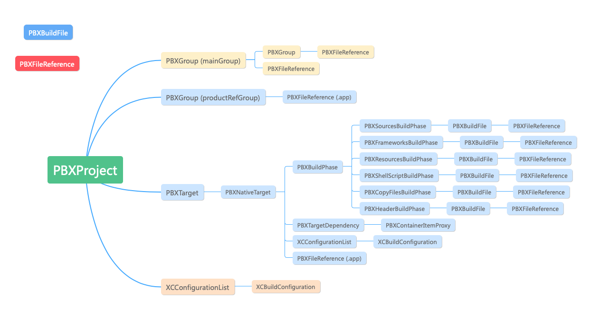

```
{
	archiveVersion = 1;
	classes = {
	};
	objectVersion = 46;
	objects = {
		...
	};
	rootObject = 6003F582195388D10070C39A /* Project object */; 引用PBXProject
}
```




- PBXBuildFile
- PBXBuildPhase.   // 对应Xcode中Build Phases
  - PBXAppleScriptBuildPhase
  - PBXCopyFilesBuildPhase
  - PBXFrameworksBuildPhase
  - PBXHeadersBuildPhase
  - PBXResourcesBuildPhase
  - PBXShellScriptBuildPhase
  - PBXSourcesBuildPhase
- PBXContainerItemProxy
- PBXFileElement
  - PBXFileReference
  - PBXGroup
  - PBXVariantGroup
- PBXTarget
  - PBXAggregateTarget
  - PBXLegacyTarget
  - PBXNativeTarget
- PBXProject
- PBXTargetDependency
- XCBuildConfiguration
- XCConfigurationList


### PBXFileReference

PBXFileReference用于跟踪项目引用的每个外部文件：源文件、资源文件、库、生成的应用程序文件等等。

记录了每个代码文件的文件类型、路径path、sourceTree，不论引入文件的时候是create group还是create reference，都会在这里添加一条记录

```
/* Begin PBXFileReference section */

		F38B42DD0DB7A176B9C762D9 /* Pods-KBTEST1_Tests.release.xcconfig */ = {isa = PBXFileReference; includeInIndex = 1; lastKnownFileType = text.xcconfig; name = "Pods-KBTEST1_Tests.release.xcconfig"; path = "Target Support Files/Pods-KBTEST1_Tests/Pods-KBTEST1_Tests.release.xcconfig"; sourceTree = "<group>"; };
		
/* End PBXFileReference section */
```

```
15FAD90A746794A646D95BDF = {
	isa = PBXFileReference;
	//
	includeInIndex = 1;
	// 文件类型
	lastKnownFileType = sourcecode.c.objc;
	// filename
	name = InforMationHeaderView.m;
	// 文件路径
	path = InforMationHeaderView.m;
	// 
	sourceTree = "<group>"
}
```


sourceTree：

``` ruby
SOURCE_TREES_BY_KEY = {
  :absolute        => '<absolute>',
  :group           => '<group>',
  :project         => 'SOURCE_ROOT',
  :built_products  => 'BUILT_PRODUCTS_DIR',
  :developer_dir   => 'DEVELOPER_DIR',
  :sdk_root        => 'SDKROOT',
}.freeze
```


### PBXBuildFile

所有参与工程编译的源文件，依赖库，资源文件

```
/* Begin PBXBuildFile section */

7365796321B8C314006D6DF9 /* KBTodayWidget.appex in Embed App Extensions */ = {isa = PBXBuildFile; fileRef = 7365795621B8C314006D6DF9 /* KBTodayWidget.appex */; settings = {ATTRIBUTES = (RemoveHeadersOnCopy, ); }; };
		
/* End PBXBuildFile section */
```

```
7365796321B8C314006D6DF9 = {
	isa = PBXBuildFile;
	// 引用 PBXFileReference
	fileRef = 7365795621B8C314006D6DF9;
	// 用于附加设置的键/值对的映射
	settings = {ATTRIBUTES = (RemoveHeadersOnCopy, ); };
}
```


### PBXContainerItemProxy

这里记录了每个target的targetProxy，与PBXTargetDependency相对应

```
/* Begin PBXContainerItemProxy section */

		6003F5B3195388D20070C39A /* PBXContainerItemProxy */ = {
			isa = PBXContainerItemProxy;
			// 引用 PBXProject
			containerPortal = 6003F582195388D10070C39A /* Project object */;
			proxyType = 1;
			// 引用对应的target
			remoteGlobalIDString = 6003F589195388D20070C39A;
			// 引用target名称
			remoteInfo = KBTodayWidget;
		};
		
/* End PBXContainerItemProxy section */
```


### PBXGroup

工程中所有文件的group信息，这个和xcode文件目录是对应的，每一层的文件目录有唯一的UUID,同一层group下的子group会和上一层的group的UUID有很高的重合度(基本只有1-2位不同)，这个PBXGroup section中，子group没有用树的方式，而是采用类似列表的方式呈现了所有的group目录，可以脑补：打开xcode左侧目录，然后让所有目录和文件"左对齐"，然后就会生成如下的结构

```
/* Begin PBXGroup section */

		6003F593195388D20070C39A /* Example for KBTEST1 */ = {
			isa = PBXGroup;
			// 引用列表，可能为PBXGroup，也可能是 PBXFileReference
			children = (
				6003F59C195388D20070C39A /* KBAppDelegate.h */,
				6003F59D195388D20070C39A /* KBAppDelegate.m */,
				873B8AEA1B1F5CCA007FD442 /* Main.storyboard */,
				6003F5A5195388D20070C39A /* KBViewController.h */,
				6003F5A6195388D20070C39A /* KBViewController.m */,
				71719F9D1E33DC2100824A3D /* LaunchScreen.storyboard */,
				6003F5A8195388D20070C39A /* Images.xcassets */,
				6003F594195388D20070C39A /* Supporting Files */,
			);
			// group 名称
			name = "Example for KBTEST1";
			// 路径
			path = KBTEST1;
			sourceTree = "<group>";
		};
		
/* End PBXGroup section */
```


### PBXNativeTarget

```
/* Begin PBXNativeTarget section */

		034A078C1A369D5A007EC984 /* Kanzhun */ = {
			isa = PBXNativeTarget;
			// 引用 XCConfigurationList
			buildConfigurationList = 034A07BF1A369D5A007EC984 /* Build configuration list for PBXNativeTarget "Kanzhun" */;
			// PBXBuildPhase 列表
			buildPhases = (
				85102184A668BB6CFD44D05E /* [CP] Check Pods Manifest.lock */,
				034A07891A369D5A007EC984 /* Sources */,
				034A078A1A369D5A007EC984 /* Frameworks */,
				034A078B1A369D5A007EC984 /* Resources */,
				191488CD1EA0A5F90076D02C /* ShellScript */,
				AF252337961E9E32880C9BDA /* [CP] Copy Pods Resources */,
				750DCB12213D112F006E7D40 /* Embed App Extensions */,
				732C742E23BF2210009C04C4 /* CopyFiles */,
				09858B2BC3C75018A2A7E434 /* [CP] Embed Pods Frameworks */,
			);
			buildRules = (
			);
			// 引用 PBXTargetDependency
			dependencies = (
				750DCB0D213D112F006E7D40 /* PBXTargetDependency */,
				7365796221B8C314006D6DF9 /* PBXTargetDependency */,
			);
			// target名称
			name = Kanzhun;
			// product名称
			productName = Kanzhun;
			// product的引用，PBXFileReference
			productReference = 034A078D1A369D5A007EC984 /* Kanzhun.app */;
			productType = "com.apple.product-type.application";
		};
		
/* End PBXNativeTarget section */
```


productType：

``` ruby
PRODUCT_TYPE_UTI = {
  :application      => 'com.apple.product-type.application',
  :framework        => 'com.apple.product-type.framework',
  :dynamic_library  => 'com.apple.product-type.library.dynamic',
  :static_library   => 'com.apple.product-type.library.static',
  :bundle           => 'com.apple.product-type.bundle',
  :unit_test_bundle => 'com.apple.product-type.bundle.unit-test',
}.freeze
```


### PBXProject

整个项目工程Project的信息，包括项目路径、Config信息，相关版本号，所有的Target等信息

```
/* Begin PBXProject section */
		6003F582195388D10070C39A /* Project object */ = {
			isa = PBXProject;
			attributes = {
				CLASSPREFIX = KB;
				LastUpgradeCheck = 0720;
				ORGANIZATIONNAME = gaoyu;
				TargetAttributes = {
					6003F5AD195388D20070C39A = {
						TestTargetID = 6003F589195388D20070C39A;
					};
				};
			};
			
			// 引用XCConfigurationList，配置列表，包含debug、release
			buildConfigurationList = 6003F585195388D10070C39A /* Build configuration list for PBXProject "KBTEST1" */;
			compatibilityVersion = "Xcode 3.2";
			developmentRegion = English;
			hasScannedForEncodings = 0;
			knownRegions = (
				English,
				en,
				Base,
			);
			
			// 主分组，引用 PBXGroup
			mainGroup = 6003F581195388D10070C39A;
			
			// product分组，引用 PBXGroup
			productRefGroup = 6003F58B195388D20070C39A /* Products */;
			projectDirPath = "";
			projectRoot = "";
			
			// target列表，引用 PBXNativeTarget
			targets = (
				6003F589195388D20070C39A /* KBTEST1_Example */,
				6003F5AD195388D20070C39A /* KBTEST1_Tests */,
			);
		};
/* End PBXProject section */
```


### PBXResourcesBuildPhase

项目中所有target下的  Build Phases -> Copy Bundle Resources

列举了项目中每个Resources的信息, 包括Build Phase下`Copy Bundle Resources`文件、Assets.xcassets等资源文件

```
/* Begin PBXResourcesBuildPhase section */

		6003F588195388D20070C39A /* Resources */ = {
			isa = PBXResourcesBuildPhase;
			buildActionMask = 2147483647;
			files = (
				873B8AEB1B1F5CCA007FD442 /* Main.storyboard in Resources */,
				71719F9F1E33DC2100824A3D /* LaunchScreen.storyboard in Resources */,
				6003F5A9195388D20070C39A /* Images.xcassets in Resources */,
				6003F598195388D20070C39A /* InfoPlist.strings in Resources */,
			);
			runOnlyForDeploymentPostprocessing = 0;
		};
		
/* End PBXResourcesBuildPhase section */
```


### PBXFrameworksBuildPhase

工程构建所需的framework

Build Phases -> Link Binary With Libraies

```
/* Begin PBXFrameworksBuildPhase section */

		6003F587195388D20070C39A /* Frameworks */ = {
			isa = PBXFrameworksBuildPhase;
			buildActionMask = 2147483647;
			files = (
				6003F590195388D20070C39A /* CoreGraphics.framework in Frameworks */,
				6003F592195388D20070C39A /* UIKit.framework in Frameworks */,
				6003F58E195388D20070C39A /* Foundation.framework in Frameworks */,
				F13D7F881634EC89880D36A3 /* Pods_KBTEST1_Example.framework in Frameworks */,
			);
			runOnlyForDeploymentPostprocessing = 0;
		};
		
/* End PBXFrameworksBuildPhase section */
```


### PBXCopyFilesBuildPhase

Build Phases -> Copy Files

 -> Embed App Extensions

```
/* Begin PBXCopyFilesBuildPhase section */

		73E1AAA022BA0A7B00ABFD5D /* Embed App Extensions */ = {
			isa = PBXCopyFilesBuildPhase;
			buildActionMask = 2147483647;
			dstPath = "";
			dstSubfolderSpec = 13;
			files = (
				73E1AAA122BA0A7B00ABFD5D /* NotificationService.appex in Embed App Extensions */,
				73E1AAA222BA0A7B00ABFD5D /* KBTodayWidget.appex in Embed App Extensions */,
			);
			name = "Embed App Extensions";
			runOnlyForDeploymentPostprocessing = 0;
		};
		
/* End PBXCopyFilesBuildPhase section */
```

dstSubfolderSpec：

``` ruby
COPY_FILES_BUILD_PHASE_DESTINATIONS = {
  :absolute_path      =>  '0',
  :products_directory => '16',
  :wrapper            =>  '1',
  :resources          =>  '7', # default
  :executables        =>  '6',
  :java_resources     => '15',
  :frameworks         => '10',
  :shared_frameworks  => '11',
  :shared_support     => '12',
  :plug_ins           => '13',
}.freeze
```


### PBXShellScriptBuildPhase

对应Xcode中Build Phases下的脚本文件，包括：Embed Pods Frameworks，Check Pods Manifest.lock以及其他本地或者第三方的脚本文件信息

```
/* Begin PBXShellScriptBuildPhase section */

		43817820C976003B0EEF4439 /* [CP] Embed Pods Frameworks */ = {
			isa = PBXShellScriptBuildPhase;
			buildActionMask = 2147483647;
			files = (
			);
			inputPaths = (
				"${PODS_ROOT}/Target Support Files/Pods-KBTEST1_Example/Pods-KBTEST1_Example-frameworks.sh",
				"${BUILT_PRODUCTS_DIR}/KBTEST1/KBTEST1.framework",
			);
			name = "[CP] Embed Pods Frameworks";
			outputPaths = (
				"${TARGET_BUILD_DIR}/${FRAMEWORKS_FOLDER_PATH}/KBTEST1.framework",
			);
			runOnlyForDeploymentPostprocessing = 0;
			shellPath = /bin/sh;
			shellScript = "\"${PODS_ROOT}/Target Support Files/Pods-KBTEST1_Example/Pods-KBTEST1_Example-frameworks.sh\"\n";
			showEnvVarsInLog = 0;
		};
		
/* End PBXShellScriptBuildPhase section */
```


### PBXSourcesBuildPhase

Build Phases -> Compile Sources

对应Xcode中Build Phases的Complie Sources的代码文件

```
/* Begin PBXSourcesBuildPhase section */

		6003F586195388D20070C39A /* Sources */ = {
			isa = PBXSourcesBuildPhase;
			buildActionMask = 2147483647;
			files = (
				6003F59E195388D20070C39A /* KBAppDelegate.m in Sources */,
				6003F5A7195388D20070C39A /* KBViewController.m in Sources */,
				6003F59A195388D20070C39A /* main.m in Sources */,
				55D627F94EE0F8222DD12C0B /* KBDraftBoxViewController.m in Sources */,
			);
			runOnlyForDeploymentPostprocessing = 0;
		};

/* End PBXSourcesBuildPhase section */
```


### PBXTargetDependency

Build Phases -> Dependencies

```
/* Begin PBXTargetDependency section */

		7365796221B8C314006D6DF9 /* PBXTargetDependency */ = {
			isa = PBXTargetDependency;
			target = 7365795521B8C314006D6DF9 /* KBTodayWidget */;
			targetProxy = 7365796121B8C314006D6DF9 /* PBXContainerItemProxy */;
		};
		
/* End PBXTargetDependency section */
```


### PBXVariantGroup

引用本地化资源的元素

不同地区的资源文件的引用信息，如果你项目使用了国际化，相关的xxx.string就在这个section中

```
/* Begin PBXVariantGroup section */

		6003F596195388D20070C39A /* InfoPlist.strings */ = {
			isa = PBXVariantGroup;
			children = (
				6003F597195388D20070C39A /* en */,
			);
			name = InfoPlist.strings;
			sourceTree = "<group>";
		};
		
/* End PBXVariantGroup section */
```


### XCBuildConfiguration

```
/* Begin XCBuildConfiguration section */

		6003F5BD195388D20070C39A /* Debug */ = {
			isa = XCBuildConfiguration;
			buildSettings = {
				ALWAYS_SEARCH_USER_PATHS = NO;
				CLANG_CXX_LANGUAGE_STANDARD = "gnu++0x";
				CLANG_CXX_LIBRARY = "libc++";
				CLANG_ENABLE_MODULES = YES;
				CLANG_ENABLE_OBJC_ARC = YES;
				CLANG_WARN_BOOL_CONVERSION = YES;
				CLANG_WARN_CONSTANT_CONVERSION = YES;
				CLANG_WARN_DIRECT_OBJC_ISA_USAGE = YES_ERROR;
				CLANG_WARN_EMPTY_BODY = YES;
				CLANG_WARN_ENUM_CONVERSION = YES;
				CLANG_WARN_INT_CONVERSION = YES;
				CLANG_WARN_OBJC_ROOT_CLASS = YES_ERROR;
				CLANG_WARN__DUPLICATE_METHOD_MATCH = YES;
				"CODE_SIGN_IDENTITY[sdk=iphoneos*]" = "iPhone Developer";
				COPY_PHASE_STRIP = NO;
				ENABLE_TESTABILITY = YES;
				GCC_C_LANGUAGE_STANDARD = gnu99;
				GCC_DYNAMIC_NO_PIC = NO;
				GCC_OPTIMIZATION_LEVEL = 0;
				GCC_PREPROCESSOR_DEFINITIONS = (
					"DEBUG=1",
					"$(inherited)",
				);
				GCC_SYMBOLS_PRIVATE_EXTERN = NO;
				GCC_WARN_64_TO_32_BIT_CONVERSION = YES;
				GCC_WARN_ABOUT_RETURN_TYPE = YES_ERROR;
				GCC_WARN_UNDECLARED_SELECTOR = YES;
				GCC_WARN_UNINITIALIZED_AUTOS = YES_AGGRESSIVE;
				GCC_WARN_UNUSED_FUNCTION = YES;
				GCC_WARN_UNUSED_VARIABLE = YES;
				IPHONEOS_DEPLOYMENT_TARGET = 9.3;
				ONLY_ACTIVE_ARCH = YES;
				SDKROOT = iphoneos;
				TARGETED_DEVICE_FAMILY = "1,2";
			};
			name = Debug;
		};
		6003F5BE195388D20070C39A /* Release */ = {
			isa = XCBuildConfiguration;
			buildSettings = {
				ALWAYS_SEARCH_USER_PATHS = NO;
				CLANG_CXX_LANGUAGE_STANDARD = "gnu++0x";
				CLANG_CXX_LIBRARY = "libc++";
				CLANG_ENABLE_MODULES = YES;
				CLANG_ENABLE_OBJC_ARC = YES;
				CLANG_WARN_BOOL_CONVERSION = YES;
				CLANG_WARN_CONSTANT_CONVERSION = YES;
				CLANG_WARN_DIRECT_OBJC_ISA_USAGE = YES_ERROR;
				CLANG_WARN_EMPTY_BODY = YES;
				CLANG_WARN_ENUM_CONVERSION = YES;
				CLANG_WARN_INT_CONVERSION = YES;
				CLANG_WARN_OBJC_ROOT_CLASS = YES_ERROR;
				CLANG_WARN__DUPLICATE_METHOD_MATCH = YES;
				"CODE_SIGN_IDENTITY[sdk=iphoneos*]" = "iPhone Developer";
				COPY_PHASE_STRIP = YES;
				ENABLE_NS_ASSERTIONS = NO;
				GCC_C_LANGUAGE_STANDARD = gnu99;
				GCC_WARN_64_TO_32_BIT_CONVERSION = YES;
				GCC_WARN_ABOUT_RETURN_TYPE = YES_ERROR;
				GCC_WARN_UNDECLARED_SELECTOR = YES;
				GCC_WARN_UNINITIALIZED_AUTOS = YES_AGGRESSIVE;
				GCC_WARN_UNUSED_FUNCTION = YES;
				GCC_WARN_UNUSED_VARIABLE = YES;
				IPHONEOS_DEPLOYMENT_TARGET = 9.3;
				SDKROOT = iphoneos;
				TARGETED_DEVICE_FAMILY = "1,2";
				VALIDATE_PRODUCT = YES;
			};
			name = Release;
		};
		
/* End XCBuildConfiguration section */
```


### XCConfigurationList

```
/* Begin XCConfigurationList section */

		034A07881A369D5A007EC984 /* Build configuration list for PBXProject "Kanzhun" */ = {
			isa = XCConfigurationList;
			
			// 引用 XCBuildConfiguration
			buildConfigurations = (
				034A07BD1A369D5A007EC984 /* Debug */,
				034A07BE1A369D5A007EC984 /* Release */,
			);
			defaultConfigurationIsVisible = 0;
			defaultConfigurationName = Release;
		};
		
/* End XCConfigurationList section */
```

buildConfigurations，配置列表，具体内容为XCBuildConfiguration


- PBXProject 为根节点，代表着整个工程

- PBXProject 可以有多个PBXNativeTarget，代表着工程中的target
- PBXNativeTarget 维护着各自资源文件（PBXResourcesBuildPhase），源文件.(PBXSourcesBuildPhase），以及依赖库（PBXFrameworksBuildPhase）等等
- PBXProject 和 PBXNativeTarget 都有配置管理，通过XCConfigurationList和XCBuildConfiguration维护
- 每个导入工程的文件都会有相应的PBXFileReference记录，如果该文件在导入时，选择了create groups ，会在相应的PBXGroup中有记录
- 每个在编译打包过程中被包含到可执行文件中的文件，都会有PBXBuildFile记录，根据类别分别在PBXResourcesBuildPhase，PBXSourcesBuildPhase等中有记录