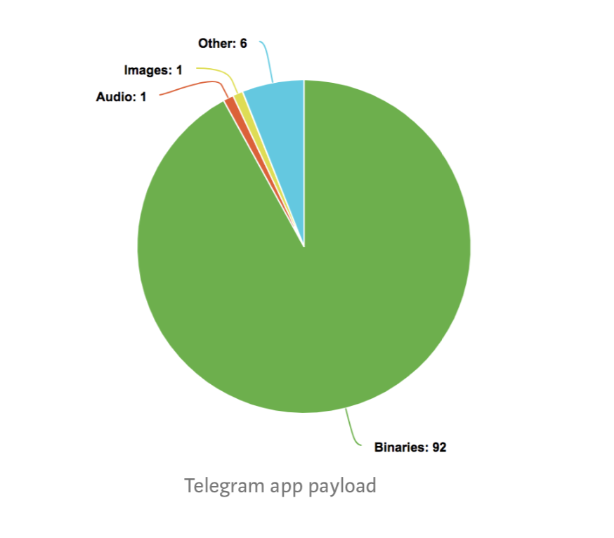

# One Quick Way to Drastically Reduce your iOS App's Download Size

**Before you read this article: Apple says that is will reduce the download size of all apps by 50% by "packaging" them differently. They are probably fixing the problems that this article provides workarounds for, making this article irrelevant. However, I will leave the article up for general interest.**

在你读这篇文章之前，苹果说他们通过不同的‘packaging’可能使app下载的大小减少百分之50。他们可能正在修复本文提供的解决办法，使这篇文章无关紧要。不过，我将把这篇文章留作一般参考

App download size is important. The larger your app's download size, the fewer users will download it. Plus, if it goes past 150MB, then the App Store won't allow users to download it over WWAN.

应用程序下载大小很重要。应用程序的下载大小越大，下载它的用户就越少。另外，如果超过150MB，应用商店将不允许用户通过WWAN下载。

## What determines an app's download size?   什么决定了app的下载大小

Let's look at the Telegram app(thinned for the iPhoneX) and see how much each file type contributes:

As you can see, it's dominated by binaries (the main binary, frameworks, and extension binaries). Binaries usually make up 60%+ of an app's download size.

如您所见，它主要由二进制文件（主要二进制文件、框架和扩展二进制文件）控制。二进制文件通常占应用程序下载大小的60%以上。

## Why are my binaries so big? Is there really that much code? Guess it's because I'm a 10x programmer

Code can certainly add up, but part of the issue is that Apple encrypts a large portion of the binary before it's added to the compressed payload that the user downloads.

代码当然会增加，但部分问题在于，在将二进制文件添加到用户下载的压缩有效负载之前，苹果会对其中的很大一部分进行加密。

Encrypted data looks like random data to the compression program, so it can't compress it at all.

加密数据在压缩程序看来就像随机数据，所以根本无法压缩。

## But encryption is good because it will make my app more tamper-proof, right?但加密是好的，因为它将使我的应用程序更防篡改，是这样吗?

Actually, the encryption is almost useless! You can easily decrypt any app on a jailbroken phone with the help of Clutch. Plus, how important is tamper-proofing for you app in particular?

实际上，加密几乎是无用的!  在Cluthch的帮助下，你可以轻松在越狱手机上脱壳任何应用程序。另外，应用程序的防篡改功能有多重要?

## How much does the encryption add?

For a typical app, the encrypted portion takes around 70% of the binary (and the binary is in turn, let's say, is 80% of the app). If unencrypted and then compressed. its size would drop by about 60%. So we have 70% of 80% of 60%, i.e. **a ballpark reduction of 34% of your app's overall size**. You can use this script to approximate the savings. You can find more details about what exactly is encrypted in the "Overview of an iOS binary" section below.

对于一个典型的应用程序，加密部分约占二进制代码的70%(而二进制代码又占应用程序的80%)。如果不加密，然后压缩。它的规模将下降60%左右。所以我们有60%的70%和80%，也就是说，你的应用程序的整体大小减少了34%。您可以使用这个脚本来估算节省的成本。你可以在下面的“iOS二进制概述”一节中找到更多关于加密的细节。

**Conclusion: your users are downloading a massively inflated app payload, for no gain**

结论:你的用户正在下载一个巨大的膨胀的应用程序payload，没有任何好处

**Solution: move everything out of the encrypted part of the binary**

解决方案:将所有内容移出二进制文件的加密部分

## Overview of an iOS binary

Each binary is organized into a number of chunks called segments. Each segment consists of sections. There’s a section for the code, a section for constant strings, etc.

Apple encrypts the __TEXT segment, and nothing else. If we move all the sections out of that segment, then the segment will take up almost no space, and encrypting it won’t have much impact on our app. The sections can be moved to a new segment, where they won’t be encrypted and can be properly compressed. The decompressed size of our app will not change, but the compressed size will.

Why not just get rid of __TEXT entirely? There may be a way to do it, but when I tried, I encountered a number of problems. so we’ll just move the sections.

每个二进制文件都被组织成一些称为segment的块。每一segment由若干sections组成。有代码section，常量字符串的section，等等。

苹果只加密了__TEXT segment。如果我们将所有的sections移出那个segment，那么这个segment将几乎不占用任何空间，对它进行加密也不会对我们的应用程序产生太大影响。sections可以移动到一个新的segment，在那里它们不会被加密，可以被适当压缩。我们的应用程序的解压大小不会改变，但压缩大小会。

为什么不干脆完全摆脱掉__TEXT呢? 可能有一种方法可以做到这一点，但当我尝试的时候，我遇到了许多问题。所以我们只需要移动sections。

**1. Disable bitcode, if it's on. 关闭bitcode**

Our linker flags won’t work with bitcode, so we’ll have to turn bitcode off. Are there any drawbacks to turning off bitcode? In my opinion, not really, but for more information, read through this article. Plus, if you decide you want bitcode for some later release, you can always just undo this trick.

我们的链接器标志不能用bitcode，所以我们必须关闭bitcode。关闭bitcode有什么缺点吗? 在我看来，并不是这样的，但要了解更多信息，请通读这篇文章。另外，如果您决定在以后的版本中使用bitcode，您可以随时取消这个技巧。

**2. Examine the current state of your app 检查应用程序的当前状态**

Get the path to your executable from the build log

从构建日志获取可执行文件的路径

We can see that the __TEXT segment has a number of sections (in the lines below Segment _TEXT: ... and above Segment _DATA: ...)

**3. Figure out the linker flags. 找出链接器标志**

We’ll call our new segment _MY_TEXT. For each section in the _TEXT segment, we’ll add a flag,  `-rename_section _TEXT <section name> _MY_TEXT <section name>`,  to the linker invocation. Also, we need to add `-segprot __MY_TEXT rx rx` to give our new segment rx permissions (read and execute, but not write). Lastly, to pass a flag to the linker during and Xcode build, it needs to get changed from <arg1> <arg2> … to -Wl, <arg1>,<arg2>,…

You can get a quick set of flags that will probably do the job with this gist. Or,you can be more thorogh and run this script for your binary, which will give you flags for all the sections.

To add these flags. go to the Xcode build settings for your target and add them under “Other Linker Flags”:

我们将把新的segment命名为_MY_TEXT。对于__TEXT segment中的每个section，我们将添加一个标志，`-rename_section _TEXT <section name> _MY_TEXT <section name>`，以用于链接器调用。另外，我们需要添加`-segprot _MY_TEXT rx rx` 来赋予我们的新段rx权限(读和执行，但不写)。最后，要在Xcode构建期间向链接器传递一个标志，需要将它从<arg1> <arg2>…更改为-Wl， <arg1>，<arg2>，…

您可以快速获得一组标记，这些标记可能可以完成本文的主旨。或者，您可以更灵活一些，运行这个二进制脚本，它将为所有部分提供标记。

添加这些标志。进入Xcode建立设置为您的目标，并添加他们在 “Other Linker Flags”:

**4. Verify**

Now run another build and run the xcrun size… command again to see if it worked.
You should see something like:

现在运行另一个版本并再次运行xcrun size…命令，看看它是否工作。
你应该看到这样的东西:

Caveat: in my experience, the __const section is not always moved. Oh well, it’s not a big section anyways.

警告: 根据我的经验，__const部分不能被移动。不过，反正也不是很大的一部分。

**5. Rinse and repeat for other binaries in your app, if necessary 如果有必要，清洗并重复应用程序中的其他二进制文件**

Although doing this for the main binary will usually be the biggest win by far, you can also do this for other binaries in your app, if you have any. The two categories that come to mind are app extensions (like a share extension) and dynamic libraries AKA dylibs (such as the Swift dylibs). For the extensions, you can simply repeat the above process if you’re doing the linking for them yourself (meaning you can’t do this for Swift dylibs). I haven’t tested the process for these other binaries, but I imagine it would be equally smooth.

到目前为止，通过做上述这些事情，主二进制文件取得了阶段性的胜利。如果有其他二进制文件，也可以为app内的其他二进制文件做这些操作。 首先想到的两类是app extensions（例如分享extension）和动态库（例如swift dylibs）。

对于extensions，可以简单重复上面的操作步骤。

对于动态库，如果是自己链接的动态库，可以重复上面步骤（不能为swift动态库做这些操作）。

虽然并没有针对其他动态库做这些步骤，但我相信它是同样顺利的

## Voila!

Now you have an app that will be compressed properly, at minimal cost to your its security. 

If you’d like to double-check what the users are downloading, you can download the app to a jailbroken phone or to your desktop(via iTunes)

现在你有一个应用程序将被正确压缩，以最低的安全成本。

如果您想再次检查用户正在下载的内容，可以将应用程序下载到越狱手机或桌面（通过iTunes）

## Disclaimer 免责声明

I have verified with an app of mine that it can be distributed on the App Store with a properly compressed binary and still work. I’ve also played around with symbolication and Objective-C introspection, and they seem to work, too. 
However,I can’t guarantee that this is risk-free. It’s possible that some crazy runtime thing in some library is affected by this. Also,Apple might someday start rejecting apps that use this technique. Use at your own risk

Nonetheless, I’d recommend trying it for any app with a good beta testing process. If you do decide to try it, let me know how it goes in the comments section!

我已经用我的一个应用程序验证过，它可以在app Store上以正确压缩的二进制文件发布，而且仍然可以工作。我还尝试了符号化和Objective-C内省，它们似乎也很有用。
然而，我不能保证这是无风险的。某些库中某些疯狂的运行时可能会受此影响。此外，苹果可能有一天会开始拒绝使用这种技术的应用程序。使用风险自负

尽管如此，我还是建议你在任何有良好的beta测试过程的应用程序中都试试它。如果你决定尝试一下，请在评论区告诉我效果如何!