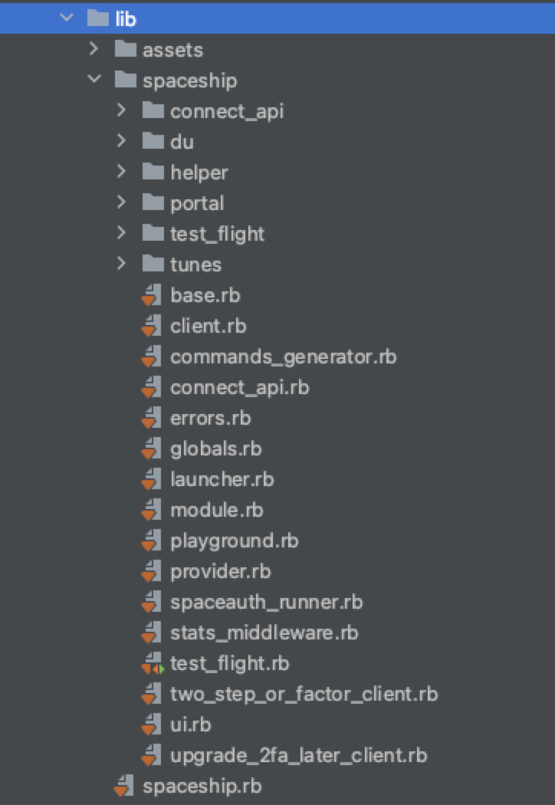
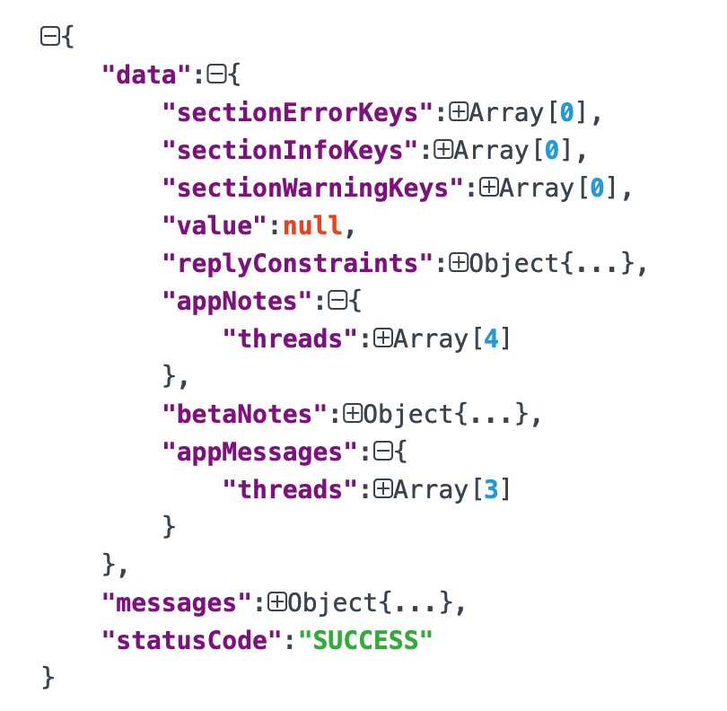

## 简介

> *spaceship* exposes both the Apple Developer Center and the App Store Connect API. It’s super fast, well tested and supports all of the operations you can do via the browser. It powers parts of *fastlane*, and can be leveraged for more advanced *fastlane* features. Scripting your Developer Center workflow has never been easier

>- Blazing fast communication using only a HTTP client
>- Object oriented access to all resources
>- Resistant against front-end design changes of the of the Apple Developer Portal
>- One central tool for the communication
>- Automatic re-trying of requests in case a timeout occurs
>- No web scraping
>- 90%+ test coverage by stubbing server responses

spaceship同时暴露了Apple Developer Center 和 App Store Connect 的api操作，速度快，在浏览器上可以完成的操作，它都可以使用脚本实现。因为spaceship的所有操作都是使用http直接请求苹果底层api，而非采用网络爬虫的方式，所以会比在浏览器上操作更快。减少了一些冗余的网络资源请求以及加载

在 Apple Developer Center 下可以添加证书、设备等操作。在 App Store Connect 中可以创建新app、修改现有app信息、管理成员信息、提交testflight、获取财务账单等等操作。

所以平时一些频繁或者复杂的操作完全可以使用spaceship来替代，避免因为使用浏览器而进行的漫长等待。而且官方也在一步步的公开api访问的方式，说明这是一个趋势


源码目录如下：



- **connect_api**

  包装苹果官方开放的[App Store Connsect API](https://developer.apple.com/documentation/appstoreconnectapi)

- **portal**

  处理苹果开发者中心的一些操作，操作证书、设备、描述文件等需要用此套api

- **test_flight**

  操作app的testflight

- **tunes**

  处理appstoreconnect的一些操作，此代码为老版的操作方式，包含api比较全。部分操作可使用 **connect_api** 采用苹果官方开发的api


## 登录

spaceship的所有操作都需要登录，所以首先研究的就是登录的步骤。

```ruby
require 'spaceship'

// tunes登录
tunes = Spaceship::Tunes.login('xxx', 'xxx')

// portal登录
portal = Spaceship::Portal.login('xxx', 'xxx');
```

调用链如下：

`client.rb`  中的 `login()` 方法检验账号密码的合法性，然后调用`client.rb` 中的 `do_login()` 方法，内部调用子类中实现的 `send_login_request()方法

`send_login_request` 的具体实现在对应的子类中（`tunes_client.rb`，`portal_client.rb`）

``` ruby
def send_login_request(user, password)
    clear_user_cached_data
    result = send_shared_login_request(user, password)

    store_cookie

    return result
end
```

最终的逻辑处理都是在`client.rb` 中的 `send_shared_login_request()` 方法内

```ruby
def send_shared_login_request(user, password)
      
      if load_session_from_file
        # Check if the session is still valid here
        begin
          return true if fetch_olympus_session
        rescue
          puts("Available session is not valid any more. Continuing with normal login.")
        end
      end
      
  
      # The user can pass the session via environment variable (Mainly used in CI environments)
      if load_session_from_env
        # see above
        begin
          # see above
          return true if fetch_olympus_session
        rescue
          puts("Session loaded from environment variable is not valid. Continuing with normal login.")
          # see above
        end
      end
      #
      # After this point, we sure have no valid session any more and have to create a new one
      #

      data = {
        accountName: user,
        password: password,
        rememberMe: true
      }

      begin
        // 请求登录接口

      # Now we know if the login is successful or if we need to do 2 factor

      // 根据返回状态执行下一步操作
      case response.status
      when 403
        raise InvalidUserCredentialsError.new, "Invalid username and password combination. Used '#{user}' as the username."
      when 200
        fetch_olympus_session
        return response
      when 409
        # 2 step/factor is enabled for this account, first handle that
        handle_two_step_or_factor(response)
        # and then get the olympus session
        fetch_olympus_session
        return true     
      else
        ......
      end
end
```

1. 从 `load_session_from_file` 中加载cookie数据，如果有数据，调用`fetch_olympus_session`判断session是否有效，若有效，说明登录还在有效期，则直接返回成功

2. 从 `load_session_from_env` 中获取用户是否设置了本地环境变量（`ENV["FASTLANE_SESSION"] || ENV["SPACESHIP_SESSION"]`）存储session值，若有值，接下来跟第一步后续操作一样，判断session是否有效

3. 若前两步都未成功，我们需要重新登录，获取有效的session

   ``` ruby
   data = {
     accountName: user,
     password: password,
     rememberMe: true
   }
   
   important_cookie = @cookie.store.entries.find { |a| a.name.include?("DES") }
   if important_cookie
     modified_cookie = self.cookie # returns a string of all cookies
     unescaped_important_cookie = "#{important_cookie.name}=#{important_cookie.value}"
     escaped_important_cookie = "#{important_cookie.name}=\"#{important_cookie.value}\""
     modified_cookie.gsub!(unescaped_important_cookie, escaped_important_cookie)
   end
   
   response = request(:post) do |req|
     req.url("https://idmsa.apple.com/appleauth/auth/signin")
     req.body = data.to_json
     req.headers['Content-Type'] = 'application/json'
     req.headers['X-Requested-With'] = 'XMLHttpRequest'
     req.headers['X-Apple-Widget-Key'] = self.itc_service_key
     req.headers['Accept'] = 'application/json, text/javascript'
     req.headers["Cookie"] = modified_cookie if modified_cookie
   end
   ```

4. 调用登录接口完成之后，根据response.status判断执行下一步操作

   - **403**

     用户或密码有问题，登录不成功

   - **200**

     登录成功。调用 `fetch_olympus_session` 请求session数据

   - **409**

     首先需要进行双重认证 `handle_two_step_or_factor(response)`，然后请求session数据。

   双重认证的处理逻辑都在此 `two_step_or_factor_client.rb` 文件中处理，包含了受信任设备以及受信任手机号的处理，完成验证之后会存储session，下一次请求直接加载seesion，无需再次登录

   ```ruby
   if r.body.kind_of?(Hash) && r.body["trustedDevices"].kind_of?(Array)
     // 受信任设备
     handle_two_step(r)
   elsif r.body.kind_of?(Hash) && r.body["trustedPhoneNumbers"].kind_of?(Array) && r.body["trustedPhoneNumbers"].first.kind_of?(Hash)
     // 受信任手机号
     handle_two_factor(r)
   else
     ...
   end
   ```

   ```ruby
   # Responsible for setting all required header attributes for the requests
   # to succeed
   def update_request_headers(req)
     req.headers["X-Apple-Id-Session-Id"] = @x_apple_id_session_id
     req.headers["X-Apple-Widget-Key"] = self.itc_service_key
     req.headers["Accept"] = "application/json"
     req.headers["scnt"] = @scnt
   end
   ```

   

## App Store Connect API

可实现的功能详细参考[这里](https://github.com/fastlane/fastlane/blob/master/spaceship/docs/AppStoreConnect.md) 或者直接查看源码 `tunes_client.rb` 

拿两个简单的例子来看一下具体的用法。这里使用的是老版本的方式，并不是苹果开放的官方api[App Store Connect API](https://developer.apple.com/documentation/appstoreconnectapi)

- App解决方案中心
- 添加内购

### 1. App解决方案中心

```ruby
require 'spaceship'

# 1.登录
Spaceship::Tunes.login(user, pwd)
Spaceship::Tunes.select_team(team_id: xxx)

# 2.根据bundleId选择app
app = Spaceship::Tunes::Application.find(bundle_id)

# 3.调用解决方案中心接口
response = app.resolution_center

# 4.根据response查找出最新信息并邮件通知对应负责人
...
```



上图为解决方案中心实际返回的json数据，可以通过抓包查看数据结构，也可以直接调用spaceship的接口查看返回值。自己根据情况对数据进行自定义的分析处理。

ps：本来准备自己通过抓包找到接口调用，后来在写的过程中发现spaceship已经给提供了对应的方法`resolution_center` 以及解释。所以以后再遇到一些想实现的功能时，可以提前查看源码看系统是否已经提供，避免走弯路

``` ruby
# @return (Hash) Contains the reason for rejection.
      #  if everything is alright, the result will be
      #  `{"sectionErrorKeys"=>[], "sectionInfoKeys"=>[], "sectionWarningKeys"=>[], "replyConstraints"=>{"minLength"=>1, "maxLength"=>4000}, "appNotes"=>{"threads"=>[]}, "betaNotes"=>{"threads"=>[]}, "appMessages"=>{"threads"=>[]}}`
      def resolution_center
        client.get_resolution_center(apple_id, platform)
      end
```


### 2. 给App添加内购

``` ruby
require 'spaceship'

# 1.登录
Spaceship::Tunes.login(user, pwd)
Spaceship::Tunes.select_team(team_id: xxx)

# 2.根据bundleId选择app
app = Spaceship::Tunes::Application.find(bundle_id)

# 3. 创建内购商品
begin
  @app.in_app_purchases.create!( # 创建商品
    type: iapType,
    versions: {
      "zh-Hans": {
        name: name,
        description: desc
      }
    },
    reference_name: reference,
    product_id: product_id,
    review_notes: review_desc,
    review_screenshot: review_image_path,
    pricing_intervals: [
      {
        country: "WW",
        begin_date: nil,
        end_date: nil,
        tier: tier
      }
    ],
    family_id: family_id,
    subscription_free_trial: subscription_free_trial,
    subscription_duration: subscription_duration,
    subscription_price_target: subscription_price_target
  )
  puts "#创建成功!!!
   "
rescue Exception => error
  puts "#创建失败: #{error}
   "
end
```

- iapType商品对应的类型

  ``` ruby
  # 获取到对应的商品类型
  def  get_correct_iapType(type)
    if type == "消耗品"
      return Spaceship::Tunes::IAPType::CONSUMABLE
    elsif type == "非消耗品"
      return Spaceship::Tunes::IAPType::NON_CONSUMABLE
    elsif type == "非自动续订"
      return Spaceship::Tunes::IAPType::NON_RENEW_SUBSCRIPTION
    elsif type == "自动续订"
      return Spaceship::Tunes::IAPType::RECURRING
    end
  end
  ```

- product_id

  商品唯一id

  ...

对应的还有对商品修改方法

``` ruby
# 根据商品id查找到对应商品
purch = @app.in_app_purchases.find(product_id)
e = purch.edit # 编辑商品
e.versions = {
  "zh-Hans": {
    name: name,
    description: desc
  }
}
e.reference_name = reference
e.review_notes = review_desc
e.review_screenshot = review_image_path
e.pricing_intervals = [
  {
    country: "WW",
    begin_date: nil,
    end_date: nil,
    tier: tier
  }
]
# family_id = family_id,
e.subscription_free_trial = subscription_free_trial,
e.subscription_duration = subscription_duration,
e.subscription_price_target = subscription_price_target
e.save!
```

创建群组方法

``` ruby
value = create_family(
  name: product["family_name"],
  product_id: product_id,
  reference_name: name,
  versions: {
    "zh-Hans": {
      subscription_name: "xxx",
      name: product["family_name"]
    }
  }
)
```


## Apple Developer Portal API

可实现的功能详细参考[这里](https://github.com/fastlane/fastlane/blob/master/spaceship/docs/DeveloperPortal.md) 或者直接查看源码 `portal_client.rb` 


## 参考资料

[spaceship](https://github.com/fastlane/fastlane/tree/master/spaceship)

[spaceship文档](https://github.com/fastlane/fastlane/tree/master/spaceship/docs)

[App Store Connect API](https://developer.apple.com/documentation/appstoreconnectapi)

[Authentication.md](https://github.com/fastlane/fastlane/blob/master/spaceship/docs/Authentication.md)

[Authenticating with Apple services](https://docs.fastlane.tools/best-practices/continuous-integration/#two-step-or-two-factor-auth)


