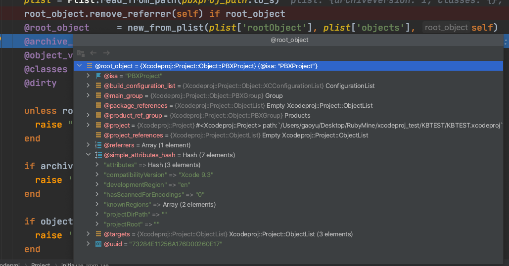
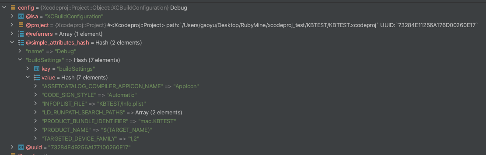

# Xcodeproj

[Xcodeproj](https://github.com/CocoaPods/Xcodeproj) 通过Ruby创建和修改Xcode项目结构。同样支持对 Xcode workspaces（.xcworkspace）、配置文件（.xcconfig）和 Xcode Scheme文件（.xcscheme）的修改

[API Reference](https://www.rubydoc.info/gems/xcodeproj)


## 1. 安装

```
sudo gem install xcodeproj
```


## 2. 使用

### 1. open

``` ruby
require 'xcodeproj'
project = Xcodeproj::Project.open("KBTEST/KBTEST.xcodeproj")
...
...
...
project.save
```

首先通过xcodeproj路径打开文件，内部会生成对应的Project类，所有信息都在此类中。若进行了修改，最后调用save方法保存，重新生成.pbxproj文件


### 2. 获取所有target

``` ruby
# target
project.targets.each do |target|
  puts target.name
end
```


### 3. 获取target的source files

``` ruby
# target source files
target = project.targets.first
files = target.source_build_phase.files.to_a.map do |pbx_build_file|
  pbx_build_file.file_ref.real_path.to_s

end.select do |path|
  path.end_with?(".m", ".mm", ".swift")

end.select do |path|
  File.exists?(path)
end

puts files
```


### 4. 获取target的build configuration

``` ruby
# target build setting
project.targets.each do |target|
  target.build_configurations.each do |config|
    if config.name == "Debug"
      puts config.build_settings
    end
  end
end
```

获取debug模式下的所有build_settings，可以自行进行修改配置或者新增配置

``` ruby
# 修改描述文件名称
config.build_settings["PROVISIONING_PROFILE_SPECIFIER"] = "xxProfileName"

# 新增配置
config.build_settings['MY_CUSTOM_FLAG'] ||= 'TRUE'
```


### 5. 引入类文件到工程中

``` ruby
# 添加文件
new_path = File.join("KBTEST","New")
group = project.main_group.find_subpath(new_path, true )
group.set_source_tree("<group>")
group.set_path("New")

file_ref = group.new_reference(File.join(project.project_dir, "/KBTEST/New/a.h"))
file_ref1 = group.new_reference(File.join(project.project_dir, "/KBTEST/New/a.m"))

target = project.targets.first
target.add_file_references([file_ref1])

project.save
```

新建一个名称为New的group，放在maingroup下

添加a.h、a.m文件到New group下

由于.m文件要进行编译，所以需要执行`add_file_references` ，添加到buildFile和sourcefiles。.h文件只用调用`new_reference`添加文件引用即可


# 源码分析

## 1. open

``` ruby
require 'xcodeproj'
project = Xcodeproj::Project.open("KBTEST/KBTEST.xcodeproj")
...
...
...
project.save
```

首先需要传入工程路径，调用Project类的open方法

open方法定义在`lib/project.rb` 文件中

``` ruby
def self.open(path)
  path = Pathname.pwd + path
  unless Pathname.new(path).exist?
    raise "[Xcodeproj] Unable to open `#{path}` because it doesn't exist."
  end
  project = new(path, true)
  project.send(:initialize_from_file)
  project
end
```

1. 首先拼接绝对路径，根据路径判断文件是否存在

2. 创建project对象，第一个参数为path，第二个参数skip_initialization = true，说明不需要从头进行初始化，因为接下来会根据path去创建初始化root_object对象

   ``` ruby
   def initialize(path, skip_initialization = false, object_version = Constants::DEFAULT_OBJECT_VERSION)
     @path = Pathname.new(path).expand_path
     @project_dir = @path.dirname
     @objects_by_uuid = {}
     @generated_uuids = []
     @available_uuids = []
     @dirty           = true
     unless skip_initialization.is_a?(TrueClass) || skip_initialization.is_a?(FalseClass)
       raise ArgumentError, '[Xcodeproj] Initialization parameter expected to ' \
         "be a boolean #{skip_initialization}"
     end
     unless skip_initialization
       initialize_from_scratch
       @object_version = object_version.to_s
       unless Constants::COMPATIBILITY_VERSION_BY_OBJECT_VERSION.key?(object_version)
         raise ArgumentError, "[Xcodeproj] Unable to find compatibility version string for object version `#{object_version}`."
       end
       root_object.compatibility_version = Constants::COMPATIBILITY_VERSION_BY_OBJECT_VERSION[object_version]
     end
   end
   ```

3. 初始化root_object对象

   ``` ruby
   # Initializes the instance with the project stored in the `path` attribute.
       #
   def initialize_from_file
     pbxproj_path = path + 'project.pbxproj'
     plist = Plist.read_from_path(pbxproj_path.to_s)
     root_object.remove_referrer(self) if root_object
     @root_object     = new_from_plist(plist['rootObject'], plist['objects'], self)
     @archive_version = plist['archiveVersion']
     @object_version  = plist['objectVersion']
     @classes         = plist['classes'] || {}
     @dirty           = false
   
     unless root_object
       raise "[Xcodeproj] Unable to find a root object in #{pbxproj_path}."
     end
   
     if archive_version.to_i > Constants::LAST_KNOWN_ARCHIVE_VERSION
       raise '[Xcodeproj] Unknown archive version.'
     end
   
     if object_version.to_i > Constants::LAST_KNOWN_OBJECT_VERSION
       raise '[Xcodeproj] Unknown object version.'
     end
   
     # Projects can have product_ref_groups that are not listed in the main_groups["Products"]
     root_object.product_ref_group ||= root_object.main_group['Products'] || root_object.main_group.new_group('Products')
   end
   ```

   `plist = Plist.read_from_path(pbxproj_path.to_s)` 内部会通过 `Nanaimo::Reader.new(contents).parse!.as_ruby` 把pbx文件转换为ruby的hash字典类型

   

   然后通过 `new_from_plist` 方法生成root_object对象。这一步就把pbx文件所有内容都一一映射为root_object对象，从此对象中可以获取到任意想要的内容

   

   - build_configuration_list 对应的是 XCConfigurationList，内部包含的是所有的XCBuildConfiguration
   - main_group对应的是 PBXGroup，工程的主group
   - product_ref_group 对应的是包文件对应的group
   - simple_attributes_hash 对应的是一些其他的简单配置项
   - targets 对应的就是项目内所有的target，PBXNativeTarget
   - ...

至此，open的逻辑基本分析完毕。总结一下就是通过xcodeproj路径把pbx文件转换为ruby对应的对象。最后来看一下project类初始化完毕后的全部属性


## 2. 获取target

``` ruby
# target
project.targets.each do |target|
  puts target.name
end
```

1. 调用project对象的targets方法，返回一个target抽象类数组

   ``` ruby
   # @return [ObjectList<AbstractTarget>] A list of all the targets in the
   #         project.
   #
   def targets
     root_object.targets
   end
   ```

2. 遍历targets数组，这里只是打印出每一个target的name。可以根据自己的需求进行不同的操作

   


## 3. 获取target的souce files

``` ruby
# target source files
target = project.targets.first
files = target.source_build_phase.files.to_a.map do |pbx_build_file|
  pbx_build_file.file_ref.real_path.to_s

end.select do |path|
  path.end_with?(".m", ".mm", ".swift")

end.select do |path|
  File.exists?(path)
end

puts files
```

这里大体分为三步

1. 首先通过 `target.source_build_phase.files` 获取此target下的build_file ，然后获取到build_file 的 file_ref。最后获取到file_ref的真实路径
2. 只筛选出`.m .mm .swift` 结尾的文件，说明这是我们自己编写的代码文件
3. 最后再根据路径判断是否是真实存在的文件

我们主要来分析第一步，如何获取到target下的build_file。了解pbx格式的就知道获取source files就是要获取PBXBuildPhase下的 PBXSourcesBuildPhase 段的内容，通过PBXSourcesBuildPhase下的files数组可以找到对应的PBXBuildFile，然后就可以找到PBXFileReference。


下图是ruby下的build_phase结构


`target.source_build_phase` 就是获取上图中build_phase对象

`target.source_build_phase.files` 是获取到 build_phase 对象中的files数组，对files数组进行遍历，其中每一个对象对PBXBuildFile


`pbx_build_file.file_ref` 就是获取上图中的 PBXFileReference 对象

最后调用 `real_path.to_s` 获取到真实路径转换为字符串形式


## 4. 获取target的build configuration

``` ruby
# target build setting
project.targets.each do |target|
  target.build_configurations.each do |config|
    if config.name == "Debug"
      puts config.build_settings
    end
  end
end
```

获取每一个target Debug环境下的buildSettings

调用 `target.build_configurations` ，获取到 XCConfigurationList，接着获取到 XCBuildConfiguration

```ruby
# @return [ObjectList<XCBuildConfiguration>] the build
#         configurations of the target.
#
def build_configurations
  build_configuration_list.build_configurations
end
```

遍历中config此时就是 XCBuildConfiguration 类型，通过XCBuildConfiguration中的属性build_settings获取到所有配置

```ruby
# @return [Hash] the build settings to use for building the target.
#
attribute :build_settings, Hash, {}
```




## 5. 引入类文件到工程中


# 参考资料

- [Xcodeproj](https://github.com/CocoaPods/Xcodeproj)
- [API Reference](https://www.rubydoc.info/gems/xcodeproj)
- [Xcode Project File Format](http://www.monobjc.net/xcode-project-file-format.html)
- [ruby库xcodeproj使用心得](https://www.jianshu.com/p/cca701e1d87c)

- [XcodeProject的内部结构分析](https://www.jianshu.com/p/50cc564b58ce)
- [使用代码为 Xcode 工程添加文件](https://draveness.me/bei-xcodeproj-keng-de-zhe-ji-tian/)


- project.rb

  

## Xcodeproj

### Project

#### Object

##### AbstractBuildPhase

```
lib/xcodeproj/project/object/build_phase.rb
```

已知子类：

[PBXCopyFilesBuildPhase](https://www.rubydoc.info/gems/xcodeproj/Xcodeproj/Project/Object/PBXCopyFilesBuildPhase), [PBXFrameworksBuildPhase](https://www.rubydoc.info/gems/xcodeproj/Xcodeproj/Project/Object/PBXFrameworksBuildPhase), [PBXHeadersBuildPhase](https://www.rubydoc.info/gems/xcodeproj/Xcodeproj/Project/Object/PBXHeadersBuildPhase), [PBXResourcesBuildPhase](https://www.rubydoc.info/gems/xcodeproj/Xcodeproj/Project/Object/PBXResourcesBuildPhase), [PBXRezBuildPhase](https://www.rubydoc.info/gems/xcodeproj/Xcodeproj/Project/Object/PBXRezBuildPhase), [PBXShellScriptBuildPhase](https://www.rubydoc.info/gems/xcodeproj/Xcodeproj/Project/Object/PBXShellScriptBuildPhase), [PBXSourcesBuildPhase](https://www.rubydoc.info/gems/xcodeproj/Xcodeproj/Project/Object/PBXSourcesBuildPhase)


##### XCConfigurationList


##### PBXGroup

```
lib/xcodeproj/project/object/group.rb
```

```ruby
# Creates a new reference with the given path and adds it to the
# group. The reference is configured according to the extension
# of the path.
#
# @param  [#to_s] path
#         The, preferably absolute, path of the reference.
# 				最好是绝对路径
#
# @param  [Symbol] source_tree
#         The source tree key to use to configure the path (@see
#         GroupableHelper::SOURCE_TREES_BY_KEY).
#
# @return [PBXFileReference, XCVersionGroup] The new reference.
#
def new_reference(path, source_tree = :group)
  FileReferencesFactory.new_reference(self, path, source_tree)
end
alias_method :new_file, :new_reference
```


```ruby
def new_reference(group, path, source_tree)
  ref = case File.extname(path).downcase
        when '.xcdatamodeld'
          new_xcdatamodeld(group, path, source_tree)
        when '.xcodeproj'
          new_subproject(group, path, source_tree)
        else
          new_file_reference(group, path, source_tree)
        end

  configure_defaults_for_file_reference(ref)
  ref
end
```


``` ruby
# Creates a new file reference with the given path and adds it to the
# given group.
# 使用给定的path创建新的文件引用，并且加入到指定的group
#
# @param  [PBXGroup] group
#         The group to which to add the reference.
#
# @param  [#to_s] path
#         The, preferably absolute, path of the reference.
#
# @param  [Symbol] source_tree
#         The source tree key to use to configure the path (@see
#         GroupableHelper::SOURCE_TREES_BY_KEY).
#
# @return [PBXFileReference] The new file reference.
#
def new_file_reference(group, path, source_tree)
  path = Pathname.new(path)
  ref = group.project.new(PBXFileReference)
  group.children << ref
  GroupableHelper.set_path_with_source_tree(ref, path, source_tree)
  ref.set_last_known_file_type
  ref
endv
```


``` ruby
# Sets the path of the given object according to the provided source
# tree key. The path is converted to relative according to the real
# path of the source tree for group and project source trees, if both
# paths are relative or absolute. Otherwise the path is set as
# provided.
#
# @param  [PBXGroup, PBXFileReference] object
#         The object whose path needs to be set.
#
# @param  [#to_s] path
#         The path.
#
# @param  [Symbol, String] source_tree
#         The source tree, either a string or a key for
#         {SOURCE_TREES_BY_KEY}.
#
# @return [void]
#

def set_path_with_source_tree(object, path, source_tree)
  path = Pathname.new(path)
  source_tree = normalize_source_tree(source_tree)
  object.source_tree = source_tree

  if source_tree == SOURCE_TREES_BY_KEY[:absolute]
    unless path.absolute?
      raise '[Xcodeproj] Attempt to set a relative path with an ' \
        "absolute source tree: `#{path}`"
    end
    object.path = path.to_s
  elsif source_tree == SOURCE_TREES_BY_KEY[:group] || source_tree == SOURCE_TREES_BY_KEY[:project]
    source_tree_real_path = GroupableHelper.source_tree_real_path(object)
    if source_tree_real_path && source_tree_real_path.absolute? == path.absolute?
      relative_path = path.relative_path_from(source_tree_real_path)
      object.path = relative_path.to_s
    else
      object.path = path.to_s
    end
  else
    object.path = path.to_s
  end
end
```


``` ruby
def save(save_path = nil)
  save_path ||= path
  @dirty = false if save_path == path
  FileUtils.mkdir_p(save_path)
  file = File.join(save_path, 'project.pbxproj')
  Atomos.atomic_write(file) do |f|
    Nanaimo::Writer::PBXProjWriter.new(to_ascii_plist, :pretty => true, :output => f, :strict => false).write
  end
end
```


#### AbstractObject

```
lib/xcodeproj/project/object.rb
```

这是Xcode项目中可以存在的所有对象类型的基类。因此，它提供了常见的行为，但是您只能使用AbstractObject子类的实例，因为这个类不存在于实际的Xcode项目中。


#### UUIDGenerator


- CLAide

  命令解析器

- Cocoapods-Core

  DSL解析器

- Cocoapods-Downloader

  下载模块

- Molinillo

  依赖仲裁算法

- nanaimo

  nanaimo是一个实现ASCII Plist序列化和反序列化的简单库，完全使用原生Ruby代码（并且没有依赖关系）。它还提供了对序列化Xcode projects（带注释）和XML plist的现成支持。

- Xcodeproj

  xcode文件生成

- Cocoapods-Plugins

  插件管理

